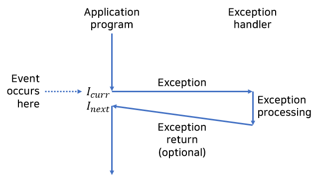
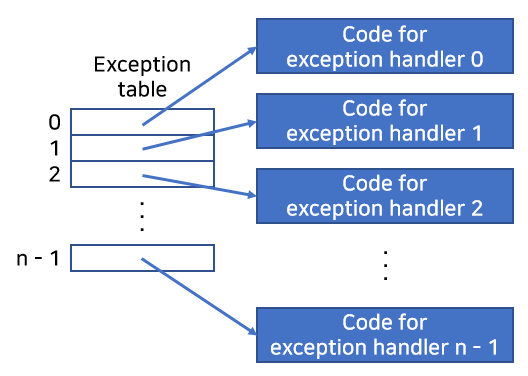
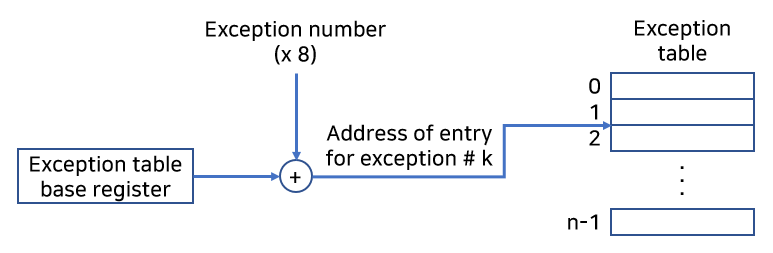
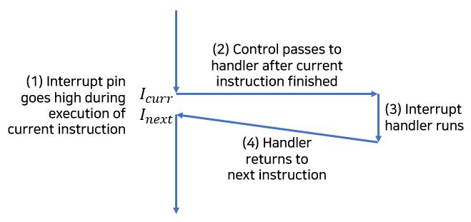
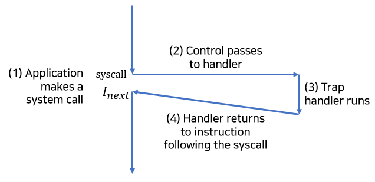
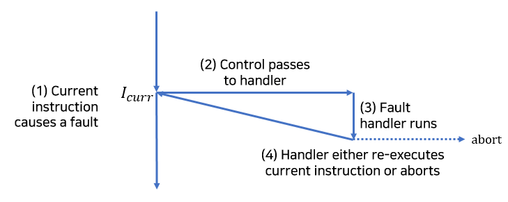
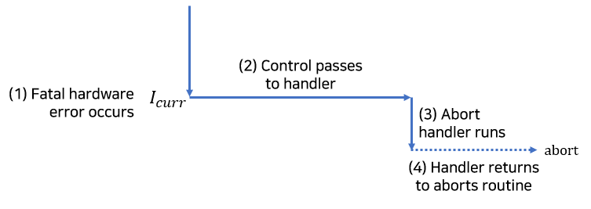

## 1. 예외적인 제어흐름 (Exceptional Control Flow)

프로그램 카운터(program counter)는 아래와 같이 연속된 값들을 가정한다.

$$
a_0, a_1, ..., a_{n-1}
$$

인스트럭션 $$I_k$$에 대응되는 주소가 $$a_k$$다. $$a_k$$에서 $$a_{k+1}$$로의 전환을
'제어이동'이라고 하며, 이러한 제어이동의 배열은 제어흐름(control flow)이라고 부른다.

보통의 제어흐름에서 $$I_k, I_{k+1}$$는 메모리상에서 나란히 존재한다.
`jmp`, `call`, `ret` 같은 인스트럭션에 의해 $$I_k$$가 $$I_{k+1}$$와 인접하지 않는 경우가 있을 수 있다.
이러한 인스트럭션은 프로그램의 상태 변화를 표현하기 위해 당연히 필요하다.

시스템은 프로그램에서 표현되지 않은 시스템 상태의 변화에도 반응할 수 있어야 한다.
시간, 입출력, 신호 등이 이러한 변화 중 하나가 될 수 있다.

현대 시스템은 특정 상황에 반응하기 위해 예외적인 제어흐름(exceptional control flow)을 만든다.
이러한 형태의 제어흐름은 생각보다 많이 쓰인다.
하드웨어 수준 이벤트, 커널 수준의 문맥전환(context switch), 시그널(signal) 보내고 받기,
비지역성 점프를 통한 에러 대응 등 수많은 기능이 제어를 이동시킨다.

프로그래머로서 예외적인 제어흐름, 즉 ECF를 이해하는 것에는 어떤 장점이 있을까.

1. ECF의 이해는 중요한 시스템 개념을 이해하는 데 도움을 준다.
    * ECF는 입출력, 프로세스, 가상메모리와 같은 중요 아이디어를 이해하기 위해 필요하다.
2. ECF의 이해는 응용프로그램이 트랩(trap)이나 시스템 콜(system call)과 같은 ECF의 한 형태로 운영체제와 상호작용하는 데 이해하는 데 도움을 준다.
3. ECF의 이해는 강력한 응용프로그램 작성에 도움을 준다.
4. ECF의 이해는 동시성(concurrency)의 이해에 도움을 준다.
    * 실행시간이 겹치는 프로세스, 쓰레드, 예외처리 핸들러, 시그널 핸들러를 이해하기 위해 필요하다.
5. ECF의 이해는 소프트웨어적인 예외상황의 이해에 도움을 준다.
    * C++와 자바 같은 언어는 `try`, `catch`, `throw` 키워드로 비지역성 점프를 하도록 해준다.
    * C에서는 `setjmp`, `longjmp` 함수로 제공되며, 이런 하위 함수의 이해는 상위 소프트웨어 예외가 어떻게 구현되는지 이해하는 데 도움을 준다.

## 2. 예외 상황 (Exceptions) 및 예외 처리 (Exception Handling)



예외 상황은 어떤 프로세서 상태의 변화에 대한 대응으로, 제어흐름의 갑작스런 변화다.
위 그림에서 프로세서는 $$I_{curr}$$를 실행하던 중에 상태 변화가 일어난다.

상태변화는 곧 이벤트(event)를 뜻한다.

이 이벤트는 현재 인스트럭션의 실행에 직접적으로 관련될 수 있다.
가상메모리 페이지 오류, 산술 오버플로우, divide by zero 시도 등이 그렇다.

반대로 현재 인스트럭션의 실행과 관련이 없을 수도 있다.
시스템 타이머가 정지하거나 I/O 요청이 완료되는 경우가 그렇다.



프로세서가 이벤트 발생을 감지하면,
예외 테이블(exception table)이라고 하는 점프 테이블을 통해
운영체제 서브루틴(예외처리 핸들러)으로 간접 프로시저 콜을 한다.

예외처리 핸들러가 처리를 끝내면, 예외상황을 발생시킨 이벤트의 종류에 따라서
다음과 같은 세 가지 중의 한 가지 일이 발생한다.

1. 핸들러는 제어를 현재 인스트럭션 $$I_{curr}$$로 돌려준다.
    * 이 인스트럭션은 이벤트가 발생했을 때 실행되고 있던 인스트럭션을 말한다.
2. 핸들러는 제어를 다음 인스트럭션 $$I_{next}$$로 돌려준다.
    * 이 인스터력션은 예외상황이 발생하지 않았다면 다음에 실행됐을 인스트럭션이다.
3. 핸들러는 중단된 프로그램을 종료한다.

시스템은 가능한 예외상황의 종류마다 중복되지 않는 양의 정수를 예외번호로 할당한다.
일부는 프로세서 설계자가, 나머지는 운영체제 커널 설계자가 할당한다.

전자는 divide by zero, 페이지 오류, 메모리 접근 위반, breakpoint, 산술연산 오버플로우가 있다.

후자는 시스템 콜, 외부 I/O 디바이스에서 온 시그널이 있다.

시스템 부팅 시, 운영체제는 예외 테이블을 할당하고 초기화해서
엔트리 k는 예외상황 k에 대한 핸들러의 주소를 갖는다.

런타임에 프로세서는 이벤트 발생을 감지하고, 대응하는 예외번호 k를 결정한다.
그리고 프로세서는 예외 테이블의 엔트리 k를 통해 간접 프로시저 콜을 해, 예외상황을 발생시킨다.
이 테이블의 시작주소는 예외 테이블 베이스 레지스터(exception table base register)라는 특별한 CPU 레지스터에 저장된다.

그림으로 그리면 아래와 같다.



예외 상황과 프로시저 콜은 유사하지만 차이가 있다.

1. 프로세서는 프로시저 콜을 사용해서 핸들러로 분기하기 전에 스택에 return address를 push한다. 주소는 예외 종류에 따라 현재 인스트럭션이나 다음 인스터럭션이 된다.
2. 프로세서는 핸들러가 리턴할 때 스택 상에 추가적인 프로세서 상태를 push한다.
3. 제어가 사용자 프로그램에서 커널로 전환될 때, 모든 아이템은 커널 스택 상에 push된다.
4. 예외 핸들러는 커널 모드에서 돌아가며, 모든 시스템 자원에 접근할 수 있다.

## 3. 예외 종류

예외 상황은 네 가지 종류로 구분할 수 있다. 다음 표를 보자.

| Class     | Cause                         | Async/Sync | Return behavior                     |
| --------- | ----------------------------- | ---------- | ----------------------------------- |
| Interrupt | Signal from I/O device        | Async      | Always returns to next instruction  |
| Trap      | Intentional exception         | Sync       | Always returns to next instruction  |
| Fault     | Potentially recoverable error | Sync       | Might return to current instruction |
| Abort     | Nonrecoverable error          | Sync       | Never returns                       |

비동기(async) 예외는 외부의 입출력 디바이스 내 이벤트로 발생한다.
동기(sync) 예외는 인스트럭션을 실행한 결과로 발생한다.

더 자세히 알아보자.

### (1) 인터럽트(Interrupt)



인터럽트는 비동기적으로 발생하는 예외로,
프로세서 외부에 있는 입출력 디바이스에게 온 시그널(signal)의 결과로 발생한다.

입출력 디바이스는 프로세서 칩의 핀에 시그널을 보내서 인터럽트를 발생시키고,
디바이스를 식별하는 예외번호를 시스템 버스에 보낸다.

프로세서는 현재 인스트럭션의 실행을 완료한 후에,
인터럽트 핀의 시그널을 발견하고 시스템 버스에서 예외번호를 읽어들이고,
적절한 인터럽트 핸들러를 호출한다.

핸들러가 리턴할 때, 제어를 다음 인스트럭션으로 돌려준다.
프로그램은 인터럽트가 발생하지 않은 것처럼 계속해서 실행될 것이다.

### (2) 트랩(Trap), 시스템 콜(System Call)



트랩은 의도적인 예외상황으로, 특정 인스트럭션을 실행한 결과로 발생한다.

트랩 핸들러는 인터럽트 핸들러와 마찬가지로 제어를 다음 인스트럭션으로 돌려준다.

트랩은 주사용은 시스템 콜과 같은 인터페이스를 제공하는 것이다.
사용자 프로그램은 파일 읽기(read), 새 프로세스 생성(fork), 새 프로그램 실행(execve),
현재 프로세스 종료(exit)와 같은 서비스를 커널에게 요청할 수 있다.
syscall 인스트럭션을 실행하면 트랩은 인자를 해독하고
적절한 커널 루틴을 호출하는 예외 핸들러로 이동시킨다.

보통 함수는 사용자 모드에서 돌아간다.
반면 시스템 콜은 커널 모드에서 돌아가며,
커널 스택 접근과 특별한 인스트럭션을 실행할 수 있다.

### (3) Fault



번역본에서 error와 다른 '오류'라고 번역했는데,
error와 혼동될 여지가 있어서 fault로만 부르겠다.

fault는 핸들러가 복구할 가능성이 있는 에러 조건에서 발생한다.
fault가 발생하면 프로세서는 제어를 fault 핸들러로 이동한다.

에러 조건을 정정하면, 제어를 fault를 발생시킨 인스트럭션으로 돌려준다.
그렇지 못하면, 핸들러는 커널 내부의 abort 루틴으로 리턴해서 응용 프로그램을 종료한다.

### (4) Abort



abort는 복구할 수 없는 치명적인 에러에서 발생한다.

abort 핸들러는 절대로 응용 프로그램으로 제어를 리턴하지 않으며,
응용프로그램을 종료하는 루틴으로 넘겨준다.

## 4. 리눅스/x86-64 시스템의 예외 상황

책에 있는 x86-64 시스템에서 정의된 일부 예외를 살펴보자.

| Exception number | Description              | Exception class   |
| ---------------- | ------------------------ | ----------------- |
| 0                | Divide error             | Fault             |
| 13               | General protection fault | Fault             |
| 14               | Page fault               | Fault             |
| 18               | Machine check            | Abort             |
| 32-255           | OS-defined exceptions    | Interrupt or trap |

32부터 255에 해당하는 예외를 운영체제가 직접 정의할 수 있다는 것이 신기하다.

시스템 콜을 직접 사용해보자.

```asm
    .section        .rodata
.LC0:
    .string "hello, world\n"
    .text
    .globl  main
    .type   main, @function
main:
    .cfi_startproc
; Call write(1, "hello, world\n", 13)
    movq    $1, %rax
    movq    $1, %rdi
    leaq    .LC0(%rip), %rsi
    movq    $13, %rdx
    syscall

; Call _exit(0)
    movq    $60, %rax
    movq    $0, %rdi
    syscall
    .cfi_endproc
```

`syscall` 인스트럭션을 실행함으로서 예외 상황이 발생한다.
`rax` 레지스터에 들어가는 정수에 따라 동작할 기능이 결정된다.

다음 코드와 동일한 동작을 한다.

```c
int main()
{
    write(1, "hello, world\n", 13);
    _exit(0);
}
```

이 다음 내용은 다음 글에 정리하겠다.

## 5. 마무리

시스템 콜이 그런 원리였다니...

## 출처

'Computer Systems A Programmer's Perspective (3rd Edition)'
