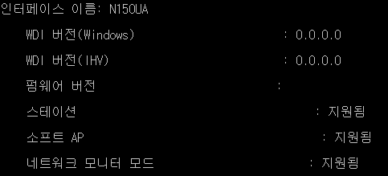

## 개요

windows에서 wireshark로 IEEE 802.11 패킷을 잡는 것을 목표로 글을 쓴다.

글 따라하려면 필요한 것.

* monitor mode를 지원하는 무선 어댑터
* npcap
* wireshark

## 1. monitor mode를 지원하는 무선 어댑터


나는 iptime N150UA로 했다.

## 2. npcap

<https://nmap.org/npcap/> 에서 받을 수 있다.


설치할 때 맨밑 옵션을 3개 체크한다.

## 3. wireshark

<https://www.wireshark.org/download.html> 에서 받을 수 있다.

### - monitor mode 지원 확인하는 방법

```powershell
netsh wlan show wirelesscapabilities
```

위 명령어를 쳐보고


이렇게 "네트워크 모니터 모드"가 "지원되지 않음"으로 뜨면 포기하자. 되게 해주는 드라이버를 찾등가



되는 어댑터는 이렇게 뜸

### - monitor mode 전환하기

npcap을 깔았다면 WlanHelper 프로그램을 사용할 수 있다.

인터페이스 이름이 N150UA라고 가정하겠다.

```powershell
WlanHelper N150UA mode
```

#### 인터페이스의 mode를 확인

```console
> WlanHelper N150UA mode
managed
```

보통 managed로 돼있다.

```bat
WlanHelper N150UA mode monitor
```

#### 인터페이스의 mode를 monitor mode로 변경

```console
> WlanHelper N150UA mode monitor
Success
```

Success가 뜨면 monitor mode로 바뀐 것이다.

### wireshark에서 IEEE 802.11 패킷 캡쳐


이제 wireshark에서 패킷을 잡고 싶다면 Capture Interfaces에서 캡쳐할 인터페이스의 Monitor Mode에 체크를 해주고 캡쳐를 시작하면 된다.


잘 잡힌다.
