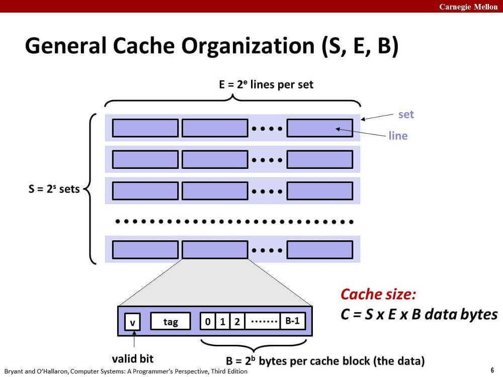
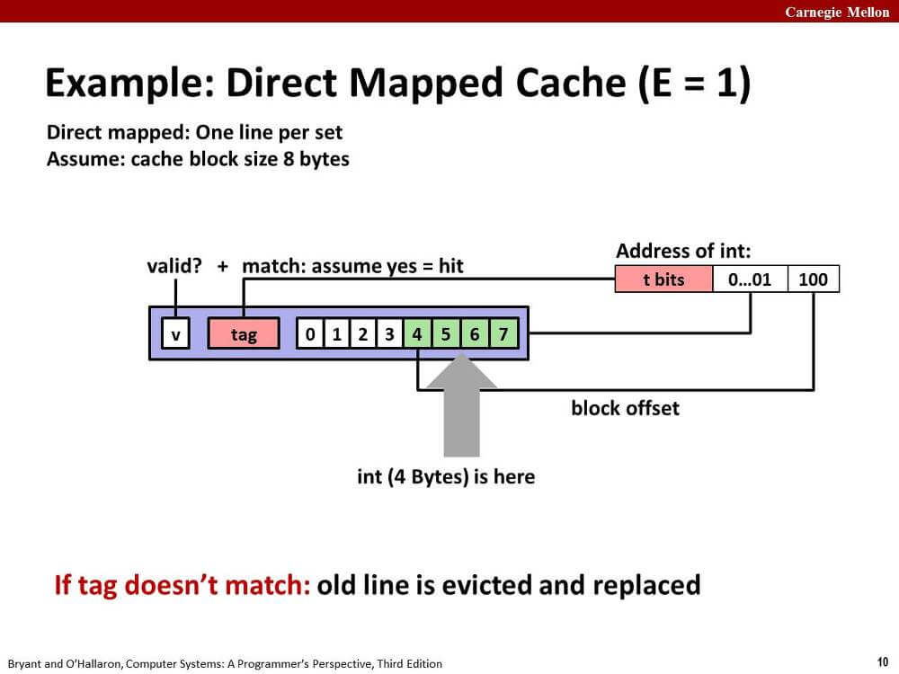
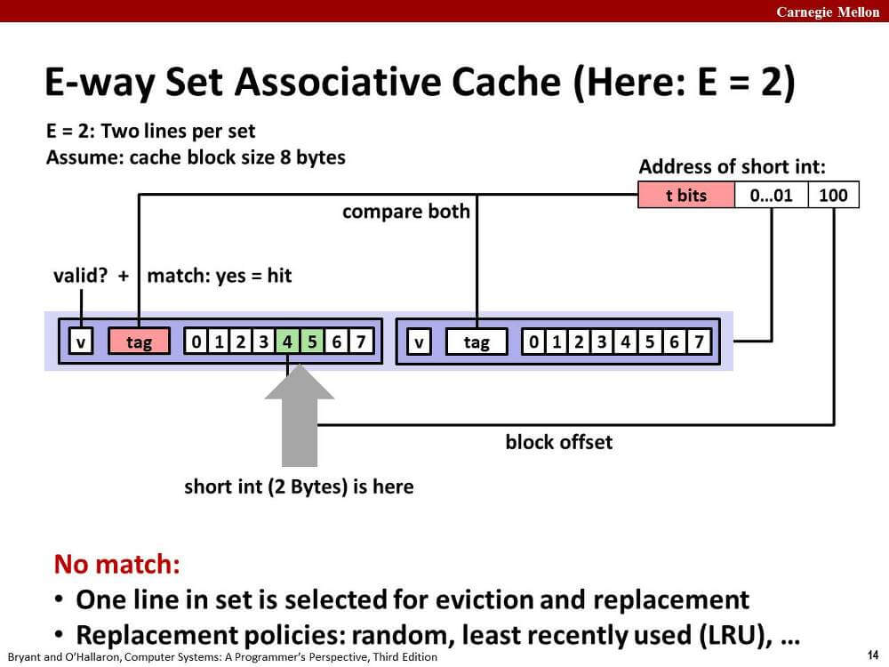
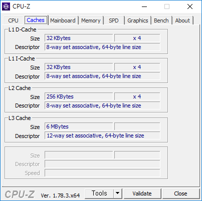

오늘은 캐시 메모리에 대해 정리.

짧게짧게 정리함.

## 1. cache hit, cache miss

찾으려는 데이터가 이미 캐시돼있다면 cache hit이 발생한다.
즉 메인 메모리를 거치지 않고 빠르게 데이터를 불러올 수 있다.

반대로 캐시돼있지 않다면 cache miss가 발생한다.
최악의 경우 메인 메모리에서 데이터를 가져와야 한다.

이미 가득찬 캐시에서 cache miss가 발생하면
캐시의 교체 정책에 따라 다른 캐시된 데이터를 추출하고 지금 불러오는 데이터를 캐시한다.

## 2. 기본 캐시 구조



한 레벨의 캐시에는 S개의 집합(set)이 존재한다.

한 집합에는 E개의 라인(line)이 존재한다.

한 line은 B바이트의 메모리 정보(data) 외에
유효 비트(vaild bit), 태그 비트(tag bit) 등을 가지고 있다.

아래 표를 정독하는 것도 좋다.

|Parameter|Description|
|---|---|
|Fundamental parameter|
|S = 2^s|Number of sets|
|E|Number of lines per set|
|B = 2^b|Block size (bytes)|
|m = log_2(M)|Number of physical (main memory) address bits|
|Derived parameter|
|M = 2^m|Maximum number of unique memory addresses|
|s = log_2(S)|Number of set index bits|
|b = log_2(B)|Number of block offset bits|
|t = m - (s + b)|Number of tag bits|
|C = B \* E \* S|Cache size (bytes), not including overhead such as the vaild and tag bits|

## 3. Direct Mapped Cache (E = 1)

이 형태의 캐시는 매우 간단하게 작동한다.



CPU가 메모리에서 정보를 읽어올 때, 주소의 중간 비트는 집합의 인덱스,
하위 비트는 라인의 비트 인덱스에 매핑된다.

메모리 주소의 상위 비트인 태그 비트가 캐시 라인에 있는 태그 비트와 일치하면 cache hit이 된다.

태그 비트가 일치하지 못해 cache miss가 발생하면 해당 라인에 바로 메모리를 캐시한다.

특정 주소 메모리는 특정 캐시 라인에만 캐시된다.
마치 해시테이블처럼 작동한다.

## 4. E-way Set Associative Cache (E > 1)

위의 Direct mapped cache는 충돌 미스(conflict miss)가 발생하기 쉽다는 단점이 있다.



메모리 주소의 중간 비트는 동일하게 집합 인덱스로 매핑된다.

CPU는 하나의 집합에 존재하는 모든 라인의 유효 비트와 태그 비트를 검사하여
cache hit인지 cache miss인지 판단한다.

만약 cache hit인 라인이 존재하면
그 라인에 대해서 하위 비트를 통해 필요한 데이터를 가져온다.

cache miss가 발생한다면?

처음에 언급한 대로 캐시 교체 정책에 따라 기존 캐시를 교체할 것이다.

LFU(least-frequently-used)도 있고...
LRU(least-recently-used)도 있고...
궁금하면 찾아보자.

## 5. 캐시 친화적인 코드 작성하기

코드 작성에 앞서 먼저 캐시의 성능은 다음과 같다고 가정한다. 지금 쓰는 데스크탑ㅎ



L1 D-캐시의 크기는 32 KByte, 캐시 라인의 크기는 64 byte다.

sumarrayrows 함수와 sumarraycols 함수 둘 중 어느 함수가 더 성능이 좋을까?

```c
int sumarrayrows(int a[M][N]) {
    int i, j, sum = 0;

    for (i = 0; i < M; i++)
        for (j = 0; j < N; j++)
            sum += a[i][j];
    return sum;
}

int sumarraycols(int a[M][N]) {
    int i, j, sum = 0;

    for (j = 0; j < N; j++)
        for (i = 0; i < M; i++)
            sum += a[i][j];
    return sum;
}
```

sumarrayrows는 stride-1 참조 패턴이다.

int 자료형의 크기가 4바이트라고 가정하면,
cache miss는 총 (4*M*N / 64)만큼 발생하고,
나머지 참조는 cache hit이라고 기대해볼 수 있다.

sumarraycols는 stride-N 참조 패턴이다.

배열의 크기가 충분히 작고, 운이 좋으면
sumarrayrows와 동일한 cache miss를 기대해볼 수 있다.

만약에 배열의 크기가 캐시보다 크다면?
모든 원소에 대해서 cache miss가 발생할 것이다.
총 (M*N)만큼의 cache miss가 말이다.

배열의 크기가 캐시보다 큰 경우는 생각보다 많다.
강의에서는 아래와 비슷한 코드를 제시한다(입맛에 맞게 많이 고침).

```c
void mmm(int n,
         double (*restrict a)[n],
         double (*restrict b)[n],
         double (*restrict c)[n])
{
    for (int i = 0; i < n; i++)
        for (int j = 0; j < n; j++)
            for (int k = 0; k < n; k++)
                c[i][j] += a[i][k] * b[k][j];
}
```

위 코드에서 n이 매우 크다고 생각해보자.
동일한 원소를 다시 참조하게 될 때, cache miss가 거의 반드시 발생할 것이다.

아래와 같이 L1 캐시 크기에 맞게 블럭화해서 계산하면
더 적은 cache miss, 그리고 더 많은 cache hit을 기대할 수 있다.

```c
void mmm2(int n,
          double (*restrict a)[n],
          double (*restrict b)[n],
          double (*restrict c)[n])
{
    int B = 12;
    for (int i = 0; i < n; i += B)
        for (int j = 0; j < n; j += B)
            for (int k = 0; k < n; k += B)
                for (int x = i; x < i + B; x++)
                    for (int y = j; y < j + B; y++)
                        for (int z = k; z < k + B; z++)
                            c[x][y] += a[x][z] * b[z][y];
}
```

명령줄 옵션 -mavx2 -O2을 주고
gcc를 실행한 바이너리에 1024 * 1024 크기의 double 배열로
mmm 함수와 mmm2 함수를 호출한 결과.

```sh
$ ./mmm2
mmm
11.118206269
mmm2
1.853558563
```

6배 정도의 성능 차이를 확인할 수 있었다.

## 6. 마무리

끝

## 출처

'Computer Systems A Programmer's Perspective (3rd Edition)'
