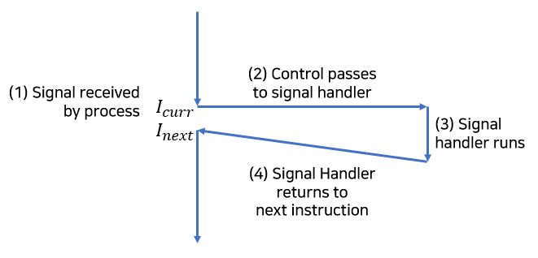
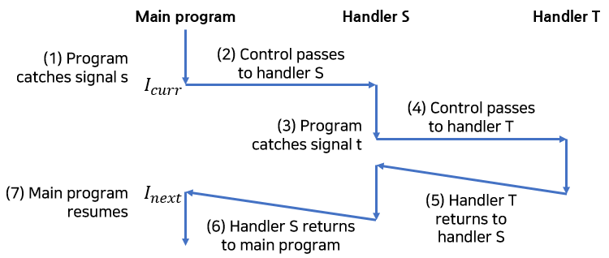

Signal!

시그널은 작은 메시지 형태로, 프로세스에게 시스탬 내에 어떤 종류의 이벤트가
일어났다는 것을 알려준다.

먼저 man 7 signal을 통해 시그널에 어떤 종류가 있는지 알아보자.

POSIX.1-1990 표준에 있는 시그널 (리눅스 x86 기준)

| Signal  | Value | Action                                       | Comment                                    |
| ------- | ----- | -------------------------------------------- | ------------------------------------------ |
| SIGHUP  | 1     | Terminate                                    | Terminal line hangup                       |
| SIGINT  | 2     | Terminate                                    | Interrupt from keyboard                    |
| SIGQUIT | 3     | Terminate and dump core (Book: Terminate)    | Quit from keyboard                         |
| SIGILL  | 4     | Terminate and dump core (Book: Terminate)    | Illegal instruction                        |
| SIGABRT | 6     | Terminate and dump core                      | Abort signal from abort function           |
| SIGFPE  | 8     | Terminate and dump core                      | Floating point exception                   |
| SIGKILL | 9     | Terminate                                    | Kill signal                                |
| SIGSEGV | 11    | Terminate and dump core                      | Invalid memory reference                   |
| SIGPIPE | 13    | Terminate                                    | Broken pipe: write to pipe with no readers |
| SIGALRM | 14    | Terminate                                    | Timer signal from alarm function           |
| SIGTERM | 15    | Terminate                                    | Termination signal                         |
| SIGUSR1 | 10    | Terminate                                    | User-defined signal 1                      |
| SIGUSR2 | 12    | Terminate                                    | User-defined signal 2                      |
| SIGCHLD | 17    | Ignore                                       | Child stopped or terminated                |
| SIGCONT | 18    | Continue if currently stopped (Book: Ignore) | Continue if stopped                        |
| SIGSTOP | 19    | Stop                                         | Stop process                               |
| SIGTSTP | 20    | Stop                                         | Stop typed at terminal                     |
| SIGTTIN | 21    | Stop                                         | Terminal input for background process      |
| SIGTTOU | 22    | Stop                                         | Terminal output for background process     |

SIGKILL과 SIGSTOP은 획득하거나(caught) 블럭되거나(blocked) 무시될(ignored) 수 없다.

core는 코드와 데이터 이미지를 디스크에 기록하는 것을 의미한다.

SUSv2와 POSIX.1-2001에 추가된 시그널. (리눅스 x86 기준. SIGPOLL 생략)

| Signal    | Value | Action                                               | Comment                       |
| --------- | ----- | ---------------------------------------------------- | ----------------------------- |
| SIGBUS    | 7     | Terminate and dump core (until Linux 2.2: Terminate) | Bus error (bad memory access) |
| SIGPROF   | 27    | Terminate                                            | Profiling timer expired       |
| SIGSYS    | 31    | Terminate and dump core (until Linux 2.2: Terminate) | Bad argument to routine       |
| SIGTRAP   | 5     | Terminate and dump core                              | Trace/breakpoint trap         |
| SIGURG    | 23    | Ignore                                               | Urgent condition on socket    |
| SIGVTALRM | 26    | Terminate                                            | Virtual alarm clock           |
| SIGXCPU   | 24    | Terminate and dump core (until Linux 2.2: Terminate) | CPU time limit exceeded       |
| SIGXFSZ   | 25    | Terminate and dump core (until Linux 2.2: Terminate) | File size limit exceeded      |

그밖에 다양한 시그널. (리눅스 x86 기준. SIGEMT, SIGCLD, SIGINFO, SIGLOST 생략)

| Signal    | Value | Action                  | Comment                             |
| --------- | ----- | ----------------------- | ----------------------------------- |
| SIGIOT    | 6     | Terminate and dump core | IOT trap. A synonym for SIGABRT     |
| SIGSTKFLT | 16    | Terminate               | Stack fault on coprocessor (unused) |
| SIGIO     | 29    | Terminate               | I/O now possible                    |
| SIGPWR    | 30    | Terminate               | Power failure                       |
| SIGWINCH  | 28    | Ignore                  | Window resize signal                |
| SIGUNUSED | 31    | Terminate               | Synonymous with SIGSYS              |

어떤 시그널은 특정 종류의 시스템 이벤트에 대응된다.

예를 들어, 어떤 프로세스가 0으로 나누려고 하면 커널은 SIGFPE 시그널(8번)을 프로세스에 보낸다.

다른 시그널은 다른 사용자 프로세스 내부의 상위수준 소프트웨어 이벤트에 대응된다.

예를 들어, 어떤 프로세스가 포그라운드(foreground)에서 돌아가고 있을 때 Ctrl+C를 입력하면
커널은 SIGINT(2번)을 포그라운드 프로세스 그룹에 속한 각 프로세스에 보낸다.

## 1. 시그널 용어 (Signal Terminology)

시그널을 목적지 프로세스로 전달하는 것은 두단계로 이루어진다.

### (1) 시그널 전송 (Sending Signals)

커널은 프로세스의 컨텍스트(context) 내에 있는 일부 상태를 갱신해서
시그널을 목적지 프로세스로 보낸다.

시그널은 다음 두 가지 이유 중 하나로 보내진다.

1. 0으로 나누기나 자식 프로세스의 종료 같은 시스템 이벤트.
2. 어떤 프로세스가 커널에 명시적으로 시그널을 목적 프로세스에 보낼 것을 요구하기 위해 kill 함수 호출.

### (2) 시그널 수신 (Receiving Signals)



전송된 시그널에 대해서 행동이 필요할 때, 목적지 프로세스는 시그널을 받는다.

프로세스는 시그널 핸들러(signal handler)를 실행해서 시그널을 무시하거나(ignore),
종료하거나(terminate), 획득할(catch) 수 있다.

전송했지만 아직 수신되지 않은 시그널을 펜딩 시그널(pending signal)이라고 부른다.

pending 시그널은 특정 타입에 대해 최대 한 개만 존재할 수 있다.
어떤 프로세스가 특정 타입의 pending 시그널을 가지고 있으면
다음에 발생하는 같은 타입의 시그널은 큐(queue)에 들어가지 않는다. 즉, 버려진다.

프로세스는 선택적으로 어떤 시그널의 수신을 블록할(block) 수 있다.
전송은 가능하지만, pending 시그널은 블록이 풀릴 때까지 수신되지 않을 것이다.

커널은 각 프로세스에 대해 pending 비트 벡터(signal mask) 내에 시그널의 집합을 관리하며,
blocked 비트 벡터 내에서 블록된 시그널의 집합을 관리한다.

커널은 pending 내에 비트 k를 타입 k의 시그널이 배달될 때마다 설정하며,
시그널 타입 k가 수신될 때마다 pending의 비트 k를 0으로 만든다.

## 2. 시그널 전송 (Sending Signals)

### (1) 프로세스 그룹

모든 프로세스는 항상 한 개의 프로세스 그룹에 속하며,
양수 프로세스 그룹 ID(process group ID)로 식별한다.

```c
#include <unistd.h>

pid_t getpgrp(void);
// Returns: process group ID of caling process
int setpgid(pid_t pid, pid_t pgid);
// Returns: 0 on success, -1 on error
```

getpgrp 함수를 호출해서 현재 프로세스의 process group ID를 얻을 수 있다.

setpgid 함수를 호출해서 프로세스 pid의 프로세스 그룹을 pgid로 변경한다.
pid나 pgid 인자에 0을 주면 현재 프로세스의 pid를 사용한다.

### (2) /bin/kill 프로그램

/bin/kill 프로그램을 실행해서 다른 프로세스에 시그널을 보낼 수 있다.

SIGKILL 시그널(9번)을 프로세스 15213에 보내려면

/bin/kill -9 15213

SIGKILL 시그널(9번)을 프로세스 그룹 15213에 보내려면

/bin/kill -9 -15213

### (3) 키보드

쉘에서 최대 한 개의 포그라운드 작업(job)과 0개 이상의 백그라운드 작업이 존재할수 있다.

키보드에서 Ctrl+C를 입력해서 포그라운드 프로세스 그룹에 속한 모든 프로세스에
SIGINT 시그널을 보낼 수 있다. 결과적으로 포그라운드 작업은 종료된다.

키보드에서 Ctrl+Z를 입력해서 포그라운드 프로세스 그룹에 속한 모든 프로세스에
SIGSTP 시그널을 보낼 수 있다. 결과적으로 포그라운드 작업은 중지된다(suspend).

### (4) kill 함수

```c
#include <sys/types.h>
#include <signal.h>

int kill(pid_t pid, int sig);
// 0 if OK, -1 on error
```

pid 인자가 0이면 kill 함수는 호출한 프로세스가 속한 프로세스 그룹의
모든 프로세스에 시그널 sig를 보낸다.
pid 인자가 0보다 작으면 kill 함수는프로세스 그룹 |pid|의
모든 프로세스로 보낸다.

다음은 kill 함수의 예제다.

```c
#include "csapp.h"

int main()
{
    pid_t pid;

    if ((pid = Fork()) == 0) {
        Pause();
        printf("control should never reach here!\n");
        exit(0);
    }

    kill(pid, SIGKILL);
    exit(0);
}
```

### (5) alarm 함수

```c
#include <unistd.h>

unsigned int alarm(unsigned int secs);
// Returns: remaining seconds of previous alarm, or 0 if no previous alarm
```

alarm 함수는 커널이 secs초마다 프로세스로 SIGALRM 시그널을 보내도록 한다.

## 3. 시그널 수신 (Receiving Signals)

커널이 프로세스를 커널 모드(kernel mode)에서 사용자 모드(user mode)로 전환할 때,
커널은 해당 프로세스의 pending  & ~blocked 집합을 체크한다.

이 집합이 비어있으면, 커널은 제어를 해당 프로세스의 논리 제어흐름(logical control flow)
내의 다음 인스트럭션($I_{next}$)으로 전달한다.

이 집합이 비어있지 않다면, 커널은 집합 내에서 시그널을 선택해서
프로세스가 이 시그널을 수신하게 한다.

시그널을 수신한 프로세스는 해당 시그널에 맞는 동작을 한다.
해당 동작이 끝나면, 제어는 p의 논리 제어흐름 내의 다음 인스트럭션으로 돌아간다.

각 시그널은 글 처음에 보여준 표와 같은 기본 동작(default action)을 가지며,
SIGSTOP, SIGKILL을 제외한 시그널의 기본 동작을 signal 함수를 통해 수정할 수 있다.

```c
#include <signal.h>
typedef void (*sighandler_t)(int);

sighandler_t signal(int signum, sighandler_t handler);
// Returns: pointer to previous handler if OK, SIG_ERR on error (does not set errno)
```

signal 함수는 시그널 signum에 대한 동작을 다음 세 가지 방법 중 하나로 바꿀 수 있다.

1. handler가 SIG_IGN
    * signum 타입의 시그널을 무시한다.
2. handler가 SIG_DFL
    * signum 타입의 시그널에 대한 동작을 기본 동작으로 한다.
3. 그 외의 handler
    * 이는 프로세스가 signum 타입의 시그널을 수신할 때마다 handler가 호출된다. 이 handler는 시그널 핸들러(signal handler)라고 부르는 사용자 함수 주소다.

이를 핸들러를 설치한다(installing)고 말한다.
핸들러의 호출은 시그널을 잡는다(catching the signal)고 부르고,
핸들러의 실행은 시그널을 처리한다(handling the signal)고 부른다.

시그널 핸들러는 잡힌 시그널 번호를 인자로 하여 호출되는데,
이는 동일한 핸들러 함수가 여러 종류의 시그널을 잡을 수 있도록 함이다.

시그널 수신 예제를 보자.

```c
#include "csapp.h"

void sigint_handler(int sig)
{
    printf("Caught SIGINT!\n");
    exit(0);
}

int main()
{
    if (signal(SIGINT, sigint_handler) == SIG_ERR)
        unix_error("signal error");

    pause();

    return 0;
}
```

위 프로그램은 사용자가 Ctrl+C를 입력할 때 보내지는 시그널 SIGINT를 잡으면
"Caught SIGINT!\n"를 출력하고 종료한다.



시그널 핸들러는 다른 시그널에 의해 중지될 수 있다.

시그널 s에 연결된 핸들러 S가 실행되는 동안 시그널 t(시그널 s는 안잡히나봄)를 잡아서
핸들러 T가 실행되는 일이 가능하다.

## 4. 마무리

시그널의 기본 개념은 이 글에서 얼추 정리했고, 자세한 개념은 다음 글에서 정리한다.

군대가기 전에 사놓은 책 다 읽어야하는데.

## 출처

'Computer Systems A Programmer's Perspective (3rd Edition)'
