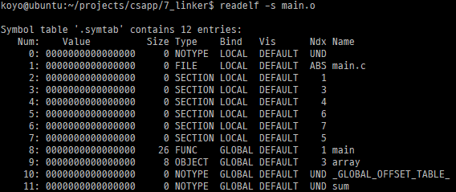

리눅스와 ELF-64 포맷 기준.

## 1. 컴파일러 드라이버

gcc와 같은 컴파일러 드라이버(Compiler driver)는 필요에 따라 전처리기, 컴파일러, 어셈블러, 링커를 호출한다.

main.c

```c
int sum(int *a, int n);

int array[2] = { 1, 2 };

int main() {
    int val = sum(array, 2);
    return val;
}
```

sum.c

```c
int sum(int *a, int n) {
    int i, s = 0;

    for (i = 0; i < n; i++) {
        s += a[i];
    }
    return s;
}
```

위 소스코드를 실행 파일로 만들고 싶다면 다음 명령어 한 줄만 실행하면 된다.

gcc -Og -o prog main.c sum.c

실제로 아래와 같은 과정을 거쳐 prog 파일을 생성한다. (명령어 또는 옵션이 다를 수 있음)

```sh
cpp main.c /tmp/main.i
cc1 -Og -o /tmp/main.s /tmp/main.i
as -o /tmp/main.o /tmp/main.s

cpp main.c /tmp/sum.i
cc1 -Og -o /tmp/sum.s /tmp/sum.i
as -o /tmp/sum.o /tmp/sum.s

ld -o prog [system object files] /tmp/main.o /tmp/sum.o
```

## 2. 목적 파일(Object File)

목적 파일에는 세가지 종류가 있다.

1. 재배치 가능 목적 파일(Relocatable object file)
2. 실행 가능 목적 파일(Executable object file)
3. 공유 목적 파일(Shared object file)

x86-64 리눅스와 유닉스 시스템은 ELF(Executable and Linkable Format)을 사용한다.

ELF 재배치 가능 목적파일은 다음과 같은 포맷을 가진다.

|ELF header|설명|
|---|---|
|.text|프로그램의 머신 코드가 있다.|
|.rodata|Read only data. 리터럴 문자열이나 switch 점프테이블 같은 데이터가 있다.|
|.data|0이 아닌 값으로 초기화된 C 전역변수와 정적변수가 있다.|
|.bss|초기화되지 않았거나 0으로 초기화된 전역변수와 정적변수가 있다.|
|.symtab|전역변수와 함수에 대한 정보를 가지고 있는 심볼 테이블.|
|.rel.text|링커가 이 목적 파일을 다른 파일과 연결할 때 수정돼야 하는 .text 섹션 내 위치 리스트.|
|.rel.data|이 모듈에 의해 정의되거나 참조되는 전역변수들에 대한 재배치 정보.|
|.debug|디버깅 심볼 테이블. 컴파일러 드라이버가 -g 옵션으로 실행된 경우에 생성.|
|.line|C 소스와 .text 섹션 내 머신 코드의 매핑. 컴파일러 드라이버가 -g 옵션으로 실행된 경우에 생성.|
|.strtab|.strtab과 .debug 섹션들 내에 있는 심볼 테이블과 섹션 헤더들에 있는 섹션 이름들을 위한 스트링 테이블.|
|Section header table||

## 3. 심볼

각 재배치 가능한 목적 모듈이 갖고 있는 심볼 테이블에는 해당 모듈에 의해 정의되고 참조되는 심볼에 대한 정보를 포함하고 있다.

심볼은 세 가지 종류가 있다.

1. 한 모듈에서 정의되고 다른 모듈에서 참조 가능한 전역 심볼.
    * 비정적 C 함수와 전역변수가 해당된다.
2. 한 모듈에서 참조하나 다른 모듈에서 정의된 전역 심볼.
    * external이라고 부르며, 다른 모듈에서 정의된 비정적 C 함수와 전역변수가 해당된다.
3. 한 모듈에서 정의되고 배타적으로 참조하는 지역 심볼.
    * static 타입으로 선언된 정적 C 함수와 전역변수가 해당된다. 다른 모듈에서 접근할 수 없다.

재배치 가능 목적 파일, main.o의 심볼 테이블을 보자.



8번 엔트리의 전역 심볼 main은 .text 섹션(Ndx 1)에 위치하는 26바이트 함수다.

9번 엔트리의 전역 심볼 array는 .data 섹션(Ndx 3)에 위치하는8바이트 객체다.

마지막 엔트리 sum의 Ndx인 UND(UNDEF)는 정의되지 않은 심볼을 뜻한다.

전역 심볼이 중복되면 링커는 어떻게 처리할까? 중복되는 족족 오류를 낼 것 같지만 그렇지 않은가보다.

gcc에서 사용하는 링커는 심볼을 강한 심볼(String symbol)과 약한 심볼(Weak symbol)로 나눈다.

* 강한 심볼: 함수, 초기화된 전역변수
* 약한 심볼: 초기화되지 않은 전역변수

그리고 세 규칙에 따라 처리한다.

* 규칙 1: 동일한 이름을 갖는 복수의 강한 심볼을 허용하지 않는다.
* 규칙 2: 동일한 이름의 강한 심볼과 다수의 약한 심볼이 있으면 강한 심볼을 선택한다.
* 규칙 3: 동일한 이름의 여러 개의 약한 심볼이 있으면 어떤 약한 심볼을 선택해도 상관없다.

규칙 2와 규칙 3이 사람을 골때리게 하는데...

규칙 2가 적용되는 예를 보자.

foo3.c

```c
#include <stdio.h>
void f(void);

int x = 15213; // strong symbol

int main() {
    f();
    printf("x = %d\n", x);
    return 0;
}
```

bar3.c

```c
int x; // weak symbol

void f() {
    x = 15212;
}
```

foo3을 작성한 사람 입장에서는 bar3에 알려주지 않은 x 값이 15212로 바뀌는 것으로 보일 수 있다.

링커는 규칙 2와 규칙 3 적용에 대해 메시지를 알려주지 않는다. 프로그래머가 주의해야 한다.

규칙 3이 적용되는 예도 위와 비슷하다.

foo4.c

```c
#include <stdio.h>
void f(void);

int x; // weak symbol

int main() {
    x = 15213;
    f();
    printf("x = %d\n", x);
    return 0;
}
```

bar4.c

```c
int x; // weak symbol

void f() {
    x = 15212;
}
```

이름이 같고 자료형이 다른 경우도 있다.

foo5.c

```c
#include <stdio.h>
void f(void);

int y = 15212;
int x = 15213; // strong symbol

int main() {
    f();
    printf("x = 0x%x y = 0x%x \n",
           x, y);
    return 0;
}
```

bar5.c

```c
double x; // weak symbol

void f() {
    x = -0.0;
}
```

foo5.c에 int형의 강한 심볼 x가 있고, bar5.c에서 double형의 약한 심볼 x가 있다.

이걸 빌드해서 실행해보면...

```sh
$ gcc -Og -o foobar5 foo5.c bar5.c
/usr/bin/ld: Warning: alignment 4 of symbol `x' in /tmp/cckW0czr.o is smaller than 8 in /tmp/ccPHbxS6.o
$ ./foobar5
x = 0x0 y = 0x80000000
$
```

충격적인 결과를 확인할 수 있다.

다행히도 이렇게 자료형 크기가 다른 경우에는 경고 메시지를 확인할 수 있다.

반대로 자료형 크기만 같으면 자료형이 달라도 경고나 에러를 확인할 수 없으므로 조심하자.

## 4. 마무리

오랜만에 글을 작성했다.

글을 쓰는게 넘 어려우니까 쓰기가 싫어져서 조금씩조금씩 썼다.

## 출처

'Computer Systems A Programmer's Perspective (3rd Edition)'
