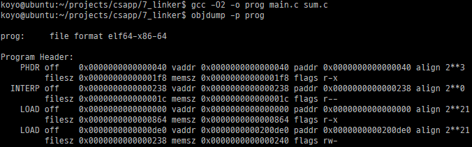
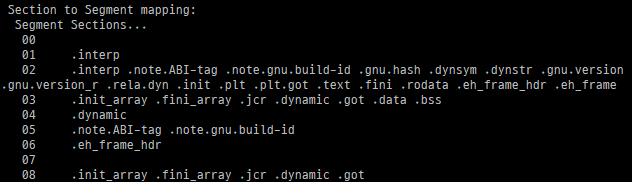
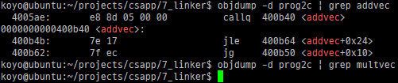
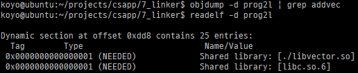

이번 글에서는 실행 파일, 라이브러리 링크, 라이브러리 삽입에 대해 정리한다.

## 1. 실행 가능한 목적 파일

실행 가능한 목적 파일은 완전히 링크된 상태이기 때문에 .rel 섹션이 필요없다.

실행에서 로드가 어떻게 되는 건지 알아보기 위해 프로그램 헤더를 살펴보자.



첫번째 LOAD에서 알 수 있는 정보는 이렇다.

해당 영역의 세그먼트(코드 세그먼트)는 읽기/실행이 허용된다. 메모리의 0x000~0x864 영역이 파일의 0x000~0x864 영역 바이트로 초기화된다.

파일의 0x000~0x864 영역에는 무엇이 있는가 하면..



위 스크린샷의 02번 라인에 해당하는 섹션이 존재한다. .init과 .text, 그리고 .rodata 섹션이 포함된 것을 알 수 있다.

두번째 LOAD에서 알 수 있는 정보는 이렇다.

해당 영역의 세그먼트(데이터 세그먼트)는 읽기/쓰기가 허용된다. 메모리 주소 0x200de0에서 시작하여 크기는 0x240 바이트다. 이 메모리 영역은 파일의 0xde0부터 0x238 개의 바이트로 초기화된다.

여기에는 .data나 .bss 같은 섹션이 존재한다. (위 스크린샷에서 03번 라인)

책에서는 잠깐 실행 가능한 목적파일을 로드하는 과정에 대해서는 설명하는데, 이 글에서는 생략한다.

## 2. 정적 라이브러리

C 언어 표준에는 많은 함수가 존재한다.

그리고 libc.a나 libm.a 등의 라이브러리에서 이 함수들을 정의하고 있다.

이러한 라이브러리가 정확히 뭔지 이해하기 전에, 표준 함수를 사용하기 싶으면 libc.o와 같은 재배치 가능 목적파일을 링크해야된다고 생각해보자.

libc.o가 있다고 가정하면 크기는 약 5 MB 정도(libc.a의 크기)가 될 것이다. 만약 atoi나 strlen 같은 함수를 사용하기 위해 이 파일을 그대로 링크하면 사용하지 않은 함수도 같이 실행 파일에 포함되고 만다.

프로그램을 실행하면 사용하지 않는 머신 코드도 같이 메모리에 로드되기 때문에 메모리 공간이 낭비된다.

그래서 당연하게도 사용하는 코드만 실행 파일에 실제로 포함이 된다.

그럼 한번 정적 라이브러리를 만들어보자.

예제 코드는 다음과 같다.

addvec.c

```c
void addvec(int *x, int *y, int *z, int n) {
    addcnt++;
    for (int i = 0; i < n; i++)
        z[i] = x[i] + y[i];
}
```

multvec.c

```c
int multcnt = 0;

void multvec(int *x, int *y, int *z, int n) {
    multcnt++;
    for (int i = 0; i < n; i++)
        z[i] = x[i] * y[i];
}
```

main2.c (vector.h에는 addvec과 multvec 함수의 선언이 있다.)

```c
#include <stdio.h>
#include "vector.h"

int x[2] = { 1, 2 };
int y[2] = { 3, 4 };
int z[2];

int main() {
    addvec(x, y, z, 2);
    printf("z = [%d %d]\n", z[0], z[1]);
    return 0;
}
```

먼저 addvec.c와 multvec.c를 컴파일해서 libvector.a 라이브러리로 만든다.

```sh
gcc -O2 -c addvec.c multvec.c
ar rcs libvector.a addvec.o multvec.o
```

그리고 main2.c를 컴파일하고 libvector.a를 링크한다.

```sh
gcc -O2 -c main2.c
gcc -static -o prog2c main2.o ./libvector.a
# gcc -static -o prog2c main2.o -L. -lvector
```



main2.c에서 사용한 addvec 함수는 실행파일에 포함되고, multvec 함수는 포함되지 않은 걸 확인할 수 있다.

## 3. 공유 라이브러리

정적 라이브러리도 단점이 있다. 프로그래머가 최신 버전의 라이브러리를 사용하고 싶다면 명시적으로 자신의 프로그램을 갱신된 라이브러리와 링크해야 한다.

그리고 많은 프로그램이 표준 함수를 사용하는데, 이 표준 함수가 각기 다른 메모리 공간에 복사되어 사용되면 이만한 공간 낭비가 또 없다.

그래서 공유 라이브러리를 사용하는데... 말재주가 없으니 설명은 여기까지 하고 실습만 함.

### (1) 동적 링크

```sh
gcc -shared -fpic -O2 -o libvector.so addvec.c multvec.c
```

-shared 플래그는 링커가 공유 목적파일을 만들도록 컴파일러에 지시한다.

-fpic은 PIC로 만들라는 뜻인데, 재배치 작업 없이 로드될 수 있는 코드를 PIC(position-independent code)라고 부른다.

PIC 코드는 단 하나의 복사본이 무한한 수의 프로세스에 의해 공유될 수 있다.

```sh
gcc -O2 -o prog2l main2.c ./libvector.so
```

실행파일 prog2l을 libvector.so와 링크될 수 있는 형태로 생성한다. 이 시점에서 libvector.so에서 prog2l에 복사되는 코드 섹션이나 데이터 섹션은 없다.



readelf나 objdump, 그리고 ldd 명령어를 통해 내가 링크한 라이브러리를 확인할 수 있다.

### (2) 런타임 동적 링크

리눅스는 런타임에 공유 라이브러리를 로드하고 링크할 수 있는 인터페이스를 제공한다.

```c
#include <dlfcn.h>

void *dlopen(const char *filename, int flag);
```

`dlopen` 함수는 공유 라이브러리 파일 이름을 로드하고 링크한다.

```c
#include <dlfcn.h>

void *dlsym(void *handle, char *symbol);
```

`dlsym` 함수는 `dlopen` 함수를 통해 얻은 핸들과 심볼 이름을 받고 심볼 주소를 리턴한다.

```c
#include <dlfcn.h>

int dlclose(void *handle);
```

open했으니까 close도.

```c
#include <dlfcn.h>

const char *dlerror(void);
```

`dlopen`, `dlsym`, `dlclose`를 호출한 결과로 가장 최근에 발생한 에러를 설명하는 스트링을 리턴한다.

사용 예는 다음과 같다.

```c
#include <stdio.h>
#include <stdlib.h>
#include <dlfcn.h>

int x[2] = { 1, 2 };
int y[2] = { 3, 4 };
int z[2];

int main() {
    void *handle;
    void (*addvec)(int *, int *, int *, int);
    char *error;

    handle = dlopen("./libvector.so", RTLD_LAZY);
    if (!handle) {
        fprintf(stderr, "%s\n", dlerror());
        exit(1);
    }

    addvec = dlsym(handle, "addvec");
    if ((error = dlerror()) != NULL) {
        fprintf(stderr, "%s\n", error);
        exit(1);
    }

    addvec(x, y, z, 2);
    printf("z = [%d %d]\n", z[0], z[1]);

    if (dlclose(handle) < 0) {
        fprintf(stderr, "%s\n", dlerror());
        exit(1);
    }
    return 0;
}
```

빌드는 다음 줄로 가능하다.

```sh
gcc -rdynamic -o prog2r dll.c -ldl
```

## 4. 라이브러리 삽입 (Library Interpositioning)

공유 라이브러리 함수로의 호출을 가로채서 내 코드를 대신 실행할 수 있게 해주는 방법이 여러 가지 있다.

다음 코드에서 호출하는 malloc의 호출을 가로채는 것이 목표이다.

int.c

```c
#include <stdio.h>
#include <malloc.h>

int main() {
    int *p = malloc(32);
    free(p);
    return 0;
}
```

### (1) 컴파일타임

malloc.h

```c
#define malloc(size) mymalloc(size)
#define free(ptr) myfree(ptr)

void *mymalloc(size_t size);
void myfree(void *ptr);
```

mymalloc.c

```c
#ifdef COMPILETIME
#include <stdio.h>
#include <malloc.h>

void *mymalloc(size_t size) {
    void *ptr = malloc(size);
    printf("malloc(%zu) = %p\n", size, ptr);
    return ptr;
}

void myfree(void *ptr) {
    free(ptr);
    printf("free(%p)\n", ptr);
}
#endif
```

컴파일은 이렇게 한다.

```sh
gcc -DCOMPILETIME -c mymalloc.c
gcc -I. -o intc int.c mymalloc.o
```

실행결과는 다음과 같다.

```sh
$ ./intc
malloc(32) = 0x5647549ed010
free(0x5647549ed010)
```

### (2) 링크타임

다음과 같이 mymalloc.c를 작성한다.

```c
#ifdef LINKTIME
#include <stdio.h>

void *__real_malloc(size_t size);
void __real_free(void *ptr);

void *__wrap_malloc(size_t size) {
    void *ptr = __real_malloc(size);
    printf("malloc(%zu) = %p\n", size, ptr);
    return ptr;
}

void __wrap_free(void *ptr) {
    __real_free(ptr);
    printf("free(%p)\n", ptr);
}
#endif
```

리눅스 정적링커는 --wrap 플래그를 통해 링크시 삽입을 지원한다.

만약 --wrap f 플래그를 사용하면 심볼 f에 대한 참조를 __wrap_f로 결정하며, __real_f로의 참조를 심볼 f로 결정한다.

다음과 같이 실행파일을 작성한다.

```sh
gcc -DLINKTIME -c mymalloc.c
gcc -c int.c
gcc -Wl,--wrap,malloc -Wl,--wrap,free -o intl int.o mymalloc.o
```

-Wl,option은 option를 링커에 전달하는 플래그다. 여기서 쉼표는 빈칸으로 치환된다.

즉, --wrap malloc과 --wrap free를 링커에 전달한다는 이야기다.

실행결과는 다음과 같다.

```sh
$ ./intl
malloc(32) = 0x55e5d4ba2010
free(0x55e5d4ba2010)
```

### (3) 런타임

런타임에 함수 호출을 가로챌 수 있다.

동적링커의 LD_PRELOAD 환경변수를 활용하는 방법이다.

LD_PRELOAD 환경변수에 공유 라이브러리가 설정되어 있으면 동적링커는 제일 먼저 LD_PRELOAD에 설정된 라이브러리를 먼저 검사한다.

이 방법을 통해서 공유 라이브러리에 있는 어떤 함수든지 후킹할 수 있다.

다음과 같이 mymalloc.c를 작성한다.

```c
#ifdef RUNTIME
#define _GNU_SOURCE
#include <stdio.h>
#include <stdlib.h>
#include <unistd.h>
#include <dlfcn.h>

void *malloc(size_t size) {
    void *(*mallocp)(size_t);
    char *error;

    mallocp = dlsym(RTLD_NEXT, "malloc");
    if ((error = dlerror()) != NULL) {
        fputs(error, stderr);
        exit(1);
    }
    void *ptr = mallocp(size);
    dprintf(STDERR_FILENO, "malloc(%zu) = %p\n", size, ptr);
    return ptr;
}

void free(void *ptr) {
    void (*freep)(void *) = NULL;
    char *error;

    if (!ptr)
        return;

    freep = dlsym(RTLD_NEXT, "free");
    if ((error = dlerror()) != NULL) {
        fputs(error, stderr);
        exit(1);
    }
    freep(ptr);
    printf("free(%p)\n", ptr);
}
#endif
```

malloc 함수 내부에서 stdout으로 문자열을 출력하려 하니까, 재귀함수 형태로 malloc이 호출되면서 스택이 터지길래 stderr로 바꿨다.

다음과 같은 명령어를 통해 공유 라이브러리를 빌드한다.

```sh
gcc -DRUNTIME -shared -fpic -o mymalloc.so mymalloc.c -ldl
gcc -o intr int.c
```

실행은 이렇게 한다.

```sh
LD_PRELOAD=./mymalloc.so ./intr
```

실행 결과는 다음과 같다.

```sh
$ LD_PRELOAD=./mymalloc.so ./intr
malloc(32) = 0x55c21567d010
malloc(1024) = 0x55c21567d010
free(0x55c21567d010)
```

## 5. 마무리

링킹이 생각보다 심오하고 재밌는 과정이란 걸 알게 됐다.

## 출처

'Computer Systems A Programmer's Perspective (3rd Edition)'
