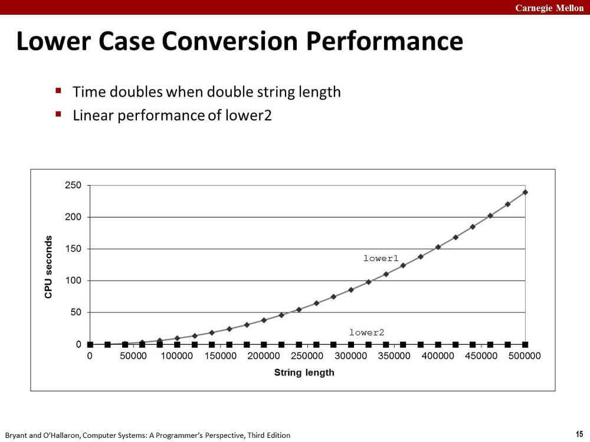

오늘은 인강도 참고했다. 이어폰 안가져와서 교수님 목소리 못듣고 페이지만 봄ㅜㅜ

<https://scs.hosted.panopto.com/Panopto/Pages/Viewer.aspx?id=4b1da67c-2980-4b96-82e7-2f99139a2c0d>

## 1. 비효율적인 함수 호출

아래 코드의 문제점은 무엇일까?

```c
void lower(char *s) {
    for (size_t i = 0; i < strlen(s); i++) {
        if (s[i] >= 'A' && s[i] <= 'Z') {
            s[i] -= ('A' - 'a');
}
```

strlen 함수가 for문이 한번씩 반복될 때마다 매번 호출되는 것이 문제다.

엥? 컴파일러는 이런 것도 최적화 못해줌? 이럴수도 있지만...

컴파일러에게 함수 내부는 블랙박스와 같다고 한다.
다해주길 바라는 건 힘든듯

위 코드를 아래처럼 고치자.

```c
void lower(char *s) {
    size_t len = strlen(s);
    for (size_t i = 0; i < len; i++) {
        if (s[i] >= 'A' && s[i] <= 'Z') {
            s[i] -= ('A' - 'a');
}
```

얼마나 성능 차이가 난다고 항목까지 작성했을까?
그래프로 두 함수의 선능차이를 학인해보자.



이만큼 차이가 난다. 왜 이만큼 차이가 날까?

strlen은 문자열 s의 길이 n에 비례하는 실행 시간을 가지고,
lower 함수 내의 for문은 문자열 s의 길이 n만큼 반복한다.

결과적으로 첫번째 lower 함수는 n의 제곱에 비례하는 실행 시간을 가진다.
세상에ㅜㅜ

두번째 lower 함수는 strlen 함수호출과 반복문을 분리했고,
결과적으로 문자열 길이 n에 비례하는 실행 시간을 가진다.

## 2. 비효율적인 메모리 참조

아래 코드는 뭐가 문제일까?

```c
void sum_rows1(double *a, double *b, long n) {
    long i, j;
    for (i = 0; i < n; i++) {
        b[i] = 0;
        for (j = 0; j < n; j++)
            b[i] += a[i*n + j];
    }
}
```

어셈블리 코드로 확인해보자.
명령어 옵션 -O1으로 gcc를 실행한 결과다.

```asm
.L3:
    vmovsd  (%rax), %xmm0           ; FP load
    vaddsd  (%rdi), %xmm0, %xmm0    ; FP add
    vmovsd  %xmm0, (%rax)           ; FP store
    addq    $8, %rdi
    cmpq    %rdx, %rdi
    jne     .L3
```

세상에... 루프마다 메모리 액세스를 세 번이나 한다.

왜 컴파일러는 매 루프마다 b[i]의 값을 메모리에서 로드하고 저장하게 만들어놨을까?
멍청해보이게

답은 아래와 같은 경우가 발생할 수 있어서다.

```c
double A[9] = { 0,   1,   2,
                4,   8,  16,
               32,  64, 128 };

double B[3] = A + 3;

sum_rows1(A, B, 3);
```

a와 b가 같은 메모리 영역을 참조하고 있다.
이러한 상황을 memory aliasing이라고 부른다.

매 루프마다 b 배열에 값을 저장하는 행위가 a 배열에도 영향을 줄수 있다.

그래서 우리는 컴파일러에게 그러지 말라고 알려줄 필요가 있다.

지역변수를 도입하자.

```c
void sum_rows2(double *a, double *b, long n) {
    long i, j;
    for (i = 0; i < n; i++) {
        double val = 0;
        for (j = 0; j < n; j++)
            val += a[i*n + j];
        b[i] = val;
    }
}
```

어셈블리 코드를 확인하자.

```asm
.L16:
    vaddsd  (%rdi), %xmm0, %xmm0    ; FP load + add
    addq    $8, %rdi
    cmpq    %rax, %rdi
    jne     .L16
    vmovsd  %xmm0, (%rsi,%rcx,8)    ; FP store
```

이제 메모리 액세스는 루프당 하나뿐이다.

책, 강의에는 없는 내용인데,
c99 표준에 도입된 restrict를 사용해도 비슷한 코드가 나오는 걸 확인할 수 있다.

위키백과에 검색해서 훑어보니까 memory aliasing 때문에 도입한듯.

```c
void sum_rows1b(double *restrict a, double *restrict b, long n) {
    long i, j;
    for (i = 0; i < n; i++) {
        b[i] = 0;
        for (j = 0; j < n; j++)
            b[i] += a[i*n + j];
    }
}
```

```asm
.L9:
    vaddsd  (%rdi), %xmm0, %xmm0    ; FP load + add
    addq    $8, %rdi
    cmpq    %rax, %rdi
    jne     .L9
    vmovsd  %xmm0, (%rdx)           ; FP store
```

다른 게 거의 없다.

## 3. 마무리

다음 글에서 다른 최적화 방법을 정리한다.

지역변수를 많이 쓰자~!

## 출처

'Computer Systems A Programmer's Perspective (3rd Edition)'
