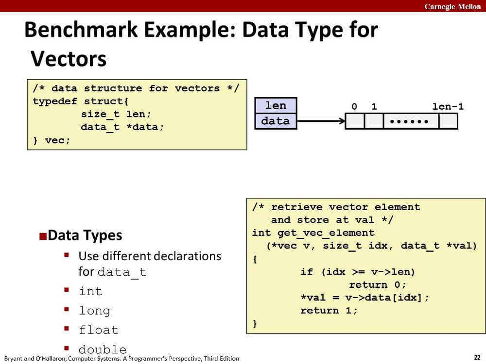
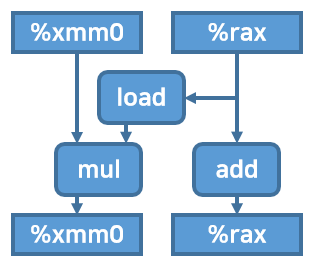
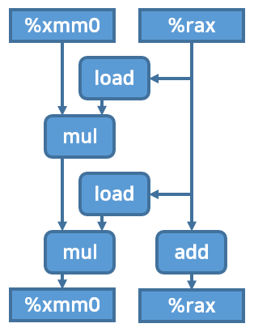
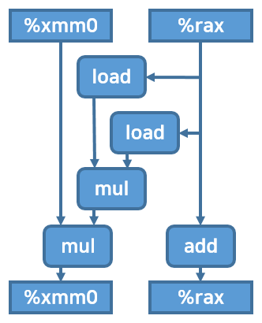
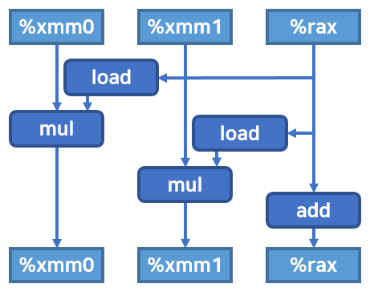

저번 글에 이어서 계속한다.

## 1. 예제 및 복습

여기서는 책, 강의에서 제시해주는 예제를 쓰자.



vector 자료형에 대한 연산이 정의된 combine 함수를
여러 기법을 사용해 최적화시키겠다.

가장 첫번째로 작성된 함수, combine1이다.
OP는 연산자다.

```c
void combine1(vec_ptr v, data_t *dest) {
    long i;

    *dest = IDENT;
    for (i = 0; i < vec_length(v); i++) {
        data_t val;
        get_vec_element(v, i, &val);
        *dest = *dest OP val;
    }
}
```

이 코드를 [CS:APP - 프로그램 최적화 1](/post/csapp-optimizing-program-1/)에서 정리한 대로 수정해보자.

combine4 함수.

```c
void combine4(vec_ptr v, data_t *dest) {
    long i;
    long length = vec_length(v);
    data_t *data = get_vec_start(v);
    data_t acc = IDENT;

    for (i = 0; i < length; i++) {
        acc = acc OP data[i];
    }
    *dest = acc;
}
```

data_t가 double이고 OP가 *일 때 생성되는 어셈블리 코드를 비교하겠다.

아래 코드는 명령줄 옵션 -mavx2 -O1 -S를 주고 gcc를 실행한 결과다.

combine1 함수의 for문 어셈블리 코드.

```asm
.L16:
    movq    %r13, %rdx
    movq    %rbx, %rsi
    movq    %rbp, %rdi
    call    get_vec_element    ; Call get_vec_element(v, i, &val)
    vmovsd  (%r12), %xmm0            ; Read product from dest
    vmulsd  4(%rsp), %xmm0, %xmm0    ; Multiply product by data[i]
    vmovsd  %xmm0, (%r12)            ; Store product at dest
    addq    $1, %rbx
    cmpq    0(%rbp), %rbx
    jl      .L16
```

combine4 함수의 for문 어셈블리 코드.

```asm
.L34:
    vmulsd  (%rax), %xmm0, %xmm0    ; acc = acc * d[i]
    addq    $4, %rax                ; i++
    cmpq    %rdx, %rax              ; Compare to length:i
    jne     .L34
.L33:
    vmovss  %xmm0, (%rsi)           ; Store product at dest
```

실제 성능 차이는 어떨까? CPE(Cycles per Element)를 측정하면 다음과 같다고 한다.

|              | Integer |       | Double FP |       |
| ------------ | ------- | ----- | --------- | ----- |
| OP           | +       | *     | +         | *     |
| Combine1 -O1 | 10.12   | 10.12 | 10.17     | 11.14 |
| Combine4     | 1.27    | 3.01  | 3.01      | 5.01  |

여기까지 어제 작성한 글 복습이다.

combine4 함수는 최적화가 끝난 것처럼 보인다.
인스트럭션 수도 최소한만 남겨둔 것 같고...

그런데 그렇지 않다. 요즘 프로세서를 고려하면 최적화 요소가 더 있다.

자세한 설명은 생략하고 기법만 정리한다.
오늘 시간이 빠듯해서;; ㅎㅎ;;

## 2. 루프 풀기(Loop Unrolling)

매 루프마다 계산되는 원소의 수를 증가시켜서 루프 반복실행 횟수를 줄이는 방법이다.

이 방법을 통해 얻는 이득은 두 가지다.

1. 루프 인덱스 계산, 조건부 분기와 같은 연산과 직접적인 연관이 없는 연산을 줄인다.
2. 전체 연산의 수를 줄이는 관점에서 최적화를 적용할 수 있다.

이 시점에서 combine4 함수의 루프문 내부를 도식화해보자.
float point과 multiply 연산에 대해서 그렸다.



combine4 함수에 loop unrolling을 적용해보자.

한 루프에 2개의 연산을 하도록 loop unrolling을 적용하면
다음과 같은 코드와, 기계어, 그리고 도식이 나온다.

코드. 이러한 변환을 2 * 1 loop unrolling이라고 부른다.

```c
void combine5(vec_ptr v, data_t *dest) {
    long i;
    long length = vec_length(v);
    long limit = length - 1;
    data_t *data = get_vec_start(v);
    data_t acc = IDENT;

    for (i = 0; i < limit; i += 2) {
        acc = (acc OP data[i]) OP data[i+1];
    }

    for (; i < length; i++) {
        acc = acc OP data[i];
    }
    *dest = acc;
}
```

기계어 (첫번째 for문)

```asm
.L39:
    vmulsd  (%rdx,%rax,8), %xmm0, %xmm0     ; data[i]
    vmulsd  8(%rdx,%rax,8), %xmm0, %xmm0    ; data[i+1]
    addq    $2, %rax     ; i += 2
    cmpq    %rax, %r8    ; Compare limit:i
    jg      .L39
```

도식



책에 의하면 CPE는 다음과 같다.
정수 덧셈 연산에 대해서는 성능이 향상됐지만
다른 연산에서는 큰 성능향상이 보이지 않는다.

|                  | Integer |      | Double FP |      |
| ---------------- | ------- | ---- | --------- | ---- |
| OP               | +       | *    | +         | *    |
| Combine4         | 1.27    | 3.01 | 3.01      | 5.01 |
| Combine5         | 1.01    | 3.01 | 3.01      | 5.01 |
| Latency bound    | 1.00    | 3.00 | 3.00      | 3.00 |
| Throughput bound | 0.50    | 1.00 | 1.00      | 0.50 |

이제 다음 최적화를 적용해보자.

## 3. 재결합 변환(Reassociation Transform)

병렬성 향상을 위해 코드를 변환하는 방법이다.

위 combine5 함수 중 일부 코드를...

```c
for (i = 0; i < limit; i += 2) {
    acc = (acc OP data[i]) OP data[i+1];
}
```

아래와 같이 바꾸면 어떻게 될까?

```c
for (i = 0; i < limit; i += 2) {
    acc = acc OP (data[i] OP data[i+1]);
}
```

괄호 위치만 바뀌었는데 성능에 큰 차이가 생길까?

확인해보겠다.

어셈블리 코드는 다음과 같이 변한다.

```asm
.L66:
    vmovsd  (%rdx,%rax,8), %xmm1            ; %xmm1 = data[i]
    vmulsd  8(%rdx,%rax,8), %xmm1, %xmm1    ; %xmm1 *= data[i+1]
    vmulsd  %xmm1, %xmm0, %xmm0             ; %xmm0 *= %xmm1
    addq    $2, %rax     ; i += 2
    cmpq    %rax, %r8    ; Compare to limit:i
    jg      .L66
```

인스트럭션은 하나가 늘었다.

그리고 사용하는 레지스터도 하나 늘었다.

눈에 보이는 인스트럭션 차이는 중요하지 않다.

아래 도식화된 그림을 보자. %xmm1 레지스터는 그림에서 일부러 생략했다.



combine5 코드대로는 %xmm0에 대한 첫번째 곱연산이 끝날 때까지
두번째 곱연산을 할 수 없었다.
순차적 의존성 때문이다.

그러나 지금 코드는 %xmm0에 대한 곱연산을 하는 동안,
%xmm1에 대한 곱연산을 실행할 수 있다.

그러므로 프로세서의 병렬 처리가 제대로 이루어진다면
꽤 많은 실행시간을 절약할 수 있다.

그렇다면 CPE는 어떻게 나올까?
책을 보면 아래와 같다.

|                  | Integer |      | Double FP |      |
| ---------------- | ------- | ---- | --------- | ---- |
| OP               | +       | *    | +         | *    |
| Combine5         | 1.01    | 3.01 | 3.01      | 5.01 |
| Combine5+        | 1.01    | 1.51 | 1.51      | 2.51 |
| Latency bound    | 1.00    | 3.00 | 3.00      | 3.00 |
| Throughput bound | 0.50    | 1.00 | 1.00      | 0.50 |

거의 2배에 가까운 성능 향상을 보여준다.

## 4. 병렬 누산기(Separate Accumulators)

지역변수를 명시적으로 여러 개 설치해서 순차적 의존성을 깰 수도 있다.

아래 코드는 combine5 함수에 대해 누산기를 적용한 함수다.

```c
void combine6(vec_ptr v, data_t *dest) {
    long i;
    long length = vec_length(v);
    long limit = length - 1;
    data_t *data = get_vec_start(v);
    data_t acc0 = IDENT;
    data_t acc1 = IDENT;

    for (i = 0; i < limit; i += 2) {
        acc0 = acc0 OP data[i];
        acc1 = acc1 OP data[i+1];
    }

    for (; i < length; i++) {
        acc0 = acc0 OP data[i];
    }
    *dest = acc0 OP acc1;
}
```

```asm
.L57:
    vmulsd  (%rdx,%rax,8), %xmm0, %xmm0     ; acc0 = acc0 * data[i];
    vmulsd  8(%rdx,%rax,8), %xmm1, %xmm1    ; acc1 = acc1 * data[i+1];
    addq    $2, %rax
    cmpq    %rax, %r8
    jg      .L57
```

루프 부분의 어셈블리 코드를 보고 combine5 함수와 비교하면
두번째 인스트럭션의 두세번째 오퍼랜드가
%xmm0에서 %xmm1으로 바뀐 것을 볼 수 있다.

첫번째 vmulsd 인스트럭션과 두번째 vmulsd 인스트럭션 사이에
순차적 의존성이 없기 때문에 프로세서가 병렬로 처리할 수 있게 된다.

그림으로 보면 더 확실하다.



%xmm0에 대한 연산과 %xmm1에 대한 연산 간에 의존 관계가 없음이 한눈에 보인다.

CPE는 다음과 같다.

|                  | Integer |      | Double FP |      |
| ---------------- | ------- | ---- | --------- | ---- |
| OP               | +       | *    | +         | *    |
| Combine5         | 1.01    | 3.01 | 3.01      | 5.01 |
| Combine5+        | 1.01    | 1.51 | 1.51      | 2.51 |
| Combine6         | 0.81    | 1.51 | 1.51      | 2.51 |
| Latency bound    | 1.00    | 3.00 | 3.00      | 3.00 |
| Throughput bound | 0.50    | 1.00 | 1.00      | 0.50 |

unrolling과 accumulating을 더 여러 개 해주면 성능이 더 좋아진다.

## 5. 마무리

여기서 만족하지 못하고 성능이 더 올리고 싶은 사람은 SIMD를 공부해보자.

다음에 공부할 내용은 메모리다.

## 출처

'Computer Systems A Programmer's Perspective (3rd Edition)'
