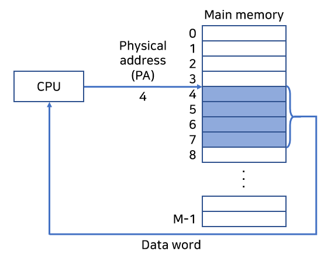
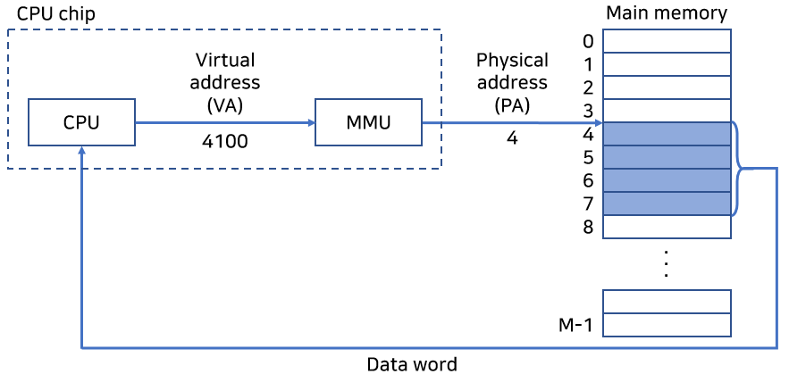
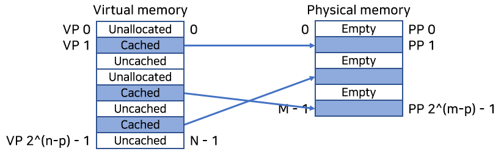
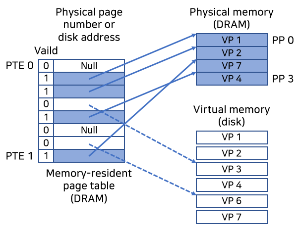

현대 시스템은 가상 메모리(Virtual memory). VM이라고 알려진
메인 메모리의 추상화를 제공한다.

## 1. 가상 메모리를 왜 공부해야 하는가

1. 가상 메모리는 중요하다.
2. 가상 메모리는 강력하다.
3. 가상 메모리는 위험하다.

## 2. 물리 주소(Physical Address), 가상 주소(Virtual Address)

컴퓨터 시스템의 메인 메모리는 M개의 연속적인 바이트 크기 셀의 배열로 구성되며,
각 바이트는 고유의 물리 주소 PA를 가진다는 사실을 먼저 숙지하자.

CPU가 메모리에 접근하기 위한 방식이 두 가지 있다.
빠른 이해를 위해 책에 있는 그림을 따라 그렸다.

### (1) 물리 주소 방식

CPU가 직접 물리 주소를 가지고 접근하는 방식이다.

### (2) 가상 주소 방식

CPU가 가상 주소 VA를 생성해서 메인 메모리에 접근하는 방식이다.

MMU는 메인 메모리에 저장된 참조 테이블을 사용해서 VA를 PA로 번역한다.
참조 테이블의 내용은 운영체제가 관리한다.

MMU가 VA를 PA로 번역하는 이 작업을 '주소 번역'이라고 한다.

## 3. 캐싱 도구로서의 VM

VM 시스템은 가상 메모리를 규정된 사이즈 블록 단위로 분할하여 관리한다.
분할된 블록은 가상 페이지라 부른다.

가상 페이지는 세 가지로 분류될 수 있다.

1. Unallocated: 할당되지 않은 페이지.
2. Cached: 물리 메모리에 캐시되어 할당된 페이지.
3. Uncached: 물리 메모리에 캐시되지 않은 할당된 페이지.

> 캐시? CPU와 메인 메모리 사이에 있는 L1, L2, L3 캐시 메모리를 말하는 건가?

위 질문에서 이야기하는 캐시는 SRAM 캐시를 뜻한다.
이 글에서 이야기하는 캐시는 DRAM 캐시다.

SRAM은 DRAM의 캐시로 작동하고,
DRAM은 DISK의 캐시로 작동한다는 사실을 기억하자.

이해에 도움이 되는 그림.

가상 주소의 크기는 N = 2^n이라고 가정하고,
물리 주소의 크기는 M = 2^m이라고 가정한다.

각 가상 페이지는 P = 2p 바이트 크기를 가지며,
물리 페이지도 P 바이트 크기를 갖는다.

VM 시스템은 페이지 테이블을 통해 가상 페이지를 관리한다.

MMU 내의 주소 번역 하드웨어는 주소 번역을 할 때마다 페이지 테이블을 읽는다.

페이지 테이블은 페이지 테이블 엔트리 PTE의 배열이다.

그림을 보자.

책에서는 편의상 PTE가 한 개의 유효 비트와
n비트의 주소 필드로 구성된다고 가정했다.

유효 비트는 Cached 여부를 나타내고, Null 주소는 Unallocated를 뜻한다.

페이지 적중, 페이지 오류, 페이지 할당에 대한 세세한 부분은 생략ㅎ

## 4. 메모리 관리 도구로서의 VM

운영체제는 프로세스마다 별도의 페이지 테이블 PTE을 제공한다.
즉, 별도의 가상 주소 공간이다.

다수의 가상 페이지가 동일한 물리 페이지에 매핑될 수도 있다.

VM을 사용해서 생기는 영향은 다음과 같다.

1. 링킹이 단순해진다.
2. 로딩이 단순해진다.
3. 공유가 단순해진다.
4. 메모리 할당이 단순해진다.

## 5. 메모리 보호 도구로서의 VM

사용자 프로세스는 read-only code section을 수정할 수 없어야 한다.

커널의 코드와 데이터 구조를 읽거나 쓸 수 없어야 한다.

명시적인 허용이 없다면, 다른 프로세스의 사적 메모리를 읽거나 쓸 수 없어야 한다.

PTE에 허가 비트를 추가하면 간단하게 해결할 수 있다.

## 6. 주소 번역

블로그에 정리하기엔 애매해서 생략.

별로 안 기니까 기회 되면 읽읍시다.

## 7. 마무리

정리는 좀 더 간단하게 하기로 했다.

기억 안 나면 책 펼쳐야지 뭐...

## 출처

'Computer Systems A Programmer's Perspective (3rd Edition)'
