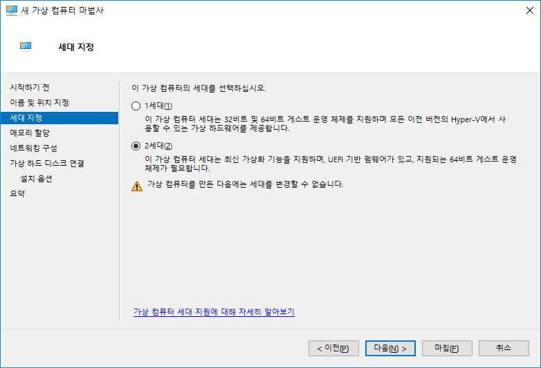
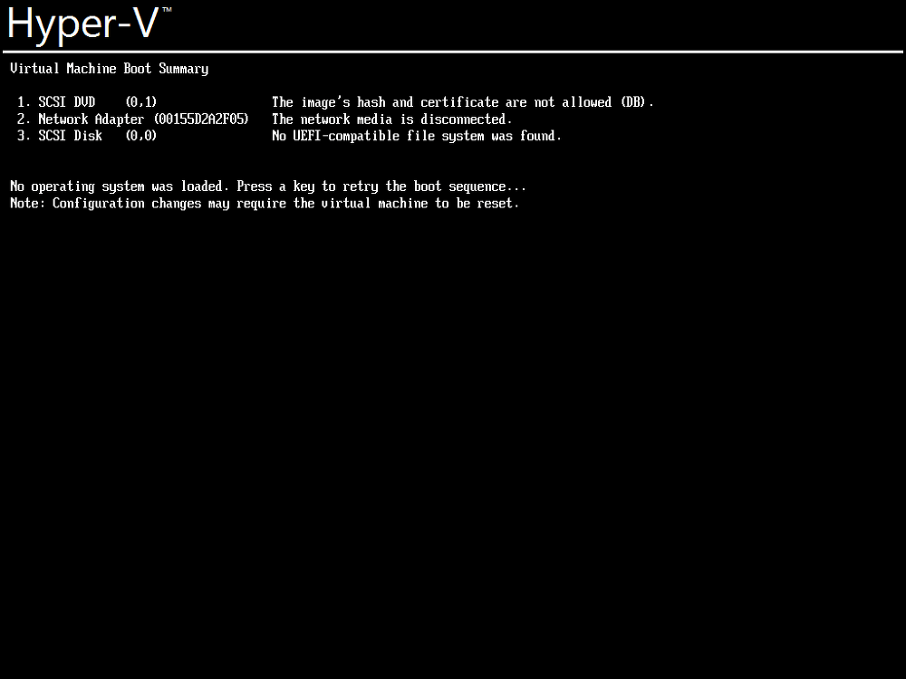
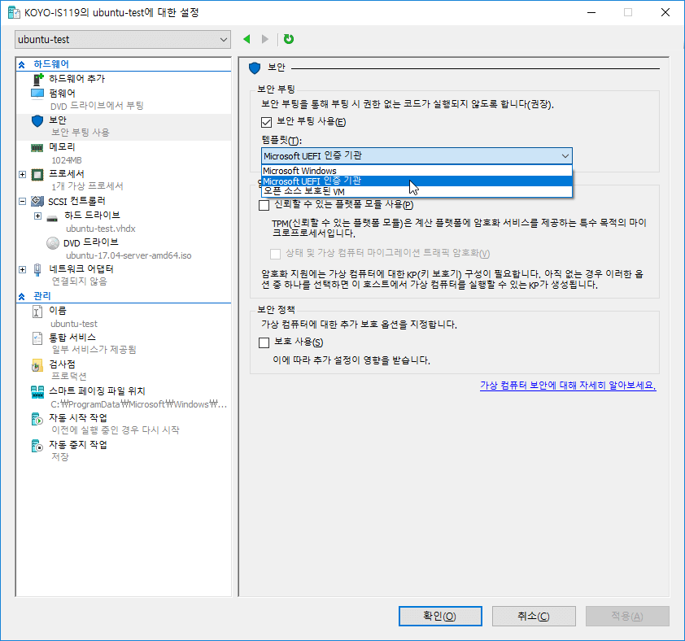
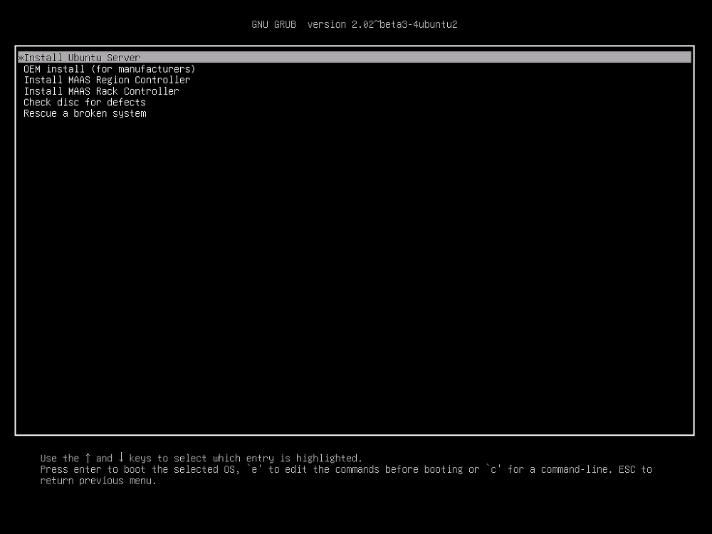

Hyper-V에서는 가상 컴퓨터를 생성할 때 1세대와 2세대 중 선택해야 한다.

2세대는 이런 기능을 제공한다.

<https://msdn.microsoft.com/ko-kr/library/dn282285.aspx>

* 1세대: 이전 버전의 Hyper-V와 동일한 가상 하드웨어를 가상 컴퓨터에 제공합니다.
* 2세대: 가상 컴퓨터에서 다음과 같은 새로운 기능을 제공합니다.
    * 표준 네트워크 어댑터를 사용 PXE 부팅
    * SCSI 가상 하드디스크에서 부팅
    * SCSI 가상 DVD에서 부팅
    * 보안 부팅(기본적으로 설정됨)
    * UEFI 펌웨어 지원

음 좋은 것이군... 하고 우분투를 설치하려고 한 나는

이 화면을 보게 된다.

그렇다고 1세대를 설치하기에는 괜히 고집이 생겨서 방법을 찾아봤다.

가상 컴퓨터의 속성 - 보안에서 템플릿을 'Microsoft Windows'에서 'Microsoft UEFI 인증 기관'으로 바꿔주면 된다.

설마 그럴리는 없겠지만 만약 그래도 안된다면?

그러면 '보안 부팅 사용'을 해제하자. 그럼 아마 되겠지.

앗 넘 좋은 것

^^;
