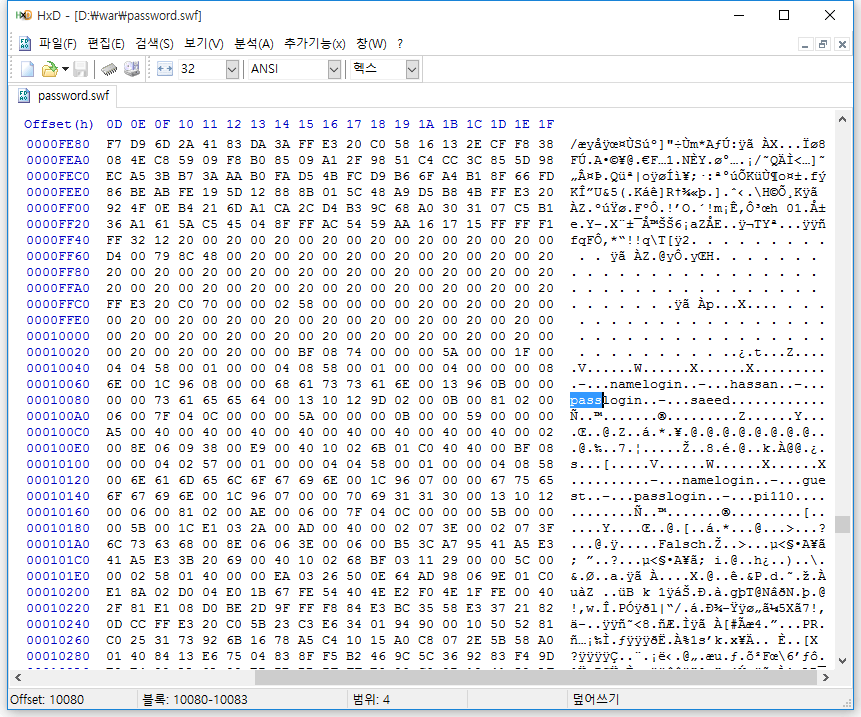

플래시 파일에서 로그인을 해야되는 것 하다. 소스는 봐도 별 거 없다.

틀리면 ACCESS DENIED가 뜬다.

카테고리가 인터넷이니까 와이어샤크로 캡쳐 뜨면 될 거라고 생각하고 ip 주소 알아내서 필터링을 하면 잡힐 것이라고 생각했다.

그래서 필터를 건 뒤에 아이디와 패스워드를 전송했다.

띠용

다행히도 헥사 에디터로 열어서 pass 검색하니까 아이디와 패스워드가 나온다.

플래시에 입력하면 saeed를 입력하라고 한다.

답은 saeed.

플래시 파일을 리버싱할 수 있게 한 IDA 플러그인도 있다고 한다. 헥사 에디터로 안되면 그걸 써야겠다.
