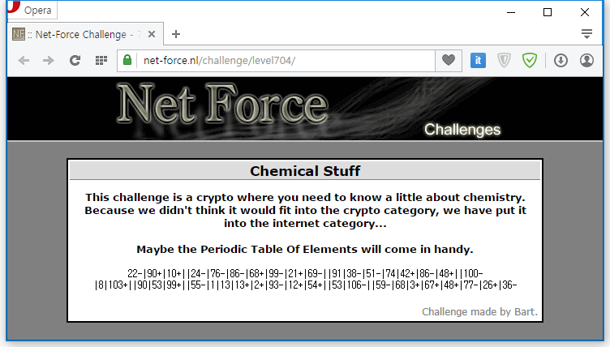

주기율표를 보라고 한다.

||||
|-|-|-|
|22-|Ti|t|
|90+|Th|h|
|10+|Ne|e|
|24-|Cr|c|
|76-|Os|o|
|86-|Rn|r|
|68+|Er|r|
|99-|Es|e|
|21+|Sc|c|
|69-|Tm|t|
|91|Pa|pa|
|38-|Sr|s|
|51-|Sb|s|
|74|W|w|
|42+|Mo|o|
|86-|Rn|r|
|48+|Cd|d|
|100-|Fm|f|
|8|O|o|
|103+|Lr|r|
|90|Th|th|
|53|I|i|
|99+|Es|s|
|55-|Cs|c|
|1|H|h|
|13|Al|al|
|13+|Al|l|
|2+|He|e|
|93-|Np|n|
|12+|Mg|g|
|54+|Xe|e|
|53|I|i|
|106-|Sg|s|
|59-|Pr|p|
|68|Er|er|
|3+|Li|i|
|67+|Ho|o|
|48+|Cd|d|
|77-|Ir|i|
|26+|Fe|e|
|36-|Kr|k|

```text
the correct password for this challenge is periodiek
```

-문자가 붙은 것은 첫번째 글자를, +문자가 붙은 것은 두번째 글자를, 아무것도 붙지 않은 것은 모든 글자를 쓰면 올바른 패스워드가 나온다.

답은 periodiek
