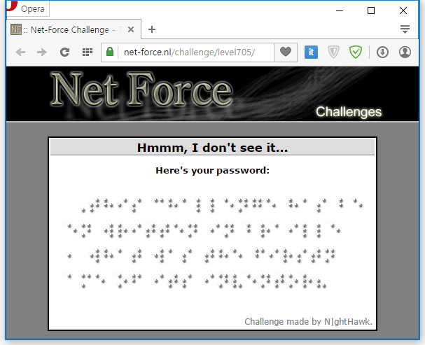
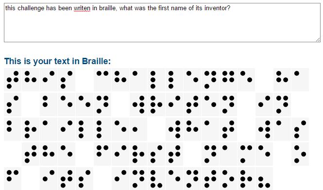
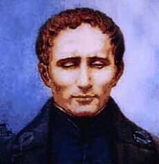

Flash Login에 이어서 2번째 문제이다. 이번 건 쉬웠다.

문제의 페이지. 점자로 써진 게 보인다.

아래 주소에서 한 글자씩 대조해 텍스트를 작성하면 점자 발명가의 이름을 말하라는 문장이 나온다. 그게 답인 듯.

<http://www.euroblind.org/resources/braille-converter/>

이 아저씨다.

답은 Louis.
