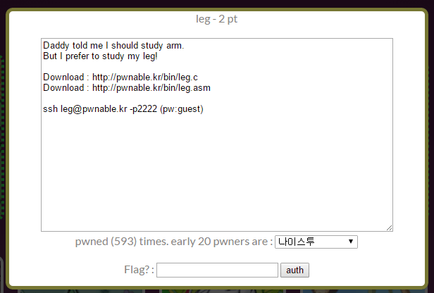

## 문제



다운로드 파일의 내용을 읽고 flag 파일을 읽기 위한 조건을 맞추면 된다.

c 코드를 보면 key1()+key2()+key3() == key을 만족하는 key를 사용자가 입력해야 한다.

leg.c

```c
#include <stdio.h>
#include <fcntl.h>
int key1(){
    asm("mov r3, pc\n");
}
int key2(){
    asm(
    "push   {r6}\n"
    "add    r6, pc, $1\n"
    "bx     r6\n"
    ".code  16\n"
    "mov    r3, pc\n"
    "add    r3, $0x4\n"
    "push   {r3}\n"
    "pop    {pc}\n"
    ".code  32\n"
    "pop    {r6}\n"
    );
}
int key3(){
    asm("mov r3, lr\n");
}
int main(){
    int key=0;
    printf("Daddy has very strong arm! : ");
    scanf("%d", &key);
    if( (key1()+key2()+key3()) == key ){
        printf("Congratz!\n");
        int fd = open("flag", O_RDONLY);
        char buf[100];
        int r = read(fd, buf, 100);
        write(0, buf, r);
    }
    else{
        printf("I have strong leg :P\n");
    }
    return 0;
}
```

## 풀이

이제 디어셈블된 코드를 보면서 문제를 풀어야 한다.

```x86asm
Dump of assembler code for function main:
   ...
   0x00008d68 <+44>:    bl      0x8cd4 <key1>
   0x00008d6c <+48>:    mov     r4, r0
   0x00008d70 <+52>:    bl      0x8cf0 <key2>
   0x00008d74 <+56>:    mov     r3, r0
   0x00008d78 <+60>:    add     r4, r4, r3
   0x00008d7c <+64>:    bl      0x8d20 <key3>
   0x00008d80 <+68>:    mov     r3, r0
   0x00008d84 <+72>:    add     r2, r4, r3
   0x00008d88 <+76>:    ldr     r3, [r11, #-16]
   0x00008d8c <+80>:    cmp     r2, r3
   ...
```

key1, key2, key3 함수에서 r0에 저장한 값을 r2에 모두 더해서, 사용자가 입력한 값과 비교하는 부분이다. 각 함수가 r0에 어떤 값을 넘기는지를 보면 된다.

```x86asm
Dump of assembler code for function key1:
   0x00008cd4 <+0>:     push    {r11}       ; (str r11, [sp, #-4]!)
   0x00008cd8 <+4>:     add     r11, sp, #0
   0x00008cdc <+8>:     mov     r3, pc
   0x00008ce0 <+12>:    mov     r0, r3
   0x00008ce4 <+16>:    sub     sp, r11, #0
   0x00008ce8 <+20>:    pop     {r11}       ; (ldr r11, [sp], #4)
   0x00008cec <+24>:    bx      lr
End of assembler dump.
```

key1 함수는 pc에 담긴 값을 r3에, r3에 담긴 값을 r0에 넘겨주고 끝난다.

pc에 대해 찾아보니 program counter로 다음에 실행될 명령어의 주소를 가지고 있으며 인텔의 x86 계열 cpu의 eip(instruction pointer)에 대응한다고 한다. 차이점으로 eip는 현재 실행하는 명령어의 주소를 담지만 pc는 다음에 실행될 명령어의 주소를 담는다고 한다. pc가 있는 명령어의 다음 명령어의 주소값을 담는다는 뜻이 되겠다.

```x86asm
Dump of assembler code for function main:
   ...
   0x00008d50 <+20>:    ldr     r0, [pc, #104]      ; 0x8dc0 <main+132>
   0x00008d54 <+24>:    bl      0xfb6c <printf>
   0x00008d58 <+28>:    sub     r3, r11, #16
   0x00008d5c <+32>:    ldr     r0, [pc, #96]       ; 0x8dc4 <main+136>
   ...
```

그런데 다른 코드를 보면 pc가 실행할 명령어의 주소에 8을 더한 만큼의 값을 가지고 있는 걸 확인할 수 있다. 다음 명령어의 주소값을 가지고 있다면 4를 더한 만큼의 값을 가지고 있어야 될텐데 말이다.

pc가 실행하는 명령어의 주소값에 8을 더한 만큼을 가리킨다고 가정하면 key1 함수는 0x8ce4를 반환한다.

```x86asm
Dump of assembler code for function key2:
   0x00008cf0 <+0>:     push    {r11}       ; (str r11, [sp, #-4]!)
   0x00008cf4 <+4>:     add     r11, sp, #0
   0x00008cf8 <+8>:     push    {r6}        ; (str r6, [sp, #-4]!)
   0x00008cfc <+12>:    add     r6, pc, #1
   0x00008d00 <+16>:    bx      r6
   0x00008d04 <+20>:    mov     r3, pc
   0x00008d06 <+22>:    adds    r3, #4
   0x00008d08 <+24>:    push    {r3}
   0x00008d0a <+26>:    pop     {pc}
   0x00008d0c <+28>:    pop     {r6}        ; (ldr r6, [sp], #4)
   0x00008d10 <+32>:    mov     r0, r3
   0x00008d14 <+36>:    sub     sp, r11, #0
   0x00008d18 <+40>:    pop     {r11}       ; (ldr r11, [sp], #4)
   0x00008d1c <+44>:    bx      lr
End of assembler dump.
```

key2 함수를 보면 0x8d04에서 pc 값은 0x8d04+8=0x8d0c일 것이고, 0x8d06에서 adds 명령어로 4를 더해주어 반환하므로 0x8d0c+4=0x8d10을 반환한다.

```x86asm
Dump of assembler code for function key3:
   0x00008d20 <+0>:     push    {r11}       ; (str r11, [sp, #-4]!)
   0x00008d24 <+4>:     add     r11, sp, #0
   0x00008d28 <+8>:     mov     r3, lr
   0x00008d2c <+12>:    mov     r0, r3
   0x00008d30 <+16>:    sub     sp, r11, #0
   0x00008d34 <+20>:    pop     {r11}       ; (ldr r11, [sp], #4)
   0x00008d38 <+24>:    bx      lr
End of assembler dump.
```

key3 함수에서는 pc가 아니라 lr을 반환하는데, 이 lr은 bl 등의 명령어로 주소를 점프했을 때 다시 돌아와서 실행할 주소를 가리킨다고 한다. key3 함수를 0x8d7c에서 bl 명령어로 점프했으므로 lr은 0x8d7c+4=0x8d80을 가리킨다.

각 함수가 반환하는 값을 다 더하면 10진수로 108404가 되는 걸 알 수 있다.

```sh
$ ./leg
Daddy has very strong arm! : 108404
I have strong leg :P
$
```

응 아니야

왜 안 풀리는 건지 계속 알수 없었고, 대충 이렇게 일주일 정도 보낸 것 같다. 그래서 다른 사람의 풀이를 찾아보니 fetch로 시작해서 일련의 과정을 거치기 때문에 pc는 실행하는 명령어에서 뒤로 두 번째 명령어의 주소값을 가리킨다고 한다. 무슨 말인지 몰라서 좀 더 찾아보았다.

<http://recipes.egloos.com/4982170>

이 글을 보고 이 문제를 쉽게 풀 수 있었다.

cpu는 명령어를 실행하는 데에 있어서  fetch -> decode -> execute라는 일련의 과정을 거친다. 그리고  cpu의 효율을 위  해 fetch와 decode와 execute를 동시에 수행하게 되는데, 때문에 명령어를 execute할 때 그 다음 명령어는 decode되고 또 다음 명령어는 fetch된다.

pc는 CPU가 현재 실행하고 있는 명령어(instruction)의 주소를 가리킨다.  pc는 fetch에서 증가하게 되는데, fetch가 끝나면 pc는 다음 명령어  의 주소를 가리키게 된다. 즉, 명령어를 execute를 하는 시점에서 다음 명령어의 fetch는 끝난 상황이며 pc는 execute하는 명령어에서 두 번째 명령어의 주소값을 가리키는 것이다.

```x86asm
Dump of assembler code for function key2:
   0x00008cf0 <+0>:     push    {r11}       ; (str r11, [sp, #-4]!)
   0x00008cf4 <+4>:     add     r11, sp, #0
   0x00008cf8 <+8>:     push    {r6}        ; (str r6, [sp, #-4]!)
   0x00008cfc <+12>:    add     r6, pc, #1
   0x00008d00 <+16>:    bx      r6
   0x00008d04 <+20>:    mov     r3, pc
   0x00008d06 <+22>:    adds    r3, #4
   0x00008d08 <+24>:    push    {r3}
   0x00008d0a <+26>:    pop     {pc}
   0x00008d0c <+28>:    pop     {r6}        ; (ldr r6, [sp], #4)
   0x00008d10 <+32>:    mov     r0, r3
   0x00008d14 <+36>:    sub     sp, r11, #0
   0x00008d18 <+40>:    pop     {r11}       ; (ldr r11, [sp], #4)
   0x00008d1c <+44>:    bx      lr
End of assembler dump.
```

key2 함수로 넘어가서 공부한 걸 적용해보자. 0x8d04의 명령어를 실행(execute)할 때, 0x8d06 명령어는 fetch가 끝나고 decode 중이며, 0x8d08 명령어는 fetch 중이다. pc는 fetch가 끝난 명령어의 다음 명령어의 주소를, 다르게 말하면 fetch가 시작된 명령어의 주소를 가리킨다고 했다. 즉 여기서 pc가 가리키는 주소값은 0x8d0c가 아니라 0x8d08인 것이다. 그리고 여기에 4를 더해주면 key2 함수가 반환하는 값은 0x8d0c가 된다.

cpu에 대해서 좀 알게 된 건 좋지만 또 겉핥기만 한 것 같아서 아주 좋진 않다. 포인트 작은 이런 문제 하나 푸는데 이렇게 시간이 오래 걸리는 것도 마음에 들지 않는다. 난 너무 게으르다.

## 참고

<https://en.wikipedia.org/wiki/Instruction_pipelining>

<http://blog.naver.com/onlyou_4ever/40006966899>
