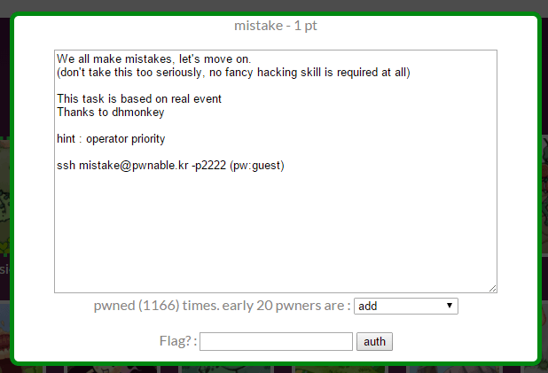

## 문제



힌트는 우선순위

mistake.c

```c
#include <stdio.h>
#include <fcntl.h>

#define PW_LEN 10
#define XORKEY 1

void xor(char* s, int len){
    int i;
    for(i=0; i<len; i++){
        s[i] ^= XORKEY;
    }
}

int main(int argc, char* argv[]){
    int fd;
    if(fd=open("/home/mistake/password",O_RDONLY,0400) < 0){
        printf("can't open password %d\n", fd);
        return 0;
    }

    printf("do not bruteforce...\n");
    sleep(time(0)%20);

    char pw_buf[PW_LEN+1];
    int len;
    if(!(len=read(fd,pw_buf,PW_LEN) > 0)){
        printf("read error\n");
        close(fd);
        return 0;
    }

    char pw_buf2[PW_LEN+1];
    printf("input password : ");
    scanf("%10s", pw_buf2);

    // xor your input
    xor(pw_buf2, 10);

    if(!strncmp(pw_buf, pw_buf2, PW_LEN)){
        printf("Password OK\n");
        system("/bin/cat flag\n");
    }
    else{
        printf("Wrong Password\n");
    }

    close(fd);
    return 0;
}
```

## 풀이

코드의 흐름은 password 파일로부터 문자를 읽어와 pw_buf 배열에 담고,
사용자로부터 pw_buf2 배열에 문자를 받아와 비교하는 것이다.

```x86asm
(gdb) r
Starting program: /home/mistake/mistake
warning: no loadable sections found in added symbol-file system-supplied DSO at 0x7fffc83fe000
can't open password 1
[Inferior 1 (process 31505) exited normally]
```

그렇다면 중간에 브레이크포인트를 걸고 메모리를 고친다면 해결할 수 있지 않을까?
그런데 gdb로 불러온 상황에서는 진행이 되지 않는다.
다른 방법을 찾아야한다.

```c
int fd;
if(fd=open("/home/mistake/password",O_RDONLY,0400) < 0){
    printf("can't open password %d\n", fd);
    return 0;
}
```

힌트를 생각하면서 if문을 보면 이상한 점을 볼 수 있다.
비교 연산자는 산술 연산자보다 우선순위가 높다.
원래 의도는 fd 변수에 open 함수의 반환값을 할당하고
그 값을 0보다 작은지 비교하려고 했을 것이다.

하지만 이 코드에서는 open 함수의 반환값을 0과 비교하여 나온 값을
fd에 할당하게 된다. 의도대로 기능하려면 다음과 같이 작성됐어야 한다.

```c
int fd;
if((fd=open("/home/mistake/password",O_RDONLY,0400)) < 0){
    ...
}
```

```c
int len;
if(!(len=read(fd,pw_buf,PW_LEN) > 0)){
    printf("read error\n");
    close(fd);
    return 0;
}
```

다음에 나오는 if문도 마찬가지로 우선순위를 고려하지 않고 작성됐다.
여기서 주목할 점은 이 if문을 실행할 때의 상황에서
fd 변수에 저장된 값은 항상 0이라는 점이다.

read 함수의 첫 인자에 0이 들어가면 표준입력으로부터 데이터를 받는다.
이 데이터는 사용자가 입력하게 되는데 대략 이런 느낌이다.

```c
scanf("%s", pw_buf);
```

```c
if(!strncmp(pw_buf, pw_buf2, PW_LEN)){
    printf("Password OK\n");
    system("/bin/cat flag\n");
}
else{
    printf("Wrong Password\n");
}
```

pw_buf와 pw_buf2 모두 사용자가 데이터를 입력할 수 있고,
최종적으로 pw_buf와 pw_buf2의 내용이 동일할 때 flag의 값을 볼 수 있다.

```c
xor(pw_buf, 10);
```

```
void xor(char* s, int len){
    int i;
    for(i=0; i<len; i++){
        s[i] ^= XORKEY;
    }
}
```

pw_buf2는 xor 함수에서 변환을 거치는데, 한 문자씩 비트 XOR 연산을 한다.
사용자가 "1111111111"을 입력하면 "0000000000"으로 바뀌고,
"bbbbbbbbbb"를 입력하면 "cccccccccc"로 바뀌게 되는 것이다.

이것을 고려하고 pw_buf와 pw_buf2에 각각 값을 입력하면 문제의 답을 알 수 있다.
