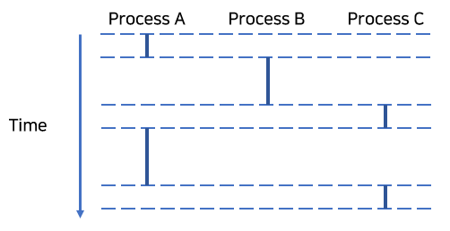
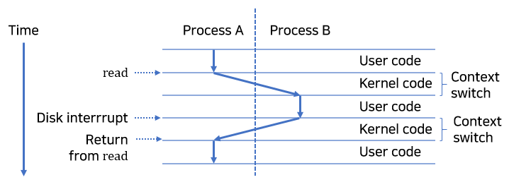

이 글은 프로세스에 대해 정리한 글이다.

먼저 프로세스에 대한 정보 두 가지를 언급한다.

## 첫번째

프로세스(process)는 프로그램(program)의 인스턴스(instance)이다.
프로그램은 프로세스의 문맥(context)에서 돌아간다.

## 두번째

프로세스는 프로그램에게 여러 추상화를 제공한다.

1. 프로그램에게 혼자서 프로세서를 사용한다는 착각을 주는 독립적 논리 제어흐름(logical control flow).
2. 프로그램에게 혼자서 메모리를 사용한다는 착각을 주는 사적 주소공간(private address space).

좀 더 자세히 알아보자.

## 1. 논리적인 제어흐름 (Logical Control Flow)

프로세스는 각 프로그램에 프로세서를 혼자 사용한다는 착각을 제공한다.

실행된 프로그램의 인스트럭션에 프로그램 카운터 pc 값이 대응되는데,
이러한 pc 값의 배열을 논리 흐름(logical control flow)라고 부른다.

위 그림은 세 프로세스를 실행하는 시스템을 보여준다.
세 논리 흐름이 서로 중첩되지 않고 교대로 돌아가고 있는 모습이다.

프로세스 A가 실행되는 동안 프로세스 B와 프로세스 C는 실행되고 있지 않으며,
이렇게 실행되고 있지 않은 프로세스를 선점된(preempted) 프로세스라고 말한다.

## 2. 동시성 흐름 (Concurrency Control Flow)

동시성(concurrency)란 무엇일까? 여러 프로그램을,
또는 여러 스레드를 '동시에 실행한다'는 것은 무엇을 의미할까?

동시성의 정의를 모르면 '동시에 실행한다'는 표현을 오해할 수 있다.

실제로 나는 이런 생각을 한 적이 있다.

> "하나의 코어에서 여러 프로세스를 실행하는 경우면 '동시에 실행한다'고 할 수 없지 않나?
동시에 돌아가지 않는 거지"

동시성의 정의를 보고 이 생각이 잘못된 걸 바로 알 수 있었다.

동시성 흐름은 다른 논리 흐름과 실행시간이 겹치는 흐름을 말한다.

위 그림에서 프로세스 A는 프로세스 B, C와 동시에 실행된다고 말할 수 있다.
왜냐하면 프로세스 A의 첫번째와 마지막 인스트럭션 실행 사이에
프로세스 B의 인스트럭션이 실행됐기 때문이다.

그리고 프로세스 B와 프로세스 C는 동시에 실행된다고 말할 수 없다.
이는 프로세스 B의 마지막 인스트럭션이 실행되고 나서
프로세스 C의 첫번째 인스트럭션이 실행됐기 때문이다.

추가로 알아두면 좋은 것.

동시에 돌아가는 두 흐름이 서로 다른 코어나 컴퓨터에서 돌아간다면
이는 병렬 흐름(parallel control flow)이라고 불린다.
'병렬로 돌아간다'는 표현은 이 흐름을 의미하는 것이다.

## 3. 사적 주소공간 (Private Address Space)

프로세스는 각 프로그램에 메모리를 혼자 사용한다는 착각을 제공한다.

프로세스는 각 프로그램에 사적 주소공간(private address space)을 제공한다.

보통 이 공간에 있는 메모리는 다른 프로세서가 읽거나 쓸 수 없기 때문에
사적(private)이라고 말하는 것이다.

## 4. 사용자 및 커널 모드 (User and Kernel Modes)

커널 모드(kernel mode)에서 동작하는 프로세스는 어떤 인스트럭션이든 실행할 수 있고,
어떤 메모리 위치든 접근할 수 있다.

반대로 사용자 모드(user mode)의 프로세스는 몇몇 특수한 인스트럭션을 실행할 수 없고,
커널의 코드와 데이터에 직접 참조할 수 없다.
사용자 프로그램은 필요하면 시스템 콜을 통해 커널 코드와 데이터에 간접적으로 접근할 수밖에 없다.

일반적으로 프로세스는 사용자 모드다.
프로세스가 커널 모드로 진입하는 방법은 인터럽트, 오류, 트랩(시스템 콜)과 같은 예외뿐이다.

제어를 받은 예외 핸들러는 커널 모드에서 돌아가며,
제어가 응용 프로그램 코드로 넘어갈 때 다시 사용자 모드로 변경된다.

프로세서는 특수한 제어 레지스터를 통해 모드 비트(mode bit)를 제공하며,
모드 비트가 설정된 프로세스는 커널 모드로 동작한다.

## 5. 문맥 전환 (Context Switches)

커널은 문맥 전환(context switch)을 통해 멀티태스킹을 구현하고 있다.
문맥(context)는 커널이 선점된 프로세스를 다시 시작하기 위해 필요로 하는 일종의 상태이다.

이 상태는 범용 레지스터, 부동소수점 레지스터, 프로그램 카운터, 사용자 스택,
상태 레지스터, 커널 스택, 페이지 테이블, 프로세스 테이블, 파일 테이블과 같은 값들로 구성된다.

context switch의 과정은 다음과 같다.

1. 현재 프로세스의 context를 저장한다.
2. 이전에 선점된(preempted) 프로세스의 context를 복원한다.
3. 제어를 복원된 프로세스로 전달한다.

context switch는 시스템 콜(system call)을 통해 발생할 수 있다.

만약 어떤 프로세스가 실행한 read 시스템 콜이 디스크 접근을 요구한다면,
커널은 그 동안 다른 프로세스를 돌리겠다고 판단할 수 있다.

context switch는 인터럽트(interrupt)를 통해 발생할 수 있다.

모든 시스템은 일정 시간이 흐를 때마다 타이머 인터럽트를 생성시키는 매커니즘을 가지고 있다.
타이머 인터럽트가 발생할 때, 커널은 현재 프로세스가 충분히 오래 실행됐다고 판단하여
다른 프로세스로 전환할 수도 있다.

위 그림은 프로세스 A와 B의 context switch를 보여준다.

커널은 프로세스 A를 동작시키고 있다가 프로세스 A의 read 시스템 콜을 받으면
디스크 컨트롤러에게 특정 행동을 요청한다.

커널은 디스크에 접근하는 긴 시간 동안 프로세스 B를 동작시키기로 결정하고
프로세서 B로의 context switch를 수행한다.

프로세스 B는 디스크에서 메모리로 전송됐음을 뜻하는 디스크 인터럽트가 오기 전까지 동작한다.
커널은 인터럽트를 받은 시점에서 프로세스 B가 충분히 돌아갔다고 판단하고
프로세스 A로 context switch를 수행한다.

프로세스 A는 다음 예외가 발생할 때까지 계속 돌아갈 것이다.

## 6. 마무리

프로세서 제어와 예외가 얼마나 큰 상관이 있겠어 했는데
예외를 통해 구현된 것이 얼마나 많은지 알게 됐다.

책 내용 정리를 어떻게 해야될 지 모르겠다.
간략하게 쓰려니 많은 핵심적인 부분을 생략하는 것 같고.
자세히 쓰는 건 책 내용 베끼기 같고.

## 출처

'Computer Systems A Programmer's Perspective (3rd Edition)'
