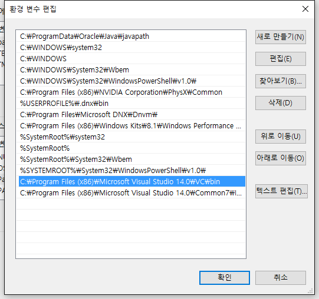
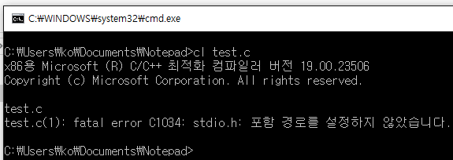
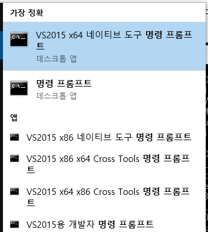
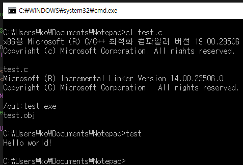
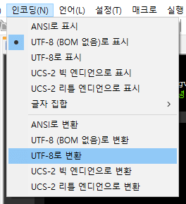
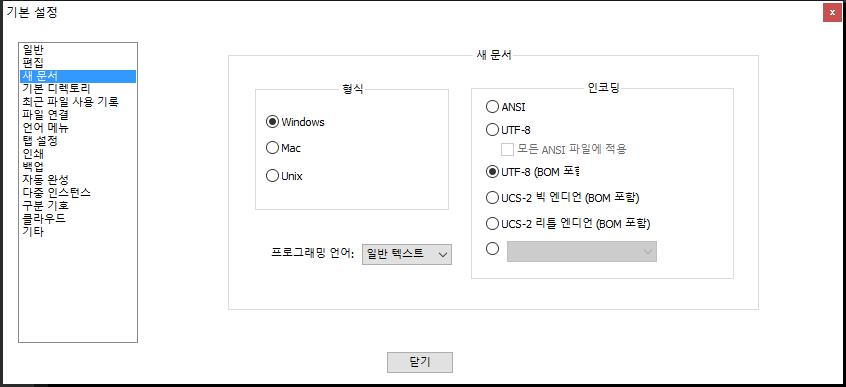
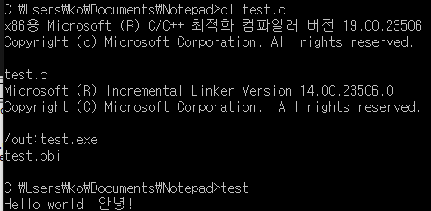
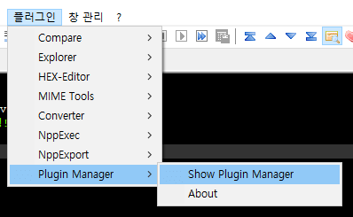
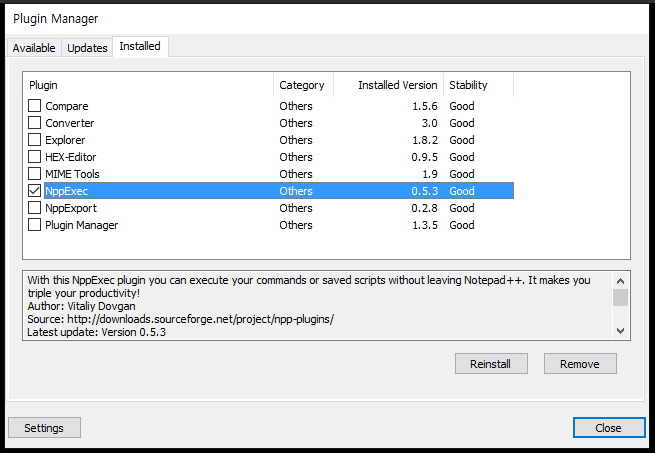
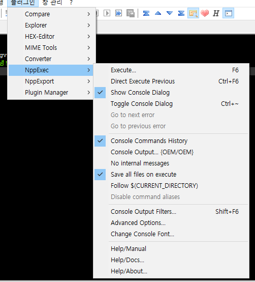

이 글은 notepad++에서 cl.exe를 이용해서 c언어를 컴파일하는 방법을 적는다.
왜 적냐면 나중에 보려고ㅎ

비주얼 스튜디오 2015를 설치하면 똑같이 따라할 수 있다.

## 1. 환경 변수에 cl.exe 등록


비주얼 스튜디오가 깔려있다면 개발자 명령 프롬프트에서 cl를 실행할 수 있다.



시스템 환경 변수 Path에 cl.exe의 경로를 등록해서 아무데서나 cl을 실행할 수 있도록 해보자.
cl.exe는 `VC\bin`에 위치하고 32비트용이다.
아래 경로를 입력하면 된다.

```text
C:\Program Files (x86)\Microsoft Visual Studio 14.0\VC\bin
```

아래와 같은 내용으로 `test.c`를 만들어서 컴파일을 테스트해보자.

```c
#include <stdio.h>

int main(int argc, char *argv[]) {
    printf("Hello world!\n");
    return 0;
}
```



컴파일이 안된다.\
헤더 파일이나 라이브러리 파일들의 경로도 환경 변수에 등록해야 정상적으로 컴파일 할 수 있다.

## 2. 환경변수에 INCLUDE, LIB, LIBPATH 추가


개발자 명령 프롬프트를 다시 실행해서 `SET INCLUDE`, `SET LIB`을 입력하고,
`INCLUDE`, `LIB`, `LIBPATH`에 해당하는 환경변수 값을 복사해서 내 시스템 환경변수에 추가한다.

참고로 환경변수를 수정했다면 명령 프롬프트 창도 껐다 켜야 수정된 환경변수가 적용된 채로 사용할 수 있다.



아마 기본적으로 x86 라이브러리를 환경변수에 등록하게 되는데,
만약 x64 네이티브 환경으로 만들고 싶다면 x64 네이티브 도구 명령 프롬프트에서
`SET INCLUDE`, `SET LIB`을 치고 새로 환경 변수를 입력해야 한다.

그리고 위에서 환경변수에 등록한 cl.exe의 경로도 x64용으로 변경해야 한다.



이제 잘 된다.

## 3. notepad++ 인코딩

notepad++에서 `test.c`의 내용을 살짝 수정해서 한글을 추가해보고 다시 컴파일해보자.

```c
#include <stdio.h>

int main(int argc, char *argv[]) {
    printf("Hello world! 안녕!\n");
    return 0;
}
```


안된다.





UTF-8 (BOM 없음)으로 되어있는데 BOM을 포함하는 UTF-8로 변환하고,
설정에서 새 문서의 인코딩을 UTF-8로 바꿔주자.



그러면 잘 컴파일 되고 한글도 잘 나온다.

## 4. notepad++에서 c 언어 컴파일



플러그인 > Plugin Manager > Show Plugin Manager에 들어가서



이미 설치했기 때문에 Installed 탭을 찍어서 올렸는데,
Available 탭에서 NppExec를 찾고 설치하면 된다.



설치했으면 재시작해서 플러그인 > NppExec > Execute에 들어가서 사용할 명령어를 입력해주자.


```bat
cl /FAs "$(FULL_CURRENT_PATH)" /link /debug /opt:icf,ref
```

나는 위와 같이 입력해서 사용하기로 했다.

옵션들을 간단하게 설명하면

* `/FAs` : asm 확장자로 된 어셈블리어 파일을 만들겠다. 리버싱 공부할 때 편할듯ㅎ, ml 명령어 치고 link 명령어 쳐서 exe 파일도 만들 수 있다.
* `/link` : 링크를 하겠다.
* `/debug` : 디버그 정보를 넣겠다.
* `/opt:icf,ref` : 이 옵션을 넣어줘야 프로그램을 올리디버거로 디스어셈블했을 때 편하게 볼 수 있다.

Execute에 넣을 명령어가 완성됐다면 코드 작성 후에 들어가서 OK 버튼 눌러주자.

```nasm
; Function compile flags: /Odtp
; File c:\users\ko\documents\notepad\test.c
_TEXT   SEGMENT
_argc$ = 8                      ; size = 4
_argv$ = 12                     ; size = 4
_main   PROC

; 3    : int main(int argc, char *argv[]) {

    push    ebp
    mov ebp, esp

; 4    :    printf("Hello world! 안녕!\n");

    push    OFFSET $SG4518
    call    _printf
    add esp, 4

; 5    :    return 0;

    xor eax, eax

; 6    : }

    pop ebp
    ret 0
_main   ENDP
_TEXT   ENDS
```

이건 `test.asm`의 일부인데 c코드가 주석으로 달려있어서 공부할 때 좋을 것 같다.

## 참고

"cl 이용 최적화 컴파일 방법 by 해커남"
<http://blog.naver.com/ifkiller/70098976909>

"[ECLIPSE] ECLIPSE에서 VISUAL C++ 개발 환경 구성"
<http://blog.powerumc.kr/402>

"Notepad++ 에서 gcc로 컴파일과 실행하기."
<http://hippolyte.tistory.com/entry/Notepad-%EC%97%90%EC%84%9C-gcc%EB%A1%9C-%EC%BB%B4%ED%8C%8C%EC%9D%BC%EA%B3%BC-%EC%8B%A4%ED%96%89%EC%9D%84-%ED%95%B4%EB%B3%B4%EC%9E%90>
