설치하면서 작성하는 글.

## 읽기 전에

최근에 이 글대로 하면 잘 안된다고 한다.

참고만... ㅎㅎ

## 1. 버추얼박스에 우분투 설치

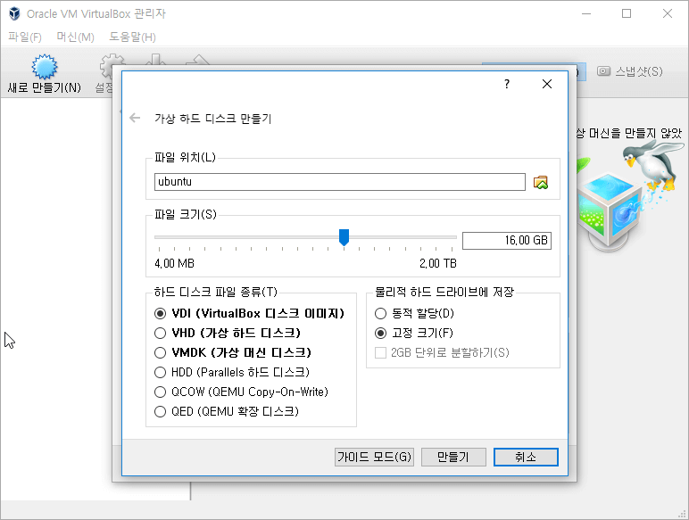

윈도우 쓰는 중인데 노트북에 남은 공간이 별로 없어서 파티션을 나누는 대신 가상머신 안에 설치하기로 했다.

## 2. 우분투 세팅

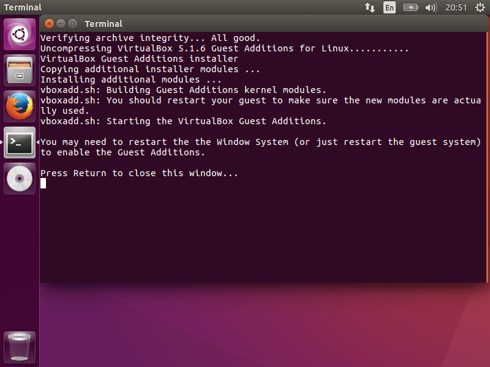

게스트 확장을 설치하고 패키지를 업데이트, 그리고 재부팅했다.

```sh
sudo apt update
sudo apt upgrade -y
sudo reboot
```

## 3. 준비

pip하고 그밖에 필요한 것들

```sh
sudo apt install python python-pip python-dev libffi-dev libssl-dev libxml2-dev libxslt1-dev libjpeg-dev
```

pip도 업데이트. 굳이 할 필욘 없지만...

```sh
sudo pip install -U pip setuptools
```

몽고DB 설치

```sh
sudo apt install mongodb
```

git도 설치

```sh
sudo apt install git
```

## 4. ssdeep, pydeep 설치

ssdeep를 설치하기 위해 필요한 것.

```sh
sudo apt install build-essential libffi-dev python python-dev python-pip automake autoconf libtool
```

ssdeep 설치

```sh
sudo BUILD_LIB=1 pip install ssdeep
```

pydeep 설치

```sh
sudo apt install libfuzzy-dev
sudo pip install pydeep
```

## 5. tcpdump 설치

tcpdump 설치

```sh
sudo apt install libcap2-bin
sudo apt install tcpdump
sudo setcap cap_net_raw,cap_net_admin=eip /usr/sbin/tcpdump
getcap /usr/sbin/tcpdump
```

잘 설치됐는지 확인.

```console
$ getcap /usr/sbin/tcpdump
/usr/sbin/tcpdump = cap_net_admin,cap_net_raw+eip
```

## 6. yara, yara-python 설치

yara는 github에서 받았다. <https://github.com/VirusTotal/yara/releases>

```sh
sudo apt install automake libtool make gcc
wget https://github.com/VirusTotal/yara/archive/v3.5.0.tar.gz
tar -zxf v3.5.0.tar.gz
cd yara-3.5.0
```

그리고 설치

```sh
./bootstrap.sh
./configure
make
sudo make install
cd ~
```

pip에서 yara-python 설치.

```sh
sudo pip install yara-python
```

## 7. volatility, distorm 설치

메모리도 분석하고자 할 때 선택사항.

github에서 받아서 설치.

```sh
git clone https://github.com/volatilityfoundation/volatility.git
cd volatility
python setup.py build
sudo python setup.py install
cd ~
```

distorm은 volatility의 apihooks 플러그인에서 쓰는 패키지라고 <http://www.hakawati.co.kr/272> 에서 읽었다. 설치.

```sh
git clone https://github.com/gdabah/distorm.git
cd distorm
python setup.py build
sudo python setup.py install
cd ~
```

## 8. cuckoobox 다운로드, 필요한 패키지 설치

cuckoobox를 받고 필요한 패키지를 정리해놓은 requirements.txt로 한꺼번에 설치하자.

```sh
git clone https://github.com/cuckoosandbox/cuckoo.git
cd cuckoo
sudo pip install -r requirements.txt
cd ~
```

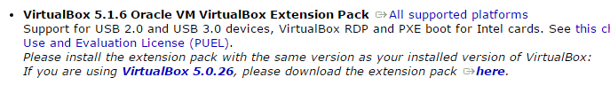

이것도 같이 받음. 우분투 소프트웨어로 실행하면 잘 설치해준다.

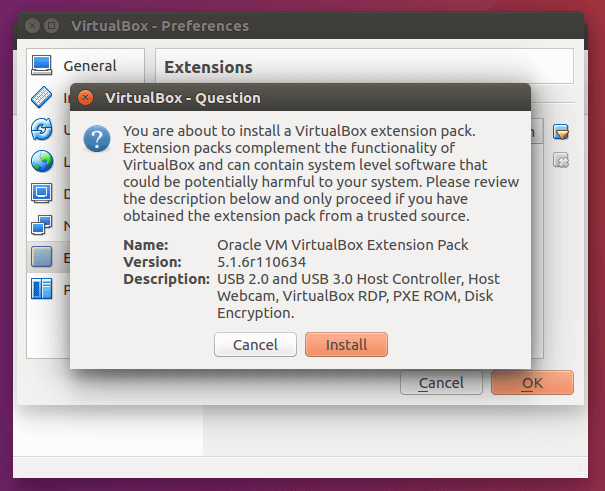

받은 김에 확장팩도 설치

## 9. 버추얼박스 설치

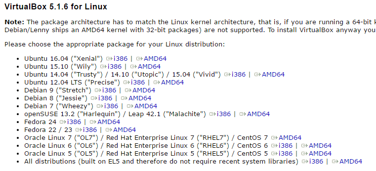

<https://www.virtualbox.org/wiki/Linux_Downloads> 에서 버전에 맞는 deb 다운로드.

이 글에선 16.04 amd64

## 10. 버추얼박스에 xp 설치

쿠쿠박스 문서에서는 xp 서비스팩3을 권장한다. 윈도우7도 되긴 된다는 듯.

이 글에서는 <https://az412801.vo.msecnd.net/vhd/VMBuild_20141027/VirtualBox/IE8/Windows/IE8.XP.For.Windows.VirtualBox.zip>를 받아서 사용했다.

```sh
wget https://az412801.vo.msecnd.net/vhd/VMBuild_20141027/VirtualBox/IE8/Windows/IE8.XP.For.Windows.VirtualBox.zip
unzip IE8.XP.For.Windows.VirtualBox.zip
```

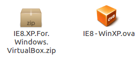

압축을 풀면 나오는 IE8-WinXP.ova는

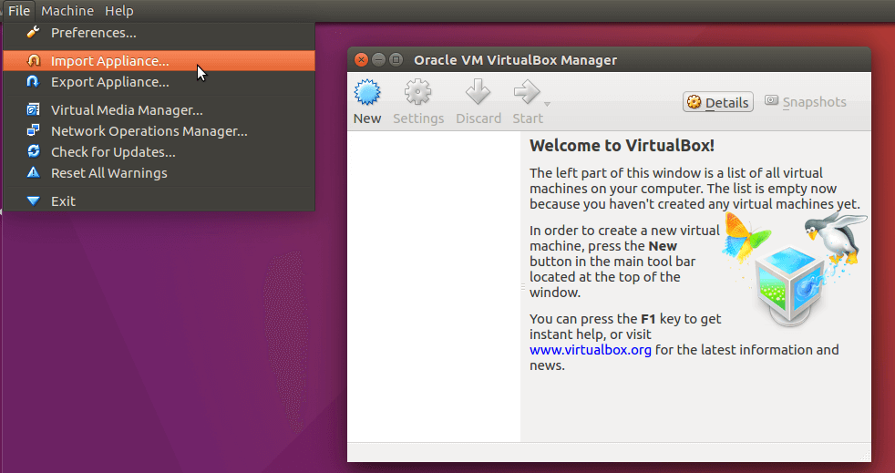

잘 import하면

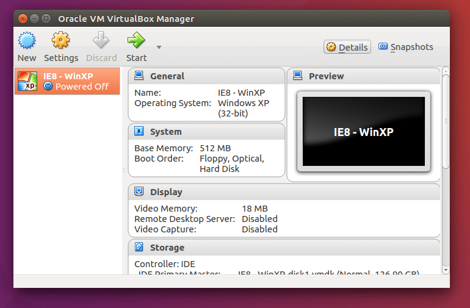

짠.

## 11. 버추얼박스 설정

네트워크를 호스트 전용 어댑터로 해놓으면 편하다.

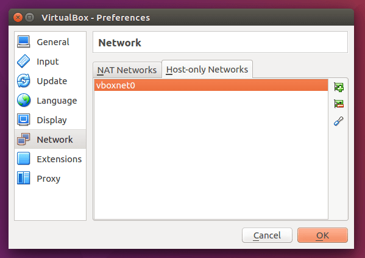

버추얼박스의 환경설정에서 호스트 전용 어댑터를 하나 추가한다.
왠만하면 vboxnet0으로 설정을 진행하는 게 좋다.

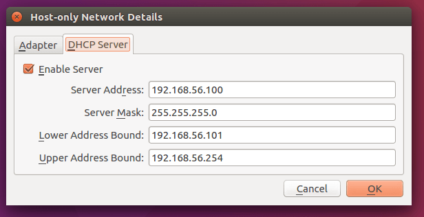

DHCP 서버는 자동으로 설정돼있을 텐데, 만약 안돼있다면 이렇게 192.168.56 라인으로 잘 맞춰놓는다.

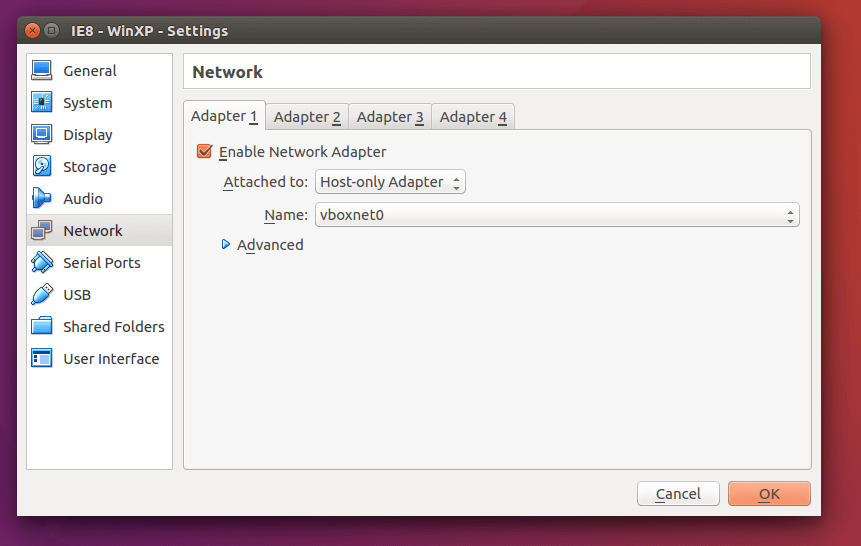

그리고 xp 설정에서 방금 추가한 호스트 전용 어댑터를 설정해준다.

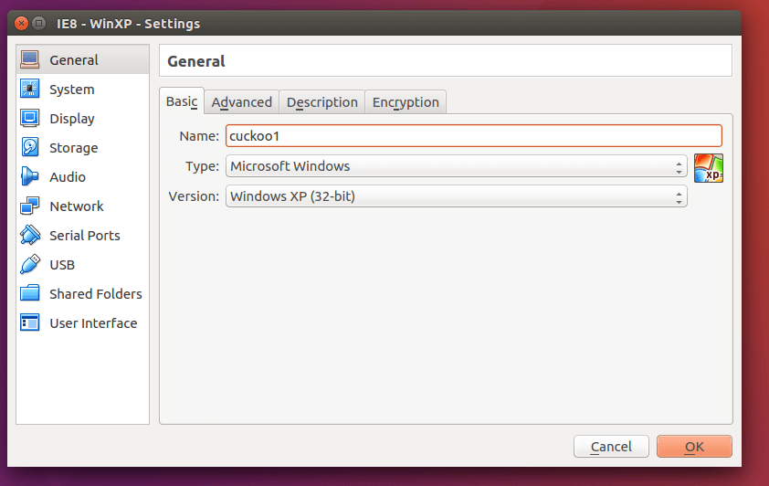

그리고 머신 이름은 cuckoo1로 바꿔놓는다.

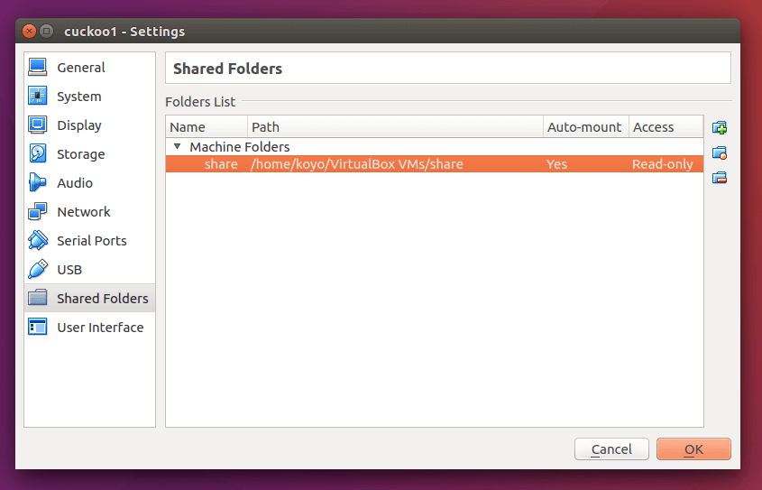

공유폴더 설정도 해주면 나중에 편하다.

## 12. xp 설정

공유폴더로 xp에 옮겨줄 파일은 4개가 있다.

python, PIL, agent.py, ProcessExplorer

PIL 최신 버전은 <http://www.pythonware.com/products/pil/>에서 확인하면 된다.

```sh
wget https://www.python.org/ftp/python/2.7.12/python-2.7.12.msi
wget http://effbot.org/media/downloads/PIL-1.1.7.win32-py2.7.exe
wget https://raw.githubusercontent.com/cuckoosandbox/cuckoo/master/agent/agent.py
wget https://download.sysinternals.com/files/ProcessExplorer.zip
```

이 시점에서 재시작 한번 해줬다.

이제 xp 가상머신을 실행해서 게스트 확장을 설치하고,

```console
> ipconfig
Windows IP Configuration

Ethernet adapter Local Area Connection:
        Connection-specific DNS Suffix  . :
        IP Address. . . . . . . . . . . . : 192.168.56.101
        Subnet Mask . . . . . . . . . . . : 255.255.255.0
        Default Gateway . . . . . . . . . :
```

ip를 확인해준다.

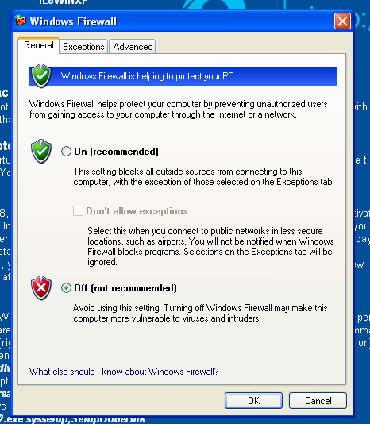

파이썬과 PIL을 설치하고, 방화벽까지 해제했다.
자동 업데이트도 끄고 페이징 파일도 꺼준다.

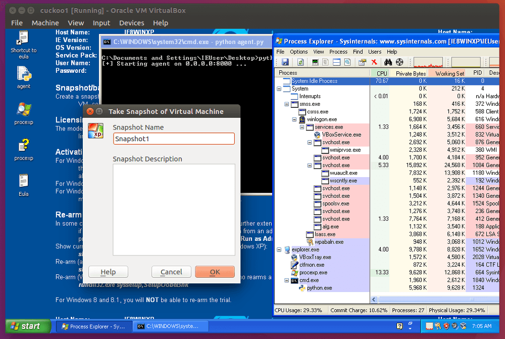

agent.py랑 procexp.exe를 실행하고 스냅샷을 SnapShot1(띄어쓰기 없이)으로 저장했다.
스냅샷 이름을 저렇게 해야 설정할때 편함ㅎ

## 13. 쿠쿠박스 설정

virtualbox.conf를 편집한다.

가상머신 설정대로 잘 있는지 확인하고, 주석처리 상태면 주석을 제거한다.

```sh
vi ~/cuckoo/conf/virtualbox.conf
```

```ini
interface = vboxnet0
machines = cuckoo1
ip = 192.168.56.101
snapshot = Snapshot1
resultserver_ip = 192.168.56.1
resultserver_port = 2042
```

volatility를 설치했으니 processing.conf도 수정한다.

```sh
vi ~/cuckoo/conf/processing.conf
```

```ini
[memory]
enabled = yes
```

cuckoo.conf도 수정한다.

```sh
vi ~/cuckoo/conf/cuckoo.conf
```

```ini
memory_dump = yes
```

그리고 memory.conf도 수정한다.

```sh
vi ~/cuckoo/conf/memory.conf
```

들어가서 모든 옵션을 enabled = yes로 바꿨다.

dump delete 여부는 하드 용량에 따라 결정.

====================

## 14. 유저 설정과 아이피테이블 설정

사실 깜빡하고 쿠쿠박스를 먼저 실행했는데, 리눅스에서 설정이 좀 더 필요하다.

이건 유저 설정

```sh
sudo adduser cuckoo
sudo usermod -a -G vboxusers cuckoo
```

이건 포워딩 설정..

```sh
sudo iptables -A FORWARD -o eth0 -i vboxnet0 -s 192.168.56.0/24 -m conntrack --ctstate NEW -j ACCEPT
sudo iptables -A FORWARD -m conntrack --ctstate ESTABLISHED,RELATED -j ACCEPT
sudo iptables -A POSTROUTING -t nat -j MASQUERADE
sudo sysctl -w net.ipv4.ip_forward=1
```

포워딩 설정을 안하면 네트워크가 안된다.

## 15. 쿠쿠 샌드박스 실행

쿠쿠 샌드박스 실행 전에 아래 두 명령어를 입력해놓자.

```sh
VBoxManage controlvm "cuckoo1" poweroff
VBoxManage snapshot "cuckoo1" restorecurrent
```

cuckoo.py를 실행하면 하면 된다.

```sh
cd ~/cuckoo
python cuckoo.py
```

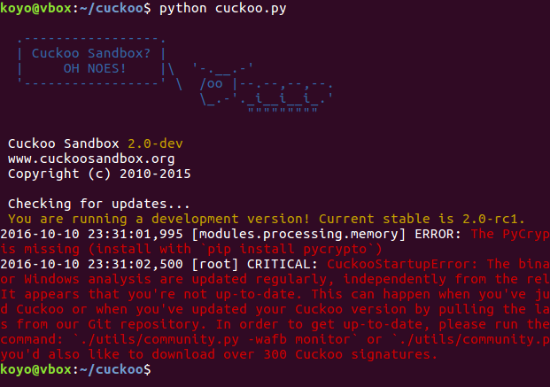

아씨

저기서 하란 대로 명령어를 더 쳐주고 다시 cuckoo.py를 실행했다.

```sh
sudo pip install pycrypto
python ./utils/community.py -wafb 2.0
```

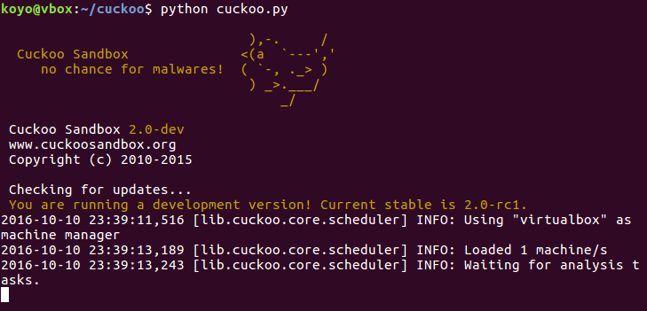

잘 되는 모습.

## 16. 웹 인터페이스

```sh
cd ~/cuckoo/web/
python manage.py runserver
```

새로 쉘을 열어서 위 명령어를 치면

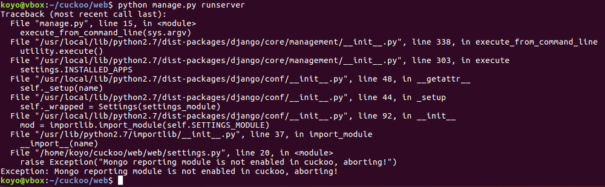

이런 게 뜰리가 업는디...

웹 인터페이스를 활성화하려면 reporting.conf를 설정해줘야 한다.

```sh
vi ~/cuckoo/conf/reporting.conf
```

```ini
[mongodb]
enabled = yes
host = 127.0.0.1
port = 27017
db = cuckoo
store_memdump = yes
paginate = 100
```

이렇게 yes로 변경해주고 다시 manage.py를 실행하면

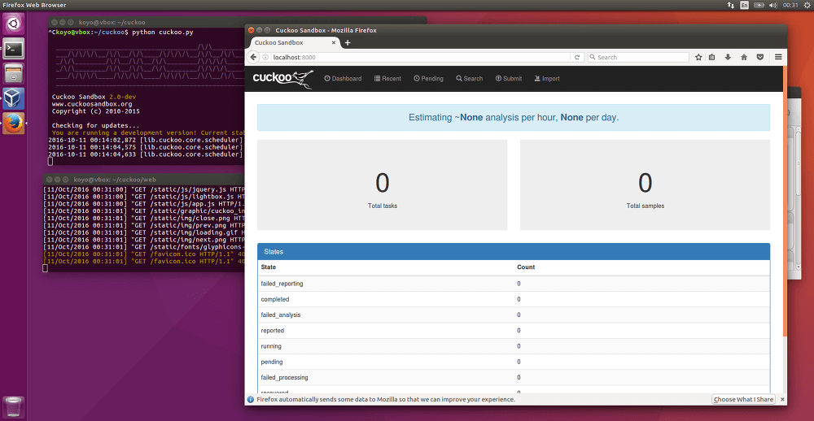

됐다! ㅎㅎ

## 참고

<http://docs.cuckoosandbox.org/en/latest/installation/host/installation/>

<http://lureout.tistory.com/213>

<http://cpuu.postype.com/post/325368/>
