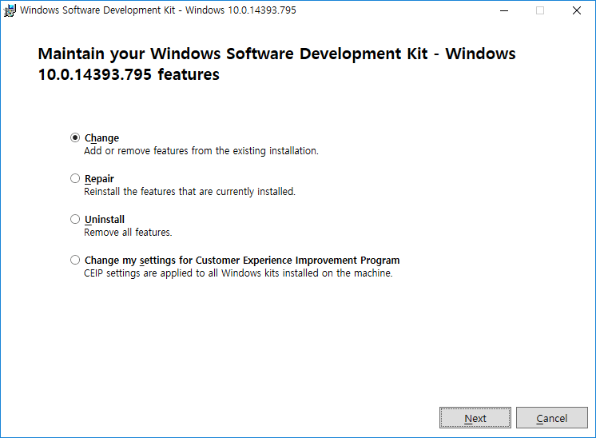
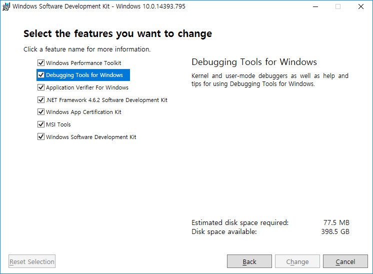
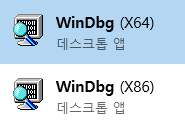

## 환경

Windows 10 Redstone 1, Visual Studio 2017

## 문제

WinDbg는 찾아도 안나오고...

그래서 설치하려고 하면 이미 SDK가 있다면서 날 화나게 하고...

## 해결

'프로그램 추가/제거'에서 'Windows Software Development Kit ...'을 찾는다.

찾았으면 선택하고 '수정'을 누른다.

설치창이 뜨면 'Change'를 선택하고 진행.

'Debugging Tools for Windows'를 선택하고 진행. (스크린샷은 이미 설치된 상태에서 찍은 것)

해결!
