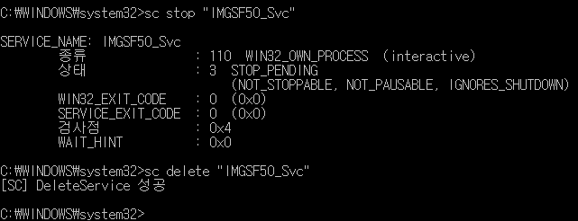

윈도우 64비트, 2016-10-20 기준

관리자 권한 명령 프롬프트에서 다음 명령어를 실행한다.

```bat
sc stop "IMGSF50_Svc"
sc delete "IMGSF50_Svc"
```



위 사진대로 나오면 된 것.

C:\Windows 에서 다음 파일을 삭제한다.

```text
ImageSAFERSvc.exe
IMGSF50Svc.exe
```

C:\Windows\System32 에서 다음 파일을 삭제한다.

```text
ImageSAFERDrv64.sys
ImageSAFERMgr.dll
IMGSF50Filter_x64.dll
IMGSF50Helper_x64.dll
IMGSF50Lang.xml
IMGSF50MGR_x64.dll
IMGSF50Policy.xml
IMGSF50Start_x64.exe
IMGSFMgr.dll
```

C:\Windows\SysWOW64 에서 다음 파일을 삭제한다.

```text
ImageSAFERFilter.dll
ImageSAFERLang.xml
ImageSAFERMessage.exe
ImageSAFERMgr.dll
ImageSAFERProcMon.dll
ImageSAFERRecovery.exe
IMGSF50Filter.dll
IMGSF50Helper.dll
IMGSF50Lang.xml
IMGSF50MGR.dll
IMGSF50Policy.xml
IMGSF50Start_x86.exe
IMGSFMgr.dll
ImgsfprocPolicy.xml
ImgsfProcPolicyForExe.xml
# 아래 파일은 관계 없을 수도 있대요.
WebSafer_Damon.ocx
MaCommAPI.dll
MaMakeUp.dll
MACS.dll
```

레지스트리도 삭제한다.

```text
HKEY_CLASSES_ROOT\AppID\MaMakeUp.Called\
HKEY_CLASSES_ROOT\AppID\MaMakeUp.Called.1\
HKEY_CLASSES_ROOT\Wow6432Node\AppID\MaMakeUp.DLL\
HKEY_LOCAL_MACHINE\SYSTEM\CurrentControlSet\Services\ISMgr\
```

주먹구구식으로 찾은 거라서 삭제되지 않은 찌꺼기가 더 있을 수도 있당.
