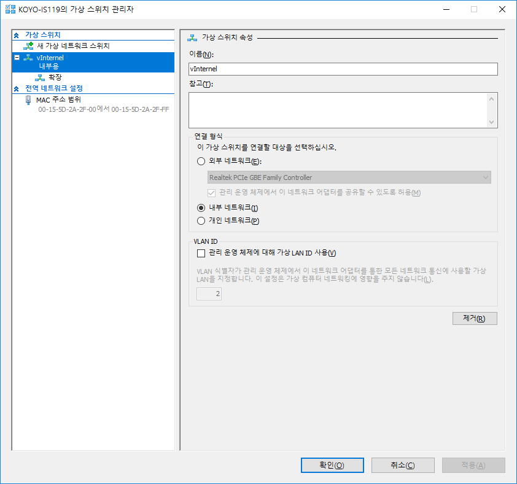
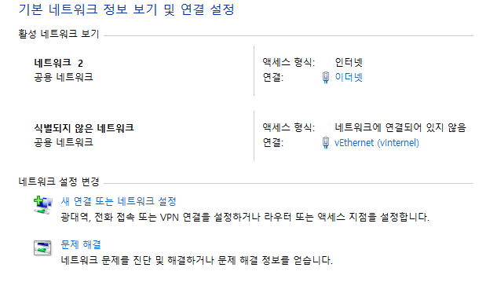
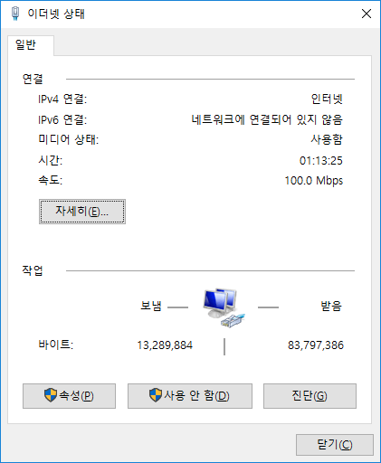
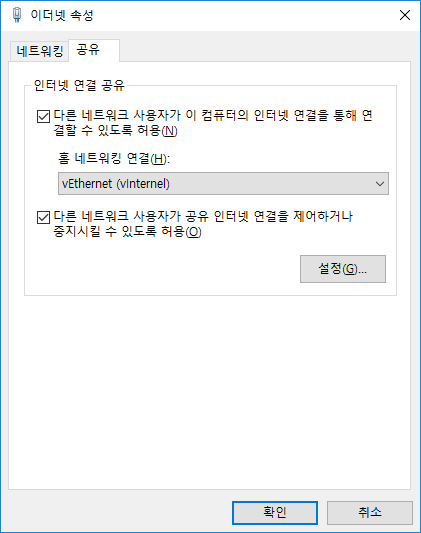
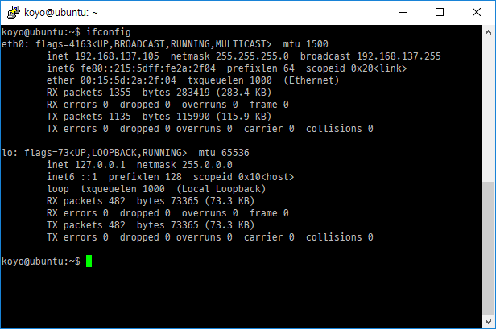
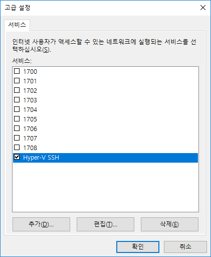
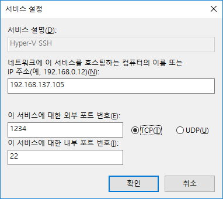

Hyper-V를 써보기로 했다.

네트워크 설정부터 포트 포워딩까지 작업이 조금 귀찮다.

그래서 여기 적음.

## 1. 네트워크 설정

가상 스위치 관리자에서 '내부 네트워크'로 가상 스위치를 생성한다.

네트워크 센터에서 물리 네트워크(여기서는 '이더넷')를 선택한다.

여기서 '속성'을 선택한다.

'공유' 탭에서 '다른 네트워크 사용자가 이 컴퓨터의 인터넷 연결을 통해 연결할 수 있도록 허용'에 체크한다.

그리고 아까 생성했던 가상 스위치(여기서는 'vEthernet (vInternel)')를 선택한다.

가상머신을 가상 스위치에 연결하면 IP가 알아서 잘 할당된다.

여기서는 192.168.137.105가 할당됐다.

## 2. 포트 포워딩

공인 IP로 오는 포트를 내 가상머신 포트에 붙여주고 싶다.

아까 전의 이더넷 속성에서 '설정'을 선택한다.

추가해주자. 이름은 맘대로

외부에서 오는 1234 포트에 대해서 192.168.137.105(가상머신 ip)의 22 포트로 연결해줬다.

난 해보니까 포트 포워딩 잘 됨.

끝!
