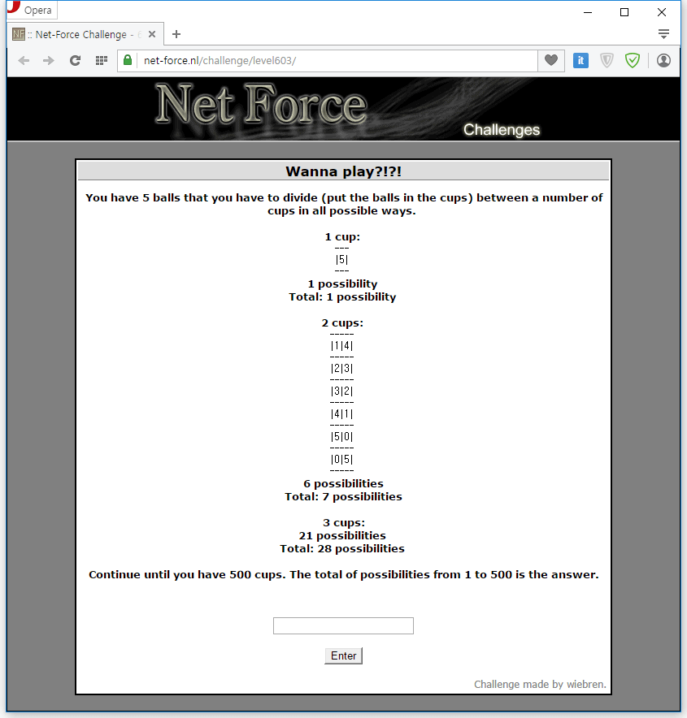

컵 개수를 늘려가면서 5개의 공을 넣는 경우의 수를 모두 합산하는 문제이다.
컵의 개수는 1개부터 500개까지 증가한다.

처음에 이 문제를 보고 고등학교 때 배운 순열과 조합이 생각났다.
어떻게 쓰는 지 까먹어서 그렇지.

그래서 처음엔 그런 공식을 이용하지 않고 문제를 풀려했다가 진행이 안되서
결국 순열과 조합 개념을 검색해서 어찌어찌 풀었다.

```python
sum = 0

def fac(n):
    if n:
        return n * fac(n - 1)
    else:
        return 1

def C(n, k):
    return fac(n) / fac(k) / fac(n-k)

def H(n, r):
    return C(n+r-1, r)

for cup in range(1, 501):
    sum += H(cup, 5)

print sum
```

fac은 팩토리얼, C는 조합, H는 중복조합이다.

설명을 덧붙이자면 중복조합 함수는 서로 다른 n개의 원소에서
중복을 허락하여 r개를 뽑는 경우의 수를 뜻하는데,
여기서 n와 r은 각각 컵의 개수와 공의 개수를 넣으면 된다.
공을 뽑는 게 아니라 컵을 뽑는 것이다.

이 개념은 볼 때마다 헷갈린다.

참고로 실행하면 22359848185500이 나온다. 답은 jippie
