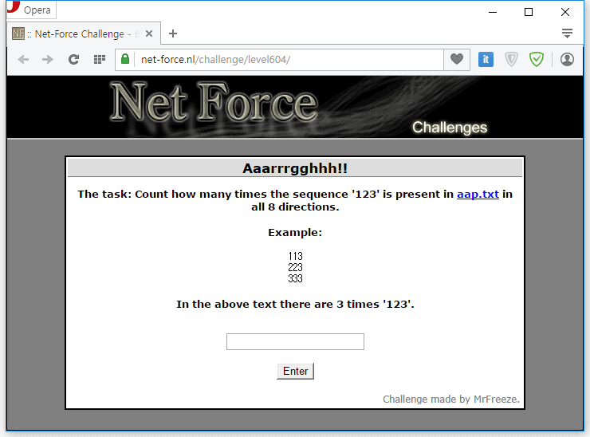

상하좌우, 대각선의 총 여덟 방향으로의 123이 몇 개 있는지를 알아내는 문제다.

aap.txt를 보면 가로 100글자, 세로 100줄로 구성되어 있다.
그렇다면 100x100의 리스트를 작성하면 되지 않을까? 그렇게 만들어봤다.

```python
aap = """3323111322122222221132131133221121321211333133323121233332323313113232321132111322122232113211321233
1333322323313132111323222122323223231323121133232133131232332321311232323122322131212221122212113312
3211222312322313323133312332221322231231321323311233331333322122122133221113312331212213111211213313
2312331333111132321331132333123223233123333123332332312113323322233321333312113313113221222321311312
3121312213213211331223331311212231132112122132311211123133122213232331133323211133321131131332123123
1311323221212213323222113221221332133213132231132232323113132221213121213321313113322313113213232223
2222221331331231222211122133311122311211231332133131233322211131123323333232221131233311312333213331
2311122222123331323212323121321121131233322233313313213321321311333321313121123112122332221322332213
3112322321332212231322231211133122323221231213122112221323312312222332323211212113223223322231333321
3212121122131122121131133233222131133321131132232132123233333221112222222111132123313331113122332232
2311131321322113233322213123223222211113113233122333313132313321122121323131131111311313312223133311
3133313213232321133323131121123111221121121233231231221123223333221323132232131331232133212231311232
3311332231112133332213133231132312213223321332111221312133331113233333222222312121131322312213123323
2232223333111311131232323211222133233131332311332321133223221231211232321221232232212223113313313312
1321223113122112233332112313112323231111113133321333321113131222113221111312133122333213223121231123
2112313231313133313121212231222113311312233232313313223132312323221331111232323221121122222111332122
2332112332222113322133112111133321133223122332212131223131322121132233122233332223332131233311131313
3123131212212332111131131132232121332132212333112312131332322332112132113223323322111123113323223211
3133111222132213333131111311112123112332333113222231321132233322112123233131323233132232323122211333
1233321322222133232332211312111121231132221112112322312223212313313221333231311323231111113111231331
1311232311332322331323123233312311323313311113213313131233123313221232211223323322311312211333311212
3122213123323313112122333112311122123233321331222312133322233331123323213212131332331333222232313322
3333312311122211111213232332323121331323113113213112121131131313321131331231122233331211313221133312
1132133222332233111321213312223313212213311121312332233313323231333231211321211123211333221311313123
3322332222321312123123132331211233131122311132213133121113133322212122233313121113311113321133321123
3122113222211223212313313133222131333333211332322311211223222122121212212322323121321322132122113211
3331133311133111322223311212312331222312311233111231223212112321232131312131231223233333313123232211
2121133213112311211111223311132333312232121212111132213331323311112311113231121133232332323223121133
2232232223131211313113321213131322131333313113312321332311133123221233311122123331233222323111323333
1313231123231312122313331313211121332121232323131322333211133331123121131212112133313232113111321323
2212231121222211113133312132231122123313333112111131322231312232323333333121321211322321113312113231
2113331312111312323233132133232222232311313222323323222331321331221132311133331312332111222211331322
3323311131313111232333333232112112322133212121111333131131322123122231222133122312131131113333213223
3211233232311331122113323113331233332321113212321233221332223133112232233312313111332332133113113211
3121233332231211121131132121321132321222331332232322321132111332323333123321113321122222133231232331
1221332222132111331223231332113323221322132332331232232212232331211132122332121111312222112222122122
3322133113122331212131321322331231232123333133221211133332232121112133232131312213113132211122333131
3322231323223211321232113213211321232221211212332233212121331222112123121331121131111312112212132332
1113121312133311112211232333311213111233231112213113132212133233232332112333231323213221131311222321
2331221123321121133121321331322113231321131333232113323211133221213123231232132232112312212132211223
2222131322331313213213122232111121212211112113131111111123221321331232323121313233223213331321223333
2113333213322232223123313113322223221212232131111213131321123131212223331112332112231311331222213311
3123323211312223333331233323233311313233111233111223232311312113233232222332211313322311321311221311
1323323221113323211122132322313111321223111211333232323132132223213122132232211333113211332211112311
1211222333132132331122233322112332333311223211113132332113131223133122111222321133332133321121132313
3133111223221233212231211332213333122232111333321312132212222123211321311221323323133332233113213311
2212331312311233132233132131221113133311122133132111213321231232121322211113332131331223231223113231
2221321333112312132322211312111123133311312321132323131132321221221233323112132231211122123131323132
1211113211232121122231321121221121131222313211221213133121121133133332223311332133333331313131311311
3322333223323323313232311213221321211123212211231132122332212322112212213131211211322213331111332323
2312232213222231232331321133132333121123221133321132113113112312332133223111221221132121321213211122
2121313312122112111322312123223222213313112311331333222232122132323131133213323132213131221111322233
3312111312213111131231131123221333211232121133321331223333133222133333122233231312321323112322332213
3321131212121323132121321132322322331112333332212222121113113133132112212212332131132212322112223331
3222121333313222212113313211132332323321312331232121121222133313311212111123311313313233123232212323
2322122323223331112313313222221132112133233213311211333313111321123222232312131111313123322212121223
1123133322332323311312123132121323211132331222323211221232313331211112233321131222111213311231112233
2322132313313123321332132231321132331323221121111312113223131323121323211332112311231331132332221311
2232333122131321122113322212332131123231113231231211323311222131331223133222211122121331322223321323
1323322112331122221233323132223123111133223232222111322311313212213222131121122111332213211312322122
3213313232131332231231332223133322233322332322313121213332132112212322231123322112133233111312322232
3311332312322321211213223311332222213332123332233231212132311131333311131113233331112321313232321312
2222313331213313321321122321132123123231111221223213123231123223132212223231222312221122322311332112
1333321331213223222313211323113132331133222312322231113312212123232332223232321312332311213212212333
3212131311332132233232111111331131121132223222233211321213231232111311123322111333321231211313121332
1231112211232223232331121222231212311223331232213211212313111122231232131231132122321113323213323123
2213332331311121223312213332311313333131112321323122322132212313221121312112312212313113312131323123
2333133213221213122123323321211313231331313211121232313221121112312113211233113123321323312313312321
2222133332121133221323123332133132313233231212223132322131312112111222211311112333323322231122222221
3121123333213222331333332213131332133311222213113312112112111131322212133333331123121233331122333321
3233211221232312212332331331321122313321132311113323322111122333311213323332312313231231133122231233
1333122111332331133113113221212231332331123323121232332332323123213213131223231321221122313113112331
1131113123321221313113231322212223322112132223221112311312223331113221222111312211311113122121333121
1212113333332321332323113221311121122311313211323313131121233121223332122111322323132112112113121321
2223311112131321322333311133112131323311132221213211211231133223212232122311111112123311232222321222
1121321321223113311311332123322332323133321222111123333231221213232332311132311332223132112231221322
1322122312223223333333111322311111213233121321232211121122223233322333133121131331323213111332322123
3312112332121113321313133133123333222112323112321112121313211222333211232212323133132333313132312131
3222212231132331331333133132212221213221233221332313221311123112331231121332212222122132121312331111
2322131322123312112323131322331313321333131333112213111221233121333331222221221311131133131211313121
2332223331322113322332122133331232321231133122223312333222221331132232313233123122212122313212113233
3313121132313212211322223313322132323311232312311321211132331323121121111232211331321323112123132213
1111332131231333213211112212323213212133122233211231231113233331321222331112111121223223132113231323
3322121232231223331122313221112213332133233111331132232232223122213132212112221112112122213333213221
3323222311231331322322132313121233211212332223133121131331113321231212131121331232123332231312111133
3222213231111321321221123233332321131331133132331333333213213111311122133313111321132113212313212231
3132233231321132321321331233331121311332323333122213231331112131332121311322322221312112331323221312
1332312231323133311213311213231331332131311131333322313132221233312112333113333222211133122322132113
3231123213213331123111333321233312333231121221112113131333312122211231232232111113112211232211331212
3131112111213111131121333231311331113133231112322132132131121112322122223223132231112212333232322222
2313333233313331213231231123321221211122223233131223221312123332331321213311332321311231211321212311
2231333222311213122323322322222123332223111331132113333211311322122323121122213212111231312221233122
3321212313332132131311122222322123121321323123133232232323232233133133233223231322331221122331322221
2133312321233312121233113212112123123332122312211333122232132131331313121132123311213321121212221211
3212131121331333313132312133122322313122322221312323321111112132322331311112221133212112111223122211
1113233323121221233221221111132333311332322222232313132332331113123121332332133113113233221322132211
1313121132321233312122122132112223223122221111331323331121333331311311111132333331223332332221322231
1323121133112212222131332112123331112231321212333323321211312333222132223323331133321322331321233332
1213212212123233122113122132313123212231121121212322221311221133113233313221112312333323212212331221
2211321223113223223313213331212312332112331311213221221323123213321322333321322211111231312223333123""".splitlines()
count = 0
for y in range(0, 100):
    for x in range(0, 100):
        if aap[y][x] == "1":
            for i in range(-1, 2):
                for j in range(-1, 2):
                    if 99 >= x + j*2 >= 0 and 99 >= y + i*2 >= 0:
                        if aap[y+i][x+j] == "2" and aap[y+i*2][x+j*2] == "3":
                            count += 1
print count
```

실행하면 2864가 나온다.
그리고 이걸 문제의 빈칸에 입력하면 답이 나온다.

답은 123hup
