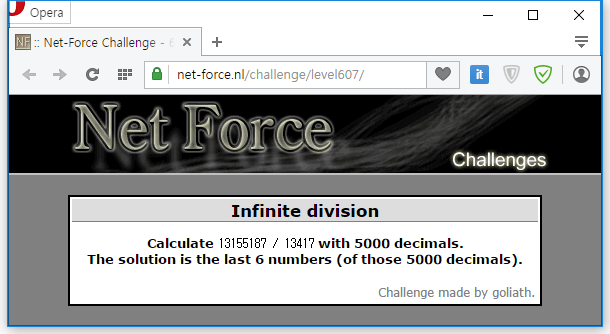

13155187 / 13417의 소수 4995~5000번째 자리 수가 답이다.

```python
a = 13155187
b = 13417
last = ""

def deviii(a):
    i = 0
    while (a > b):
        a -= b
        i += 1
    return [str(i), a]

list = deviii(a)
a = list[1]
last += list[0] + "."

for i in range(0, 5000):
    a *= 10
    if (a > b):
        list = deviii(a)
        a = list[1]
        last += list[0]
    else:
        last += "0"

print last
```

정답은 855705.
