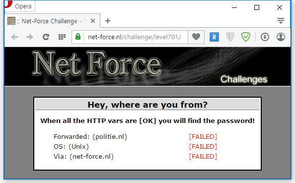
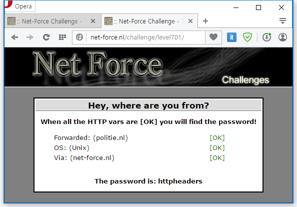

HTTP 헤더의 내용이 위 세 가지 요건을 충족하면 답을 줄 것이다.

패킷을 확인해보자.

```http
GET /challenge/level701/ HTTP/1.1
Host: net-force.nl
Accept: text/html,application/xhtml+xml,application/xml;q=0.9,image/webp,*/*;q=0.8
User-Agent: Mozilla/5.0 (Windows NT 10.0; WOW64) AppleWebKit/537.36 (KHTML, like Gecko) Chrome/43.0.2357.130 Safari/537.36 OPR/30.0.1835.125
Accept-Encoding: gzip, deflate, lzma, sdch
Accept-Language: ko-KR,ko;q=0.8,en-US;q=0.6,en;q=0.4
Cookie: locksessionip=no; autologinid=
```

이렇게 패킷이 잡혔다.

1. Forwarded: politie.nl 추가
2. Windows NT 10.0; WOW64 -> Unix
3. Via: net-force.nl 추가

위 3개를 적용하면

```http
GET /challenge/level701/ HTTP/1.1
Host: net-force.nl
Forwarded: politie.nl
Via: net-force.nl
Accept: text/html,application/xhtml+xml,application/xml;q=0.9,image/webp,*/*;q=0.8
User-Agent: Mozilla/5.0 (Unix) AppleWebKit/537.36 (KHTML, like Gecko) Chrome/43.0.2357.130 Safari/537.36 OPR/30.0.1835.125
Accept-Encoding: gzip, deflate, lzma, sdch
Accept-Language: ko-KR,ko;q=0.8,en-US;q=0.6,en;q=0.4
Cookie: locksessionip=no; autologinid=
```

완성!



성공!

답은 httpheaders
