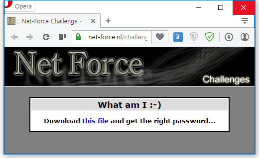
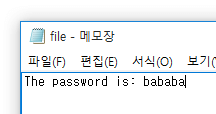

문제의 페이지.

다운로드 받은 파일의 헤더는 PK이다.

난 이걸 메모장에서 확장자만 바꿔서 저장했는데
그거 때문인지 파일이 변경되서 한참을 못풀었다.

손상된 zip 복구하는 문제인 줄 알았다.

비밀번호가 있어야 압축파일 안의 file.txt를 알 수 있다.

암호 대입 프로그램을 켜고 기다려서 bababa라는 암호를 얻어냈다.

답은 bababa
