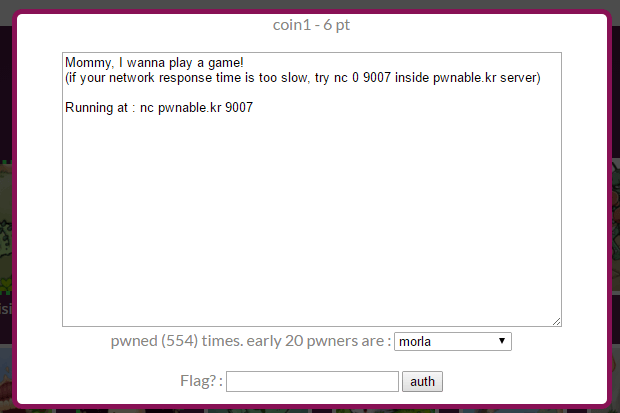
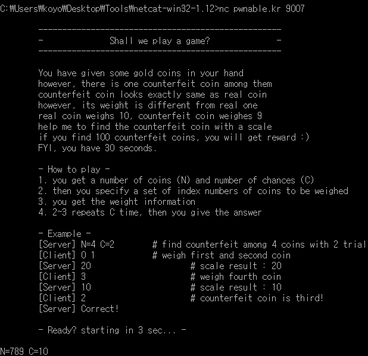
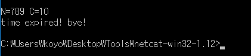
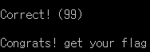

## 문제



netcat를 이용해서 들어가보자



가짜코인을 제한 시간 내에 찾아야한다.



30초가 지나면 시간초과로 다시 도전해야 한다.

## 풀이

처음에는 가짜코인을 한 번만 찾으면 되는 줄 알고
아래와 같이 소스코드를 짜고 수작업으로 값을 입력했다.
여러 번의 시도 끝에 30초 내에 가짜코인 하나를 찾았지만 새로 코인 갯수를 제시해주는 것을 보고 문제를 다시 읽게 됐다.
30초 내에 가짜동전을 100번 찾아야하는 것이었다.

c 코드

```c
#include <stdio.h>

void print(int n_A, int n_B, int tf) {
    int i;
    if (tf == 1)
        for (i = n_A; i < (n_A + n_B) / 2; i++)
            printf("%d ", i);
    else
        for (i = n_A; i < (n_A + n_B) / 2; i++)
            printf("%d ", i);
}

int main() {
    int n_A = 0, n_B, C; // n_A는 첫 코인, n_B는 마지막 코인
    int tf = 1; // 1=앞, 2=뒤, 3=찾음
    int i;

    for (i = 0; i < 1000; i++) {
        printf("%d ", i);
    }

    return 0;
    printf("n_B C: ");
    scanf_s("%d %d", &n_B, &C);
    n_B--;
    print(n_A, n_B, tf);

    for (i = 0; i < C; i++) {
        printf("\nhere: ");
        scanf_s("%d", &tf);
        if (tf == 1)
            n_B = (n_A + n_B) / 2;
        else if (tf == 2)
            n_A = (n_A + n_B) / 2 + 1;

        print(n_A, n_B, tf);
    }
    return 0;
}
```



30초안에 100개를 찾으려면 수작업으로는 어림도 없으므로
소켓으로 통신해서 빠르게 문제를 풀도록 코드를 짜서 문제를 풀었다.
