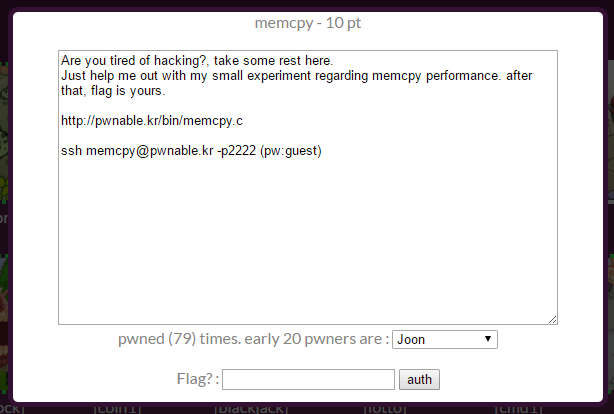
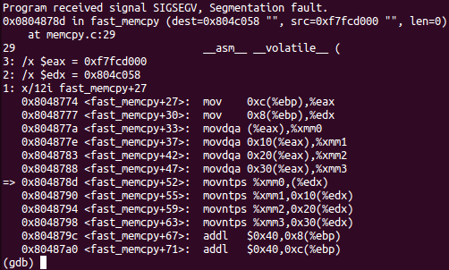
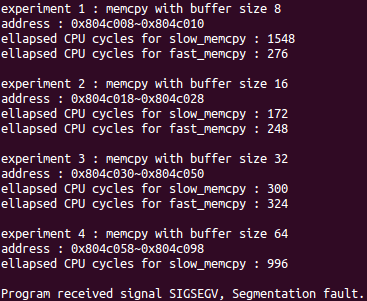
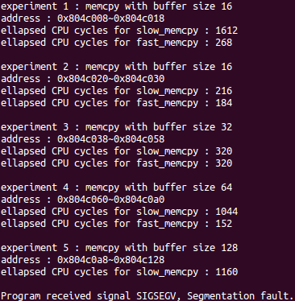

## 문제



10점 문제.

```c
// compiled with : gcc -o memcpy memcpy.c -m32 -lm
```

memcpy.c 첫줄에 이런 주석이 있어서 가상머신 우분투에서 컴파일해서 풀기로 했다.
나는 -g 옵션도 추가로 줬다.
64비트에서 안되면 아래 명령을 입력하면 된다.

```sh
sudo apt-get update
sudo apt-get install libc6-dev-i386
```

## 풀이

프로그램 흐름을 보면

```c
    char* src;
    char* dest;
    unsigned int low, high;
    unsigned int size;
    // allocate memory
    char* cache1 = mmap(0, 0x4000, 7, MAP_PRIVATE|MAP_ANONYMOUS, -1, 0);
    char* cache2 = mmap(0, 0x4000, 7, MAP_PRIVATE|MAP_ANONYMOUS, -1, 0);
    src = mmap(0, 0x2000, 7, MAP_PRIVATE|MAP_ANONYMOUS, -1, 0);
```

src에 0x2000만큼 메모리를 할당하고

```c
for(i=0; i<10; i++){
        size = sizes[i];
        printf("experiment %d : memcpy with buffer size %d\n", i+1, size);
        dest = malloc( size );

        memcpy(cache1, cache2, 0x4000);        // to eliminate cache effect
        t1 = rdtsc();
        slow_memcpy(dest, src, size);        // byte-to-byte memcpy
        t2 = rdtsc();
        printf("ellapsed CPU cycles for slow_memcpy : %llu\n", t2-t1);

        memcpy(cache1, cache2, 0x4000);        // to eliminate cache effect
        t1 = rdtsc();
        fast_memcpy(dest, src, size);        // block-to-block memcpy
        t2 = rdtsc();
        printf("ellapsed CPU cycles for fast_memcpy : %llu\n", t2-t1);
        printf("\n");
    }

    printf("thanks for helping my experiment!\n");
    printf("flag : ----- erased in this source code -----\n");
    return 0;
```

사용자가 입력한만큼 동적할당해서 dest에 주소를 넣고,
slow_memcpy와 fast_memcpy를 호출하는데

```c
char* slow_memcpy(char* dest, const char* src, size_t len){
    int i;
    for (i=0; i<len; i++) {
        dest[i] = src[i];
    }
    return dest;
}

char* fast_memcpy(char* dest, const char* src, size_t len){
    size_t i;
    // 64-byte block fast copy
    if(len >= 64){
        i = len / 64;
        len &= (64-1);
        while(i-- > 0){
            __asm__ __volatile__ (
            "movdqa (%0), %%xmm0\n"
            "movdqa 16(%0), %%xmm1\n"
            "movdqa 32(%0), %%xmm2\n"
            "movdqa 48(%0), %%xmm3\n"
            "movntps %%xmm0, (%1)\n"
            "movntps %%xmm1, 16(%1)\n"
            "movntps %%xmm2, 32(%1)\n"
            "movntps %%xmm3, 48(%1)\n"
            ::"r"(src),"r"(dest):"memory");
            dest += 64;
            src += 64;
        }
    }

    // byte-to-byte slow copy
    if(len) slow_memcpy(dest, src, len);
    return dest;
}
```

slow_memcpy는 한바이트씩 넣고,
fast_memcpy는 처음 보는 명령어와 레지스터를 써서 뭔가를 한다.
도저히 모르겠어서 도서관에서 책 빌려서 알아봤다.
책이 생각보다 재밌어서 계속 보는중ㅎ

SIMD라고 해서 명령을 병렬로 처리하는게 있는데,
xmm 레지스터에 메모리를 16바이트씩 한번에 올려서 연산하면 정말 빠르다고 한다.
위 코드에서는 xmm0~3에다가 64바이트씩 src에서 읽어와서 다시 dest로 쓰고 있다.

```c-objdump
(gdb) b *fast_memcpy+27
Breakpoint 1 at 0x8048774: file memcpy.c, line 29.
(gdb) display /12i fast_memcpy+27
(gdb) display /x $edx
(gdb) display /x $eax
```

fast_memcpy 부분에 맞춰서 세팅해서 진행하면



movntps %xmm0,(%edx)에서 segmentation fault가 발생한다.

여기서 더이상 진전이 없다가 어쩌다 "8 16 32 64 128 256 512 1024 2048 4096"
대신에 "16 16 32 64 128 256 512 1024 2048 4096"를 입력하니까
원래는 64바이트에서 진행이 막혔던 것이
128바이트째에서 segmentation fault가 발생하는 걸 볼 수 있었다.

 

```console
$ ./memcpy
8 16 32 64 128 256 512 1024 2048 4096
0x0008  8       0x0010
0x0018  16      0x0028
0x0030  32      0x0050
0x0058  64      0x0098 // segmentation fault!

16 16 32 64 128 256 512 1024 2048 4096
0x0008  8+8     0x0018
0x0020  16      0x0030
0x0038  32      0x0058
0x0060  64      0x00a0
0x00a8  128     0x0128 // segmentation fault!
```

주소를 비교해보면 dest가 가리키는 메모리 주소가 16배수가 아닐 때
segmentation fault가 발생하는 알 수 있다.

movdqa뿐만 아니라 movntps도 메모리가 정렬된(aligned) 상태여야 했던 것이다.
이걸 알게 됐을 때에서야 정렬된 메모리가 뭘 말하는 건지도 깨달을 수 있었다.
진작 알고 있었다면 이 문제는 바로 풀 수 있었을텐데.

풀이

```console
$ ./memcpy
8 16 40 72 136 264 520 1032 2056 4104
```

## 참고

<http://cafe.naver.com/tiawtech/65>

<http://x86.renejeschke.de/html/file_module_x86_id_197.html>
