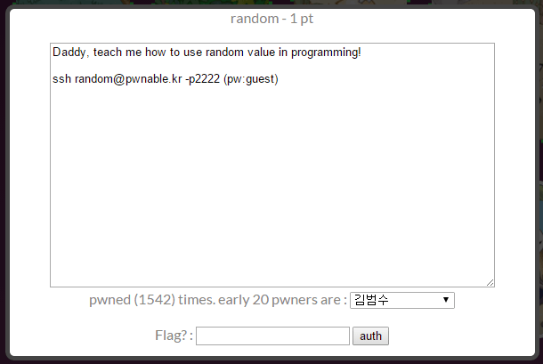

## 문제



문제를 풀면 1포인트를 준다.

```console
$ ls -l
total 20
-r--r----- 1 random_pwn root     49 Jun 30  2014 flag
-r-sr-x--- 1 random_pwn random 8538 Jun 30  2014 random
-rw-r--r-- 1 root       root    301 Jun 30  2014 random.c
```

```c
#include <stdio.h>

int main(){
    unsigned int random;
    random = rand();    // random value!

    unsigned int key=0;
    scanf("%d", &key);

    if( (key ^ random) == 0xdeadbeef ){
        printf("Good!\n");
        system("/bin/cat flag");
        return 0;
    }

    printf("Wrong, maybe you should try 2^32 cases.\n");
    return 0;
}
```

## 풀이

random, random.c, flag 세 파일이 존재하며,
rand 함수로 생성된 값과 내가 입력한 값을 비트 단위 xor 연산하여
그 값이 0xdeadbeef일 때 flag 내용을 알 수 있게 되는 코드이다.

rand 함수는 아마 시드값 같은 것을 임의로 입력하지 않으면
항상 같은 값을 반환한다고 알고 있다.
random 변수의 고정된 값을 알면 풀 수 있는 문제다.

```c-objdump
00000000004005f4 <main>:
  4005f4:       55                      push   %rbp
  4005f5:       48 89 e5                mov    %rsp,%rbp
  4005f8:       48 83 ec 10             sub    $0x10,%rsp
  4005fc:       b8 00 00 00 00          mov    $0x0,%eax
  400601:       e8 fa fe ff ff          callq  400500 <rand@plt>
  400606:       89 45 fc                mov    %eax,-0x4(%rbp)
  400609:       c7 45 f8 00 00 00 00    movl   $0x0,-0x8(%rbp)
  400610:       b8 60 07 40 00          mov    $0x400760,%eax
  400615:       48 8d 55 f8             lea    -0x8(%rbp),%rdx
  400619:       48 89 d6                mov    %rdx,%rsi
  40061c:       48 89 c7                mov    %rax,%rdi
  40061f:       b8 00 00 00 00          mov    $0x0,%eax
  400624:       e8 c7 fe ff ff          callq  4004f0 <__isoc99_scanf@plt>
  400629:       8b 45 f8                mov    -0x8(%rbp),%eax
  40062c:       33 45 fc                xor    -0x4(%rbp),%eax
  40062f:       3d ef be ad de          cmp    $0xdeadbeef,%eax
  400634:       75 20                   jne    400656 <main+0x62>
  400636:       bf 63 07 40 00          mov    $0x400763,%edi
  40063b:       e8 80 fe ff ff          callq  4004c0 <puts@plt>
  400640:       bf 69 07 40 00          mov    $0x400769,%edi
  400645:       b8 00 00 00 00          mov    $0x0,%eax
  40064a:       e8 81 fe ff ff          callq  4004d0 <system@plt>
  40064f:       b8 00 00 00 00          mov    $0x0,%eax
  400654:       eb 0f                   jmp    400665 <main+0x71>
  400656:       bf 78 07 40 00          mov    $0x400778,%edi
  40065b:       e8 60 fe ff ff          callq  4004c0 <puts@plt>
  400660:       b8 00 00 00 00          mov    $0x0,%eax
  400665:       c9                      leaveq
  400666:       c3                      retq
```

main 함수를 확인하면 rand 함수를 호출해서
[rbp-0x4]에 값을 넣는 것을 확인할 수 있다.
[rbp-0x8]는 내가 입력하는 key 변수에 해당한다.

```c-objdump
(gdb) b *main+108
Breakpoint 1 at 0x400660
(gdb) r
Starting program: /home/random/random
1111
Wrong, maybe you should try 2^32 cases.

Breakpoint 1, 0x0000000000400660 in main ()
(gdb) x $rbp-0x4
0x7fff8c48427c: 0x6b8b4567
(gdb)
```

적당한 곳에 브레이크포인트를 걸어서 실행한 뒤에
[rbp-0x4]에 있는 값을 확인하면 0x6b8b4567이 나온다.

```c
0x6b8b4567 ^ 0xdeadbeef == 0xb526fb88
```

xor 연산을 통해서 내가 입력해야 할 key의 값을 알 수 있다.
